:::: {.columns}
::: {.column width="50%"}

## Sample slides
#### PlaceHolderName
#### Universiti Malaysia Perlis
#### [placeholder@email.com](mailto:placeholder@email.com)

<!-- __AUDIO_INTRO_DO_NOT_TOUCH__ -->

:::

::: {.column width="50%"}

:::

::::

---

:::: {.columns}
::: {.column width="50%"}
### Slide one
**Key Concepts:**
- Energy conservation per @carnot1824.
- $\Delta U = Q - W$
:::

::: {.column width="50%"}

:::
::::

---

---

:::: {.columns}
::: {.column width="50%"}
### The Master Equation
The fundamental relation of thermodynamics:

$$\Delta U = Q - W$$

The work done $W$ is positive when the system expands against an external pressure.
:::

::: {.column width="50%"}
<video data-src="media/videos/sample.mp4" data-autoplay loop muted width="100%"></video>
:::

::::

---

:::: {.columns}
::: {.column width="50%"}
### Visualizing the Gas Law
**Interactive Model:**

- P, V, and T relationships.
- Use the slider to adjust pressure.
- Observe the phase boundary.
:::

::: {.column width="50%"}
<iframe 
  data-src="media/plots/sample.html" 
  width="100%" 
  height="500px" 
  style="border:none;" 
  scrolling="no">
</iframe>
:::
::::

---
## Machine Process Analysis: Control Charts & Capability

---
### PartLength Analysis for Machine 1 at 303 K, 100 kPa

  #### No Control Chart Generated
  Not enough valid numeric data was found to generate an Individual Control Chart for PartLength (Machine: 1, Temp: 303, Pres: 100).

  #### No Process Capability Generated
  Not enough valid numeric data was found to generate Process Capability for PartLength (Machine: 1, Temp: 303, Pres: 100).

---
### PartLength Analysis for Machine 1 at 303 K, 200 kPa

  #### No Control Chart Generated
  Not enough valid numeric data was found to generate an Individual Control Chart for PartLength (Machine: 1, Temp: 303, Pres: 200).

  #### No Process Capability Generated
  Not enough valid numeric data was found to generate Process Capability for PartLength (Machine: 1, Temp: 303, Pres: 200).

---
### PartLength Analysis for Machine 1 at 303 K, 300 kPa

  #### No Control Chart Generated
  Not enough valid numeric data was found to generate an Individual Control Chart for PartLength (Machine: 1, Temp: 303, Pres: 300).

  #### No Process Capability Generated
  Not enough valid numeric data was found to generate Process Capability for PartLength (Machine: 1, Temp: 303, Pres: 300).

---
### PartLength Analysis for Machine 1 at 338 K, 100 kPa

  #### No Control Chart Generated
  Not enough valid numeric data was found to generate an Individual Control Chart for PartLength (Machine: 1, Temp: 338, Pres: 100).

  #### No Process Capability Generated
  Not enough valid numeric data was found to generate Process Capability for PartLength (Machine: 1, Temp: 338, Pres: 100).

---
### PartLength Analysis for Machine 1 at 338 K, 200 kPa

  #### No Control Chart Generated
  Not enough valid numeric data was found to generate an Individual Control Chart for PartLength (Machine: 1, Temp: 338, Pres: 200).

  #### No Process Capability Generated
  Not enough valid numeric data was found to generate Process Capability for PartLength (Machine: 1, Temp: 338, Pres: 200).

---
### PartLength Analysis for Machine 1 at 338 K, 300 kPa

  #### No Control Chart Generated
  Not enough valid numeric data was found to generate an Individual Control Chart for PartLength (Machine: 1, Temp: 338, Pres: 300).

  #### No Process Capability Generated
  Not enough valid numeric data was found to generate Process Capability for PartLength (Machine: 1, Temp: 338, Pres: 300).

---
### PartLength Analysis for Machine 1 at 373 K, 100 kPa

  #### No Control Chart Generated
  Not enough valid numeric data was found to generate an Individual Control Chart for PartLength (Machine: 1, Temp: 373, Pres: 100).

  #### No Process Capability Generated
  Not enough valid numeric data was found to generate Process Capability for PartLength (Machine: 1, Temp: 373, Pres: 100).

---
### PartLength Analysis for Machine 1 at 373 K, 200 kPa

  #### No Control Chart Generated
  Not enough valid numeric data was found to generate an Individual Control Chart for PartLength (Machine: 1, Temp: 373, Pres: 200).

  #### No Process Capability Generated
  Not enough valid numeric data was found to generate Process Capability for PartLength (Machine: 1, Temp: 373, Pres: 200).

---
### PartLength Analysis for Machine 1 at 373 K, 300 kPa

  #### No Control Chart Generated
  Not enough valid numeric data was found to generate an Individual Control Chart for PartLength (Machine: 1, Temp: 373, Pres: 300).

  #### No Process Capability Generated
  Not enough valid numeric data was found to generate Process Capability for PartLength (Machine: 1, Temp: 373, Pres: 300).

---
### PartLength Analysis for Machine 2 at 303 K, 100 kPa

  #### No Control Chart Generated
  Not enough valid numeric data was found to generate an Individual Control Chart for PartLength (Machine: 2, Temp: 303, Pres: 100).

  #### No Process Capability Generated
  Not enough valid numeric data was found to generate Process Capability for PartLength (Machine: 2, Temp: 303, Pres: 100).

---
### PartLength Analysis for Machine 2 at 303 K, 200 kPa

  #### No Control Chart Generated
  Not enough valid numeric data was found to generate an Individual Control Chart for PartLength (Machine: 2, Temp: 303, Pres: 200).

  #### No Process Capability Generated
  Not enough valid numeric data was found to generate Process Capability for PartLength (Machine: 2, Temp: 303, Pres: 200).

---
### PartLength Analysis for Machine 2 at 303 K, 300 kPa

  #### No Control Chart Generated
  Not enough valid numeric data was found to generate an Individual Control Chart for PartLength (Machine: 2, Temp: 303, Pres: 300).

  #### No Process Capability Generated
  Not enough valid numeric data was found to generate Process Capability for PartLength (Machine: 2, Temp: 303, Pres: 300).

---
### PartLength Analysis for Machine 2 at 338 K, 100 kPa

  #### No Control Chart Generated
  Not enough valid numeric data was found to generate an Individual Control Chart for PartLength (Machine: 2, Temp: 338, Pres: 100).

  #### No Process Capability Generated
  Not enough valid numeric data was found to generate Process Capability for PartLength (Machine: 2, Temp: 338, Pres: 100).

---
### PartLength Analysis for Machine 2 at 338 K, 200 kPa

  #### No Control Chart Generated
  Not enough valid numeric data was found to generate an Individual Control Chart for PartLength (Machine: 2, Temp: 338, Pres: 200).

  #### No Process Capability Generated
  Not enough valid numeric data was found to generate Process Capability for PartLength (Machine: 2, Temp: 338, Pres: 200).

---
### PartLength Analysis for Machine 2 at 338 K, 300 kPa

  #### No Control Chart Generated
  Not enough valid numeric data was found to generate an Individual Control Chart for PartLength (Machine: 2, Temp: 338, Pres: 300).

  #### No Process Capability Generated
  Not enough valid numeric data was found to generate Process Capability for PartLength (Machine: 2, Temp: 338, Pres: 300).

---
### PartLength Analysis for Machine 2 at 373 K, 100 kPa

  #### No Control Chart Generated
  Not enough valid numeric data was found to generate an Individual Control Chart for PartLength (Machine: 2, Temp: 373, Pres: 100).

  #### No Process Capability Generated
  Not enough valid numeric data was found to generate Process Capability for PartLength (Machine: 2, Temp: 373, Pres: 100).

---
### PartLength Analysis for Machine 2 at 373 K, 200 kPa

  #### No Control Chart Generated
  Not enough valid numeric data was found to generate an Individual Control Chart for PartLength (Machine: 2, Temp: 373, Pres: 200).

  #### No Process Capability Generated
  Not enough valid numeric data was found to generate Process Capability for PartLength (Machine: 2, Temp: 373, Pres: 200).

---
### PartLength Analysis for Machine 2 at 373 K, 300 kPa

  #### No Control Chart Generated
  Not enough valid numeric data was found to generate an Individual Control Chart for PartLength (Machine: 2, Temp: 373, Pres: 300).

  #### No Process Capability Generated
  Not enough valid numeric data was found to generate Process Capability for PartLength (Machine: 2, Temp: 373, Pres: 300).

---
### PartLength Analysis for Machine 3 at 303 K, 100 kPa

  #### No Control Chart Generated
  Not enough valid numeric data was found to generate an Individual Control Chart for PartLength (Machine: 3, Temp: 303, Pres: 100).

  #### No Process Capability Generated
  Not enough valid numeric data was found to generate Process Capability for PartLength (Machine: 3, Temp: 303, Pres: 100).

---
### PartLength Analysis for Machine 3 at 303 K, 200 kPa

  #### No Control Chart Generated
  Not enough valid numeric data was found to generate an Individual Control Chart for PartLength (Machine: 3, Temp: 303, Pres: 200).

  #### No Process Capability Generated
  Not enough valid numeric data was found to generate Process Capability for PartLength (Machine: 3, Temp: 303, Pres: 200).

---
### PartLength Analysis for Machine 3 at 303 K, 300 kPa

  #### No Control Chart Generated
  Not enough valid numeric data was found to generate an Individual Control Chart for PartLength (Machine: 3, Temp: 303, Pres: 300).

  #### No Process Capability Generated
  Not enough valid numeric data was found to generate Process Capability for PartLength (Machine: 3, Temp: 303, Pres: 300).

---
### PartLength Analysis for Machine 3 at 338 K, 100 kPa

  #### No Control Chart Generated
  Not enough valid numeric data was found to generate an Individual Control Chart for PartLength (Machine: 3, Temp: 338, Pres: 100).

  #### No Process Capability Generated
  Not enough valid numeric data was found to generate Process Capability for PartLength (Machine: 3, Temp: 338, Pres: 100).

---
### PartLength Analysis for Machine 3 at 338 K, 200 kPa

  #### No Control Chart Generated
  Not enough valid numeric data was found to generate an Individual Control Chart for PartLength (Machine: 3, Temp: 338, Pres: 200).

  #### No Process Capability Generated
  Not enough valid numeric data was found to generate Process Capability for PartLength (Machine: 3, Temp: 338, Pres: 200).

---
### PartLength Analysis for Machine 3 at 338 K, 300 kPa

  #### No Control Chart Generated
  Not enough valid numeric data was found to generate an Individual Control Chart for PartLength (Machine: 3, Temp: 338, Pres: 300).

  #### No Process Capability Generated
  Not enough valid numeric data was found to generate Process Capability for PartLength (Machine: 3, Temp: 338, Pres: 300).

---
### PartLength Analysis for Machine 3 at 373 K, 100 kPa

  #### No Control Chart Generated
  Not enough valid numeric data was found to generate an Individual Control Chart for PartLength (Machine: 3, Temp: 373, Pres: 100).

  #### No Process Capability Generated
  Not enough valid numeric data was found to generate Process Capability for PartLength (Machine: 3, Temp: 373, Pres: 100).

---
### PartLength Analysis for Machine 3 at 373 K, 200 kPa

  #### No Control Chart Generated
  Not enough valid numeric data was found to generate an Individual Control Chart for PartLength (Machine: 3, Temp: 373, Pres: 200).

  #### No Process Capability Generated
  Not enough valid numeric data was found to generate Process Capability for PartLength (Machine: 3, Temp: 373, Pres: 200).

---
### PartLength Analysis for Machine 3 at 373 K, 300 kPa

  #### No Control Chart Generated
  Not enough valid numeric data was found to generate an Individual Control Chart for PartLength (Machine: 3, Temp: 373, Pres: 300).

  #### No Process Capability Generated
  Not enough valid numeric data was found to generate Process Capability for PartLength (Machine: 3, Temp: 373, Pres: 300).

---
### PartResistance Analysis for Machine 1 at 303 K, 100 kPa

  #### No Control Chart Generated
  Not enough valid numeric data was found to generate an Individual Control Chart for PartResistance (Machine: 1, Temp: 303, Pres: 100).

  #### No Process Capability Generated
  Not enough valid numeric data was found to generate Process Capability for PartResistance (Machine: 1, Temp: 303, Pres: 100).

---
### PartResistance Analysis for Machine 1 at 303 K, 200 kPa

  #### No Control Chart Generated
  Not enough valid numeric data was found to generate an Individual Control Chart for PartResistance (Machine: 1, Temp: 303, Pres: 200).

  #### No Process Capability Generated
  Not enough valid numeric data was found to generate Process Capability for PartResistance (Machine: 1, Temp: 303, Pres: 200).

---
### PartResistance Analysis for Machine 1 at 303 K, 300 kPa

  #### No Control Chart Generated
  Not enough valid numeric data was found to generate an Individual Control Chart for PartResistance (Machine: 1, Temp: 303, Pres: 300).

  #### No Process Capability Generated
  Not enough valid numeric data was found to generate Process Capability for PartResistance (Machine: 1, Temp: 303, Pres: 300).

---
### PartResistance Analysis for Machine 1 at 338 K, 100 kPa

  #### No Control Chart Generated
  Not enough valid numeric data was found to generate an Individual Control Chart for PartResistance (Machine: 1, Temp: 338, Pres: 100).

  #### No Process Capability Generated
  Not enough valid numeric data was found to generate Process Capability for PartResistance (Machine: 1, Temp: 338, Pres: 100).

---
### PartResistance Analysis for Machine 1 at 338 K, 200 kPa

  #### No Control Chart Generated
  Not enough valid numeric data was found to generate an Individual Control Chart for PartResistance (Machine: 1, Temp: 338, Pres: 200).

  #### No Process Capability Generated
  Not enough valid numeric data was found to generate Process Capability for PartResistance (Machine: 1, Temp: 338, Pres: 200).

---
### PartResistance Analysis for Machine 1 at 338 K, 300 kPa

  #### No Control Chart Generated
  Not enough valid numeric data was found to generate an Individual Control Chart for PartResistance (Machine: 1, Temp: 338, Pres: 300).

  #### No Process Capability Generated
  Not enough valid numeric data was found to generate Process Capability for PartResistance (Machine: 1, Temp: 338, Pres: 300).

---
### PartResistance Analysis for Machine 1 at 373 K, 100 kPa

  #### No Control Chart Generated
  Not enough valid numeric data was found to generate an Individual Control Chart for PartResistance (Machine: 1, Temp: 373, Pres: 100).

  #### No Process Capability Generated
  Not enough valid numeric data was found to generate Process Capability for PartResistance (Machine: 1, Temp: 373, Pres: 100).

---
### PartResistance Analysis for Machine 1 at 373 K, 200 kPa

  #### No Control Chart Generated
  Not enough valid numeric data was found to generate an Individual Control Chart for PartResistance (Machine: 1, Temp: 373, Pres: 200).

  #### No Process Capability Generated
  Not enough valid numeric data was found to generate Process Capability for PartResistance (Machine: 1, Temp: 373, Pres: 200).

---
### PartResistance Analysis for Machine 1 at 373 K, 300 kPa

  #### No Control Chart Generated
  Not enough valid numeric data was found to generate an Individual Control Chart for PartResistance (Machine: 1, Temp: 373, Pres: 300).

  #### No Process Capability Generated
  Not enough valid numeric data was found to generate Process Capability for PartResistance (Machine: 1, Temp: 373, Pres: 300).

---
### PartResistance Analysis for Machine 2 at 303 K, 100 kPa

  #### No Control Chart Generated
  Not enough valid numeric data was found to generate an Individual Control Chart for PartResistance (Machine: 2, Temp: 303, Pres: 100).

  #### No Process Capability Generated
  Not enough valid numeric data was found to generate Process Capability for PartResistance (Machine: 2, Temp: 303, Pres: 100).

---
### PartResistance Analysis for Machine 2 at 303 K, 200 kPa

  #### No Control Chart Generated
  Not enough valid numeric data was found to generate an Individual Control Chart for PartResistance (Machine: 2, Temp: 303, Pres: 200).

  #### No Process Capability Generated
  Not enough valid numeric data was found to generate Process Capability for PartResistance (Machine: 2, Temp: 303, Pres: 200).

---
### PartResistance Analysis for Machine 2 at 303 K, 300 kPa

  #### No Control Chart Generated
  Not enough valid numeric data was found to generate an Individual Control Chart for PartResistance (Machine: 2, Temp: 303, Pres: 300).

  #### No Process Capability Generated
  Not enough valid numeric data was found to generate Process Capability for PartResistance (Machine: 2, Temp: 303, Pres: 300).

---
### PartResistance Analysis for Machine 2 at 338 K, 100 kPa

  #### No Control Chart Generated
  Not enough valid numeric data was found to generate an Individual Control Chart for PartResistance (Machine: 2, Temp: 338, Pres: 100).

  #### No Process Capability Generated
  Not enough valid numeric data was found to generate Process Capability for PartResistance (Machine: 2, Temp: 338, Pres: 100).

---
### PartResistance Analysis for Machine 2 at 338 K, 200 kPa

  #### No Control Chart Generated
  Not enough valid numeric data was found to generate an Individual Control Chart for PartResistance (Machine: 2, Temp: 338, Pres: 200).

  #### No Process Capability Generated
  Not enough valid numeric data was found to generate Process Capability for PartResistance (Machine: 2, Temp: 338, Pres: 200).

---
### PartResistance Analysis for Machine 2 at 338 K, 300 kPa

  #### No Control Chart Generated
  Not enough valid numeric data was found to generate an Individual Control Chart for PartResistance (Machine: 2, Temp: 338, Pres: 300).

  #### No Process Capability Generated
  Not enough valid numeric data was found to generate Process Capability for PartResistance (Machine: 2, Temp: 338, Pres: 300).

---
### PartResistance Analysis for Machine 2 at 373 K, 100 kPa

  #### No Control Chart Generated
  Not enough valid numeric data was found to generate an Individual Control Chart for PartResistance (Machine: 2, Temp: 373, Pres: 100).

  #### No Process Capability Generated
  Not enough valid numeric data was found to generate Process Capability for PartResistance (Machine: 2, Temp: 373, Pres: 100).

---
### PartResistance Analysis for Machine 2 at 373 K, 200 kPa

  #### No Control Chart Generated
  Not enough valid numeric data was found to generate an Individual Control Chart for PartResistance (Machine: 2, Temp: 373, Pres: 200).

  #### No Process Capability Generated
  Not enough valid numeric data was found to generate Process Capability for PartResistance (Machine: 2, Temp: 373, Pres: 200).

---
### PartResistance Analysis for Machine 2 at 373 K, 300 kPa

  #### No Control Chart Generated
  Not enough valid numeric data was found to generate an Individual Control Chart for PartResistance (Machine: 2, Temp: 373, Pres: 300).

  #### No Process Capability Generated
  Not enough valid numeric data was found to generate Process Capability for PartResistance (Machine: 2, Temp: 373, Pres: 300).

---
### PartResistance Analysis for Machine 3 at 303 K, 100 kPa

  #### No Control Chart Generated
  Not enough valid numeric data was found to generate an Individual Control Chart for PartResistance (Machine: 3, Temp: 303, Pres: 100).

  #### No Process Capability Generated
  Not enough valid numeric data was found to generate Process Capability for PartResistance (Machine: 3, Temp: 303, Pres: 100).

---
### PartResistance Analysis for Machine 3 at 303 K, 200 kPa

  #### No Control Chart Generated
  Not enough valid numeric data was found to generate an Individual Control Chart for PartResistance (Machine: 3, Temp: 303, Pres: 200).

  #### No Process Capability Generated
  Not enough valid numeric data was found to generate Process Capability for PartResistance (Machine: 3, Temp: 303, Pres: 200).

---
### PartResistance Analysis for Machine 3 at 303 K, 300 kPa

  #### No Control Chart Generated
  Not enough valid numeric data was found to generate an Individual Control Chart for PartResistance (Machine: 3, Temp: 303, Pres: 300).

  #### No Process Capability Generated
  Not enough valid numeric data was found to generate Process Capability for PartResistance (Machine: 3, Temp: 303, Pres: 300).

---
### PartResistance Analysis for Machine 3 at 338 K, 100 kPa

  #### No Control Chart Generated
  Not enough valid numeric data was found to generate an Individual Control Chart for PartResistance (Machine: 3, Temp: 338, Pres: 100).

  #### No Process Capability Generated
  Not enough valid numeric data was found to generate Process Capability for PartResistance (Machine: 3, Temp: 338, Pres: 100).

---
### PartResistance Analysis for Machine 3 at 338 K, 200 kPa

  #### No Control Chart Generated
  Not enough valid numeric data was found to generate an Individual Control Chart for PartResistance (Machine: 3, Temp: 338, Pres: 200).

  #### No Process Capability Generated
  Not enough valid numeric data was found to generate Process Capability for PartResistance (Machine: 3, Temp: 338, Pres: 200).

---
### PartResistance Analysis for Machine 3 at 338 K, 300 kPa

  #### No Control Chart Generated
  Not enough valid numeric data was found to generate an Individual Control Chart for PartResistance (Machine: 3, Temp: 338, Pres: 300).

  #### No Process Capability Generated
  Not enough valid numeric data was found to generate Process Capability for PartResistance (Machine: 3, Temp: 338, Pres: 300).

---
### PartResistance Analysis for Machine 3 at 373 K, 100 kPa

  #### No Control Chart Generated
  Not enough valid numeric data was found to generate an Individual Control Chart for PartResistance (Machine: 3, Temp: 373, Pres: 100).

  #### No Process Capability Generated
  Not enough valid numeric data was found to generate Process Capability for PartResistance (Machine: 3, Temp: 373, Pres: 100).

---
### PartResistance Analysis for Machine 3 at 373 K, 200 kPa

  #### No Control Chart Generated
  Not enough valid numeric data was found to generate an Individual Control Chart for PartResistance (Machine: 3, Temp: 373, Pres: 200).

  #### No Process Capability Generated
  Not enough valid numeric data was found to generate Process Capability for PartResistance (Machine: 3, Temp: 373, Pres: 200).

---
### PartResistance Analysis for Machine 3 at 373 K, 300 kPa

  #### No Control Chart Generated
  Not enough valid numeric data was found to generate an Individual Control Chart for PartResistance (Machine: 3, Temp: 373, Pres: 300).

  #### No Process Capability Generated
  Not enough valid numeric data was found to generate Process Capability for PartResistance (Machine: 3, Temp: 373, Pres: 300).

---
## Machine Process Analysis: Control Charts & Capability

---
### PartLength Analysis for Machine 1 at 303 K, 100 kPa

  #### Individual Control Chart
  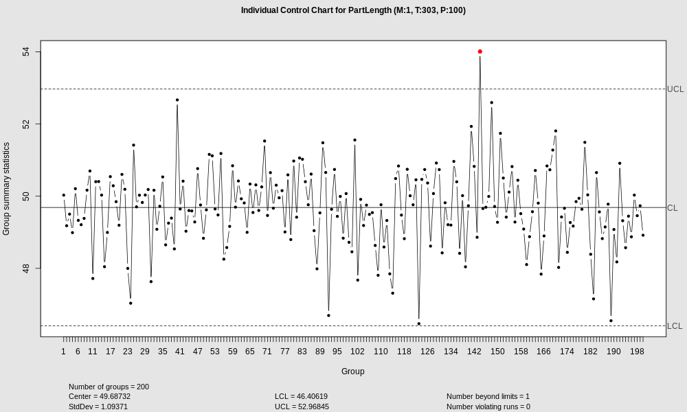
  The individual control chart assesses the stability of the process for PartLength under these conditions. Points outside control limits (red lines) indicate special cause variation.

  #### Process Capability
  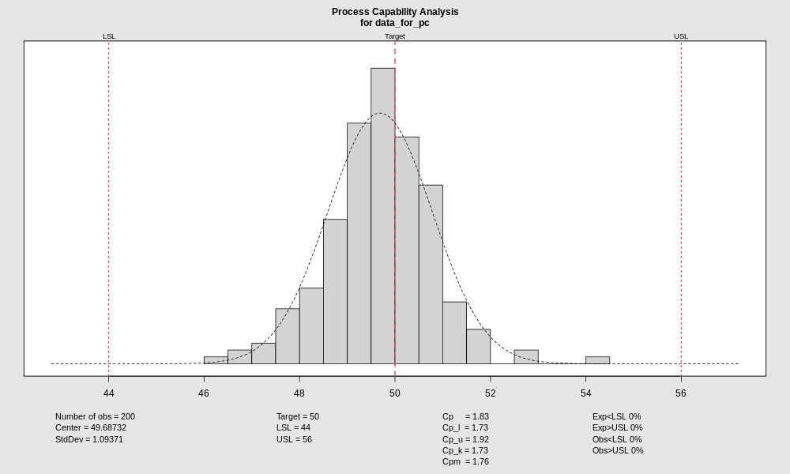
  This plot shows how well the process output for PartLength meets specification limits. Cp (Process Potential) and Cpk (Process Performance) values indicate the capability.
   
  **Note:** Specification Limits (LSL, USL, Target) are assumed for demonstration. For accurate analysis, replace them with actual engineering specifications.

---
### PartLength Analysis for Machine 1 at 303 K, 200 kPa

  #### Individual Control Chart
  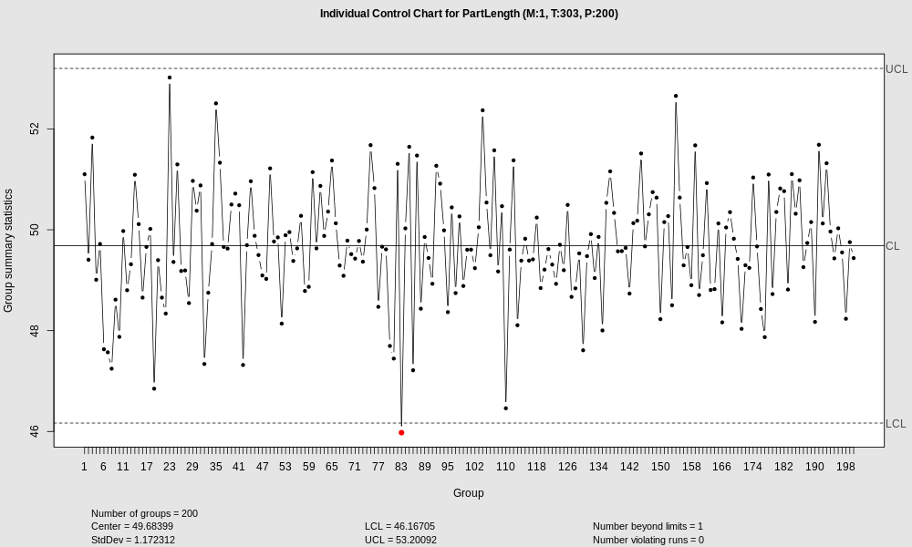
  The individual control chart assesses the stability of the process for PartLength under these conditions. Points outside control limits (red lines) indicate special cause variation.

  #### Process Capability
  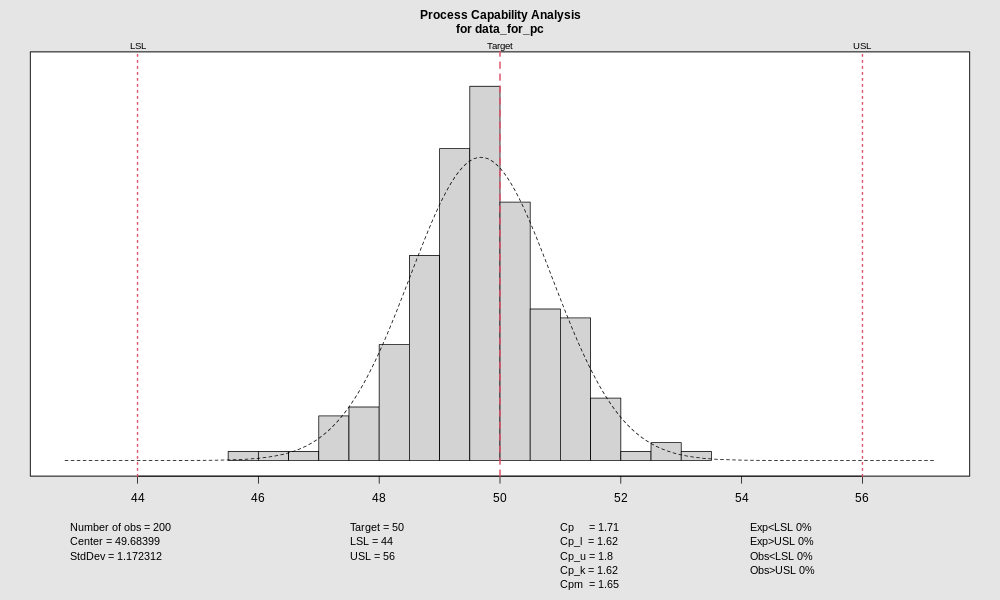
  This plot shows how well the process output for PartLength meets specification limits. Cp (Process Potential) and Cpk (Process Performance) values indicate the capability.
   
  **Note:** Specification Limits (LSL, USL, Target) are assumed for demonstration. For accurate analysis, replace them with actual engineering specifications.

---
### PartLength Analysis for Machine 1 at 303 K, 300 kPa

  #### Individual Control Chart
  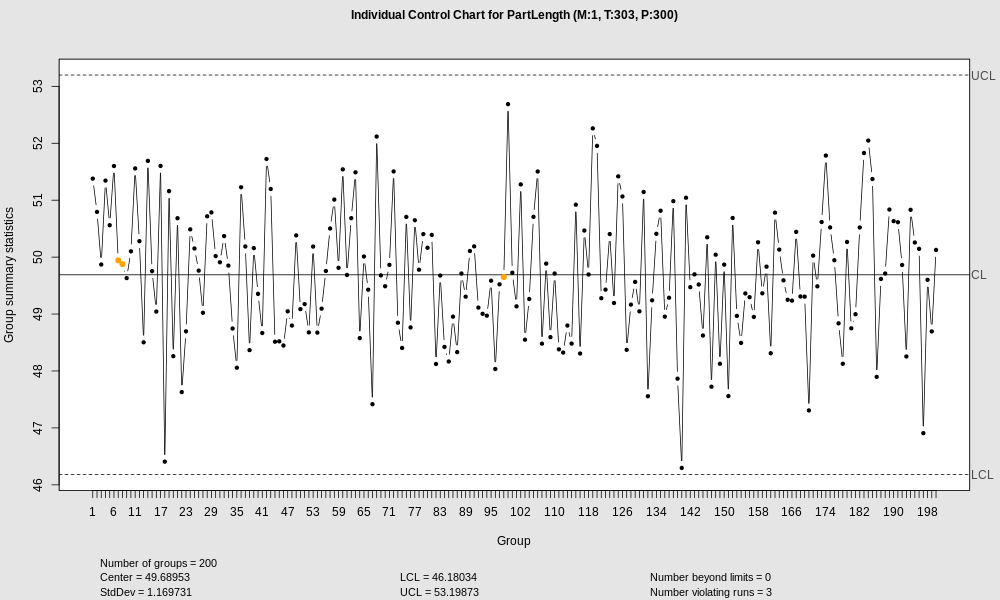
  The individual control chart assesses the stability of the process for PartLength under these conditions. Points outside control limits (red lines) indicate special cause variation.

  #### Process Capability
  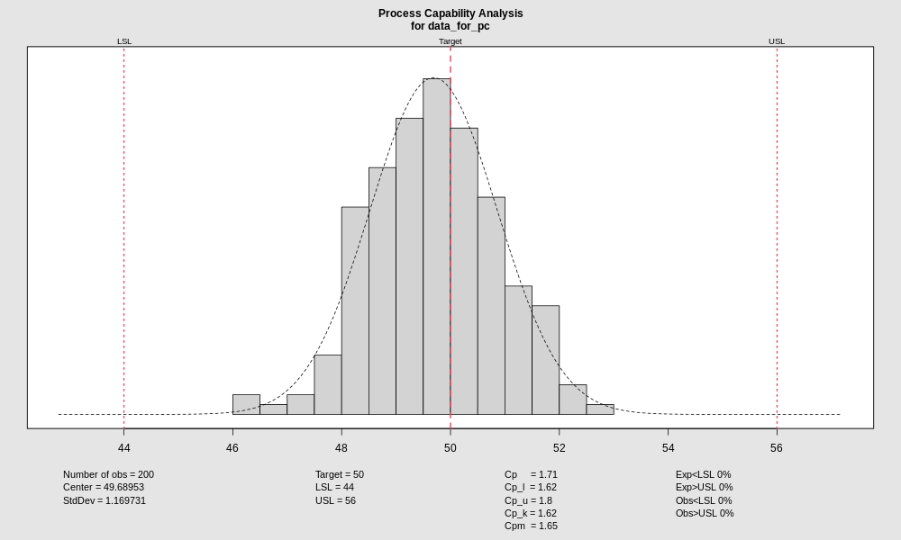
  This plot shows how well the process output for PartLength meets specification limits. Cp (Process Potential) and Cpk (Process Performance) values indicate the capability.
   
  **Note:** Specification Limits (LSL, USL, Target) are assumed for demonstration. For accurate analysis, replace them with actual engineering specifications.

---
### PartLength Analysis for Machine 1 at 338 K, 100 kPa

  #### Individual Control Chart
  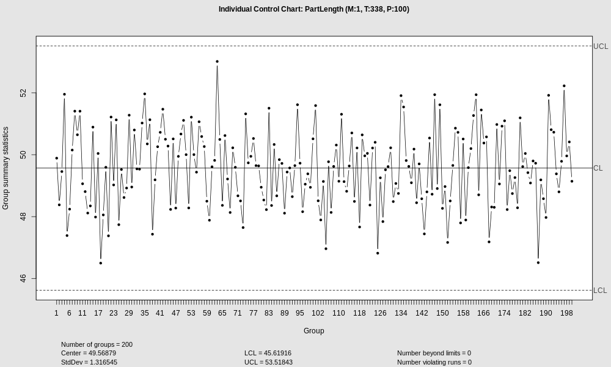
  The individual control chart assesses the stability of the process for PartLength under these conditions. Points outside control limits (red lines) indicate special cause variation.

  #### Process Capability
  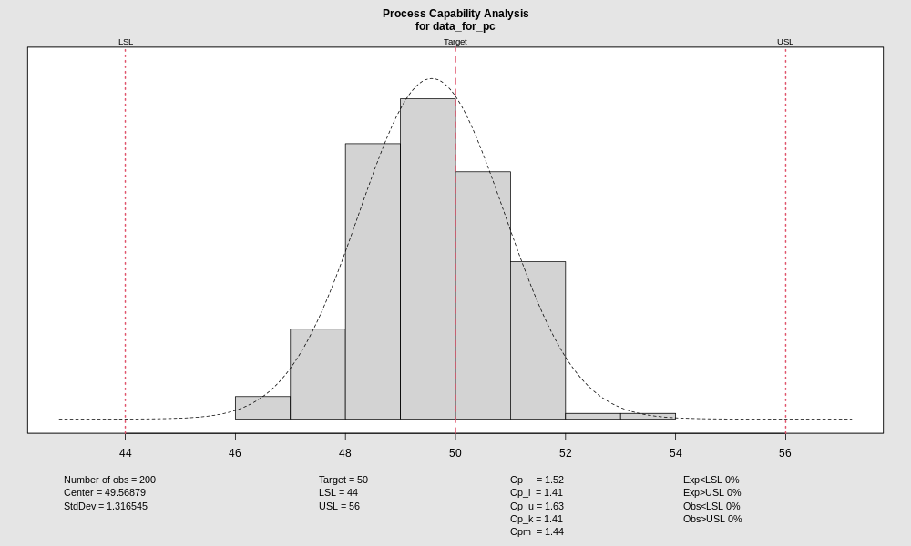
  This plot shows how well the process output for PartLength meets specification limits. Cp (Process Potential) and Cpk (Process Performance) values indicate the capability.
   
  **Note:** Specification Limits (LSL, USL, Target) are assumed for demonstration. For accurate analysis, replace them with actual engineering specifications.

---
### PartLength Analysis for Machine 1 at 338 K, 200 kPa

  #### Individual Control Chart
  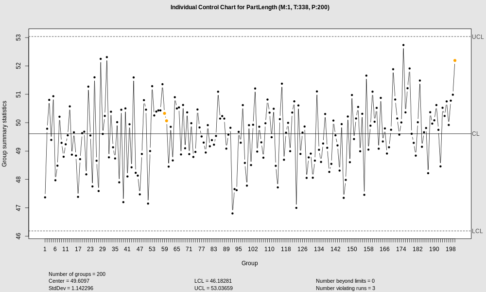
  The individual control chart assesses the stability of the process for PartLength under these conditions. Points outside control limits (red lines) indicate special cause variation.

  #### Process Capability
  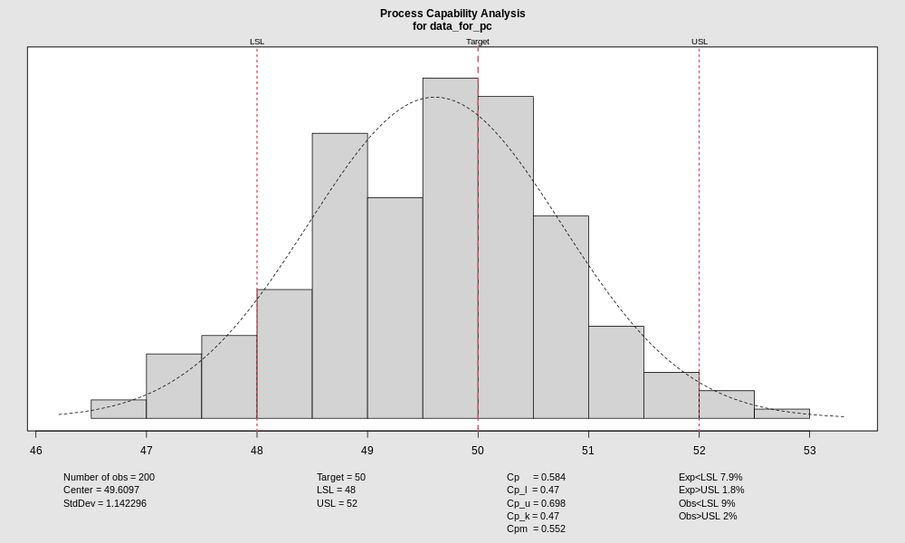
  This plot shows how well the process output for PartLength meets specification limits. Cp (Process Potential) and Cpk (Process Performance) values indicate the capability.
   
  **Note:** Specification Limits (LSL, USL, Target) are assumed for demonstration. For accurate analysis, replace them with actual engineering specifications.

---
### PartLength Analysis for Machine 1 at 338 K, 300 kPa

  #### Individual Control Chart
  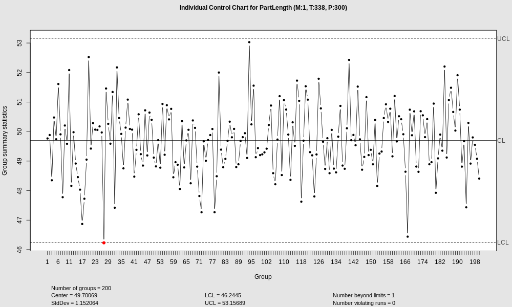
  The individual control chart assesses the stability of the process for PartLength under these conditions. Points outside control limits (red lines) indicate special cause variation.

  #### Process Capability
  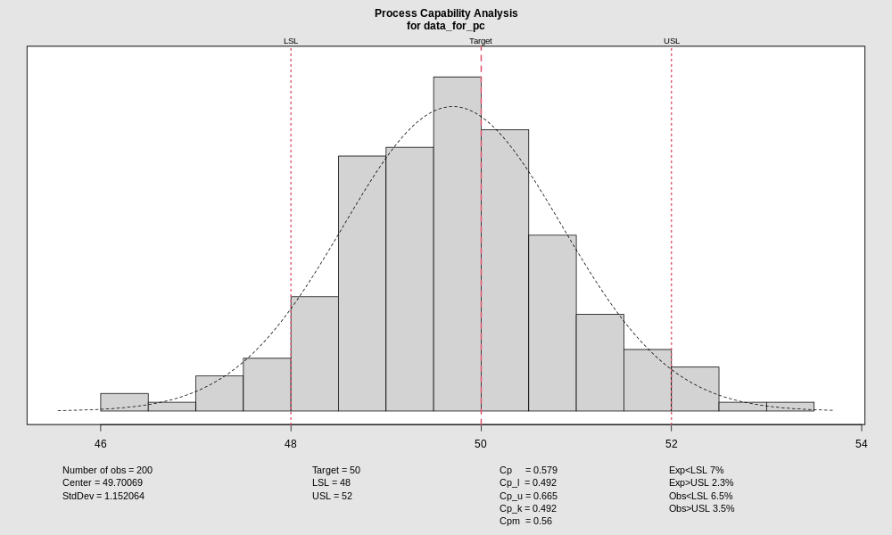
  This plot shows how well the process output for PartLength meets specification limits. Cp (Process Potential) and Cpk (Process Performance) values indicate the capability.
   
  **Note:** Specification Limits (LSL, USL, Target) are assumed for demonstration. For accurate analysis, replace them with actual engineering specifications.

---
### PartLength Analysis for Machine 1 at 373 K, 100 kPa

  #### Individual Control Chart
  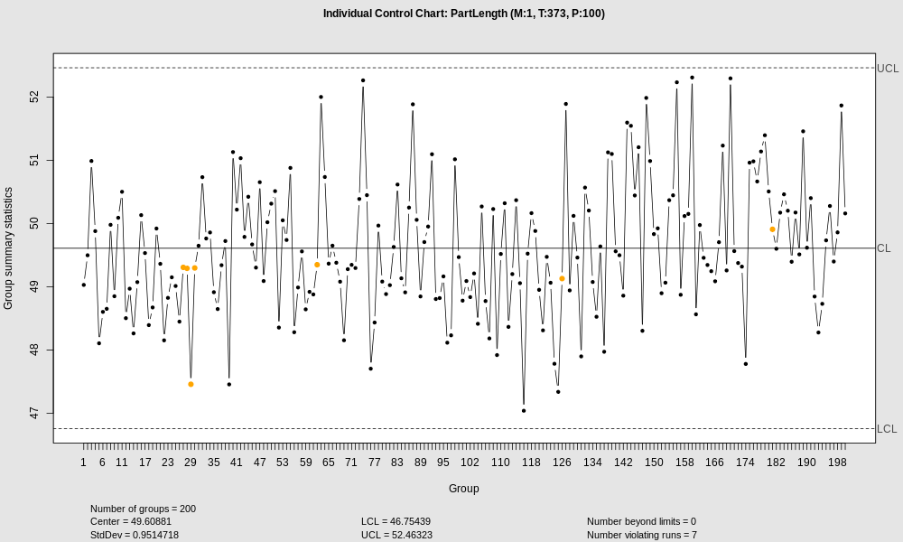
  The individual control chart assesses the stability of the process for PartLength under these conditions. Points outside control limits (red lines) indicate special cause variation.

  #### Process Capability
  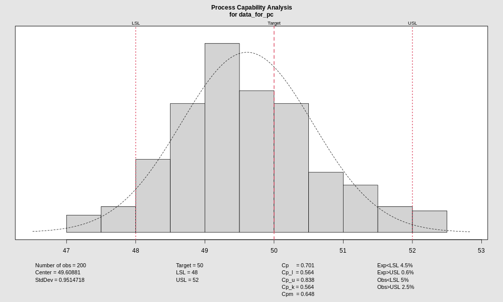
  This plot shows how well the process output for PartLength meets specification limits. Cp (Process Potential) and Cpk (Process Performance) values indicate the capability.
   
  **Note:** Specification Limits (LSL, USL, Target) are assumed for demonstration. For accurate analysis, replace them with actual engineering specifications.

---
### PartLength Analysis for Machine 1 at 373 K, 200 kPa

  #### Individual Control Chart
  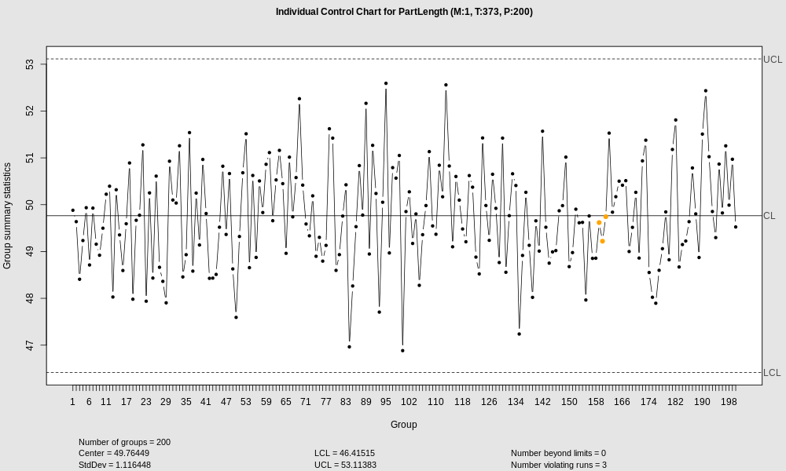
  The individual control chart assesses the stability of the process for PartLength under these conditions. Points outside control limits (red lines) indicate special cause variation.

  #### Process Capability
  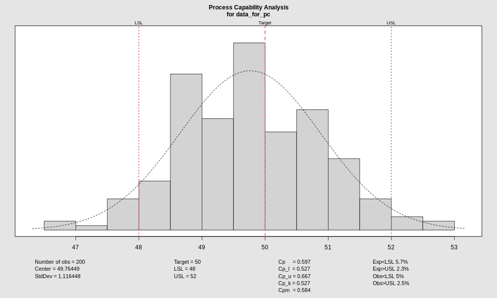
  This plot shows how well the process output for PartLength meets specification limits. Cp (Process Potential) and Cpk (Process Performance) values indicate the capability.
   
  **Note:** Specification Limits (LSL, USL, Target) are assumed for demonstration. For accurate analysis, replace them with actual engineering specifications.

---
### PartLength Analysis for Machine 1 at 373 K, 300 kPa

  #### Individual Control Chart
  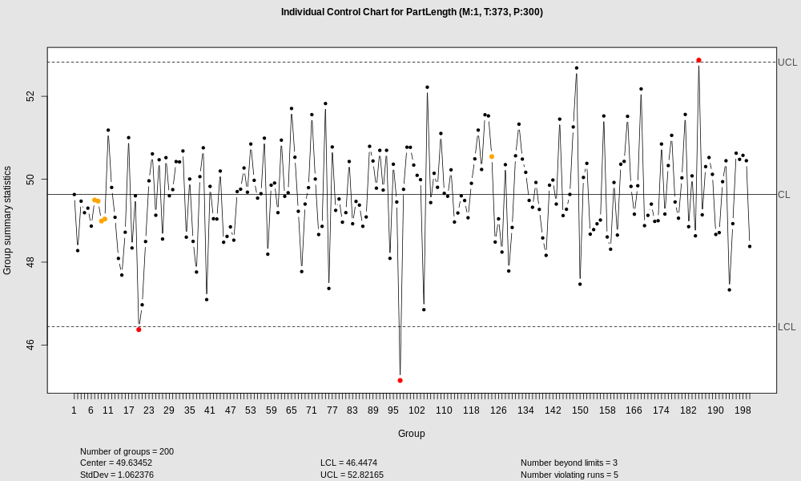
  The individual control chart assesses the stability of the process for PartLength under these conditions. Points outside control limits (red lines) indicate special cause variation.

  #### Process Capability
  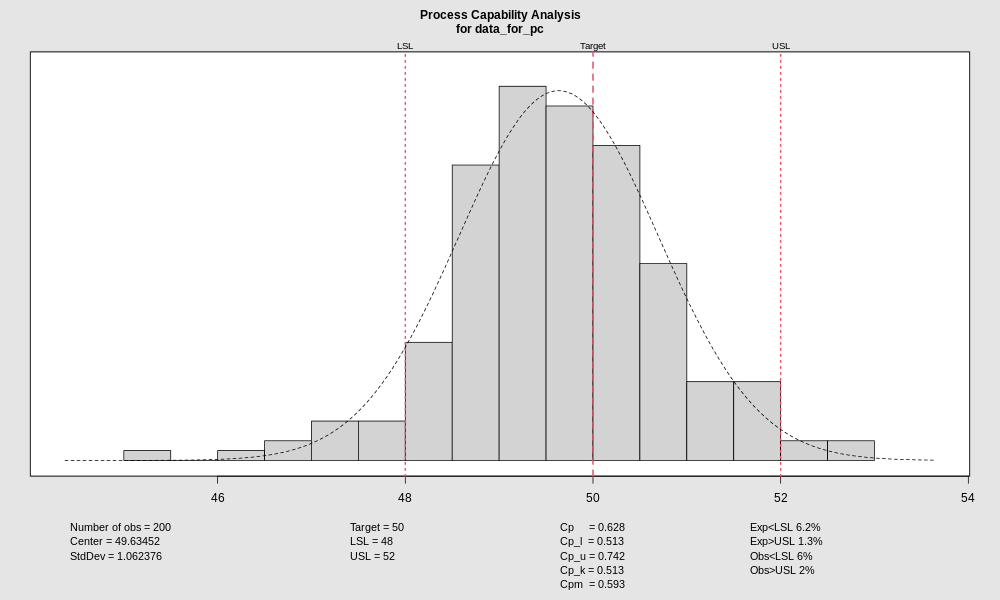
  This plot shows how well the process output for PartLength meets specification limits. Cp (Process Potential) and Cpk (Process Performance) values indicate the capability.
   
  **Note:** Specification Limits (LSL, USL, Target) are assumed for demonstration. For accurate analysis, replace them with actual engineering specifications.

---
### PartLength Analysis for Machine 2 at 303 K, 100 kPa

  #### Individual Control Chart
  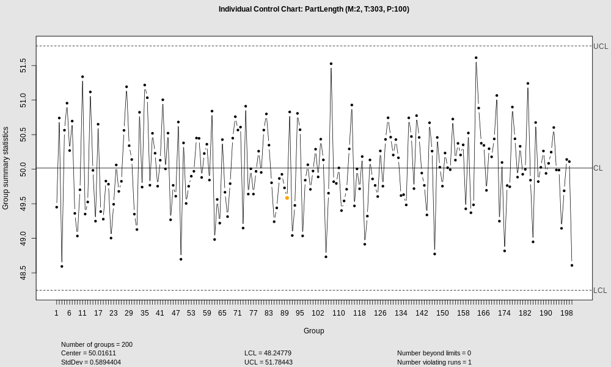
  The individual control chart assesses the stability of the process for PartLength under these conditions. Points outside control limits (red lines) indicate special cause variation.

  #### Process Capability
  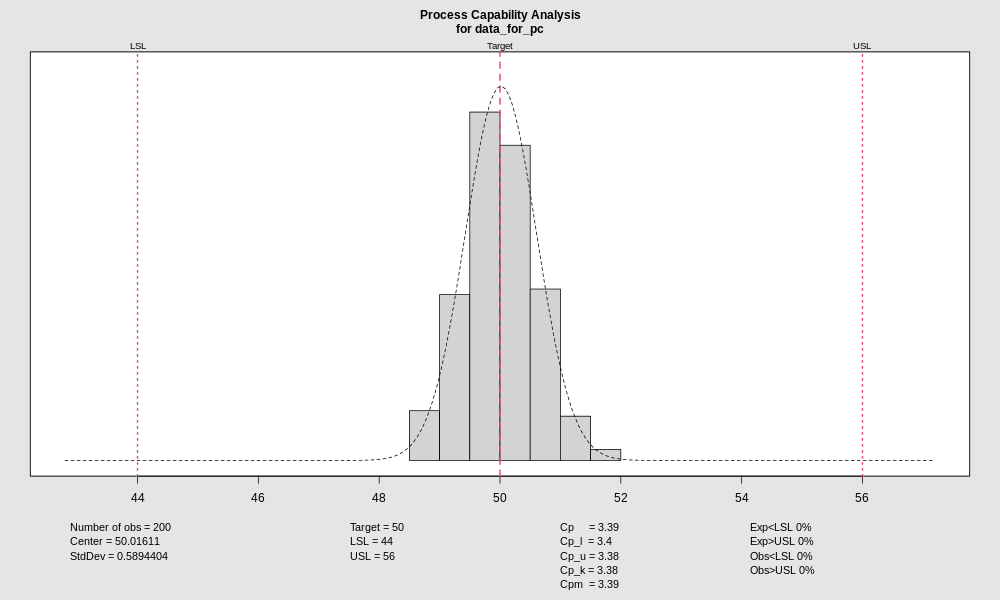
  This plot shows how well the process output for PartLength meets specification limits. Cp (Process Potential) and Cpk (Process Performance) values indicate the capability.
   
  **Note:** Specification Limits (LSL, USL, Target) are assumed for demonstration. For accurate analysis, replace them with actual engineering specifications.

---
### PartLength Analysis for Machine 2 at 303 K, 200 kPa

  #### Individual Control Chart
  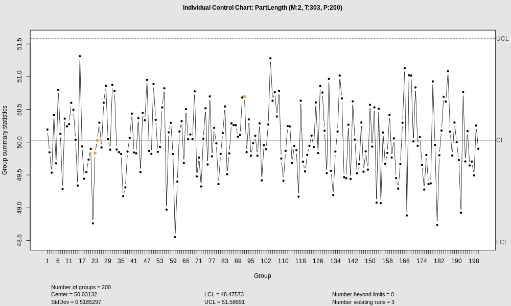
  The individual control chart assesses the stability of the process for PartLength under these conditions. Points outside control limits (red lines) indicate special cause variation.

  #### Process Capability
  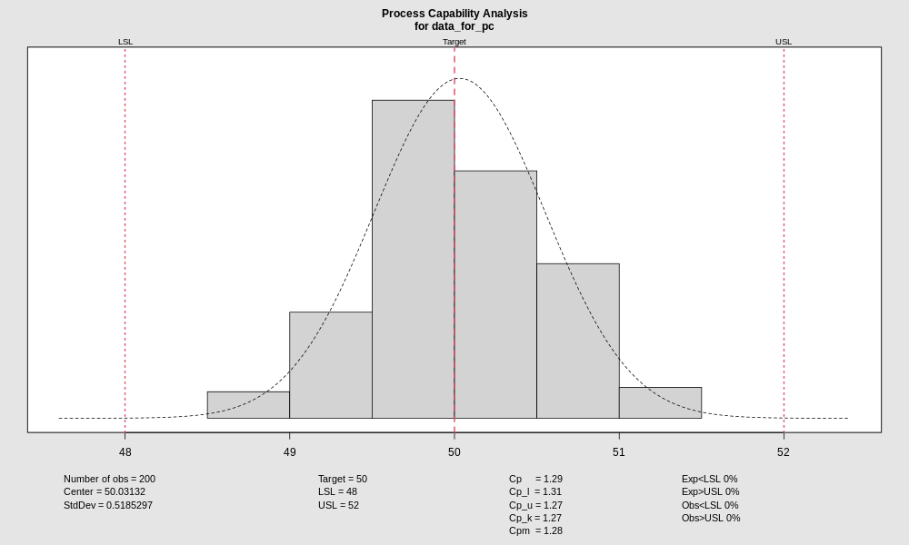
  This plot shows how well the process output for PartLength meets specification limits. Cp (Process Potential) and Cpk (Process Performance) values indicate the capability.
   
  **Note:** Specification Limits (LSL, USL, Target) are assumed for demonstration. For accurate analysis, replace them with actual engineering specifications.

---
### PartLength Analysis for Machine 2 at 303 K, 300 kPa

  #### Individual Control Chart
  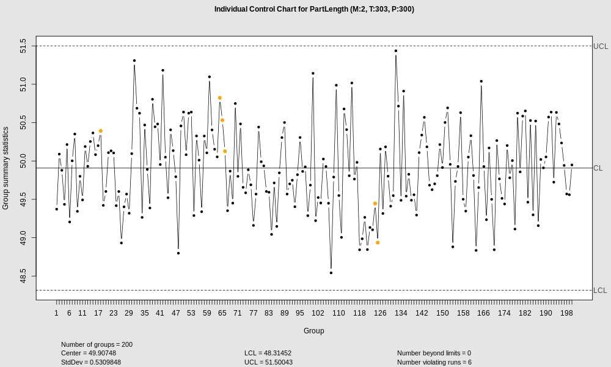
  The individual control chart assesses the stability of the process for PartLength under these conditions. Points outside control limits (red lines) indicate special cause variation.

  #### Process Capability
  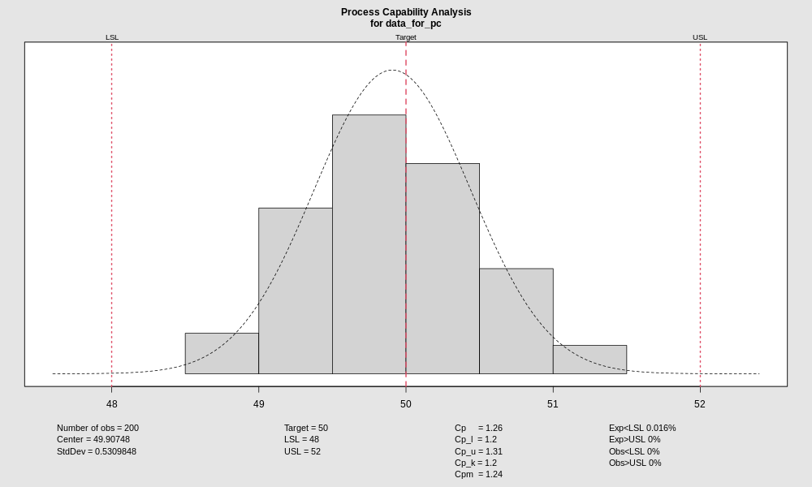
  This plot shows how well the process output for PartLength meets specification limits. Cp (Process Potential) and Cpk (Process Performance) values indicate the capability.
   
  **Note:** Specification Limits (LSL, USL, Target) are assumed for demonstration. For accurate analysis, replace them with actual engineering specifications.

---
### PartLength Analysis for Machine 2 at 338 K, 100 kPa

  #### Individual Control Chart
  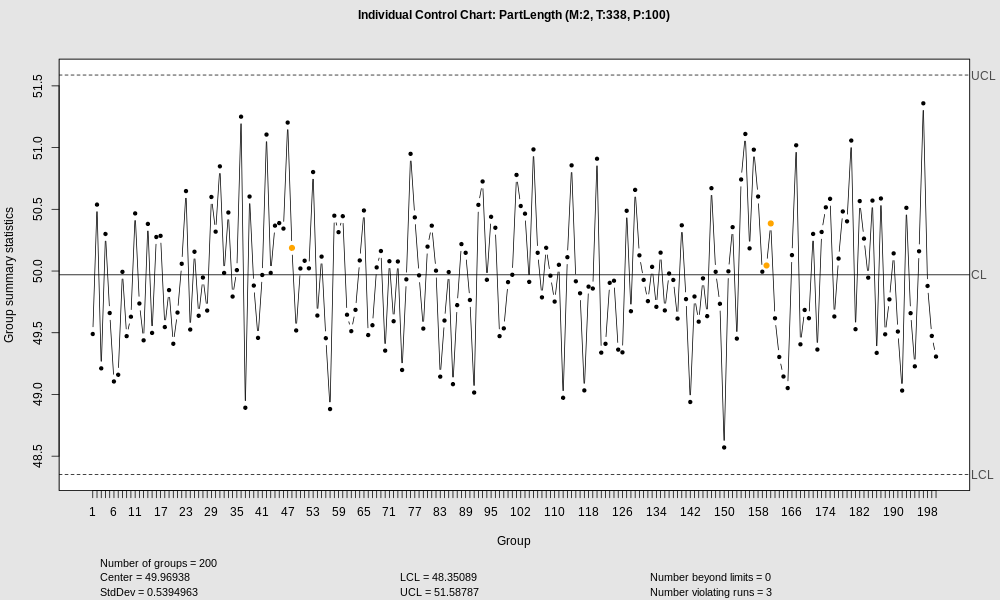
  The individual control chart assesses the stability of the process for PartLength under these conditions. Points outside control limits (red lines) indicate special cause variation.

  #### Process Capability
  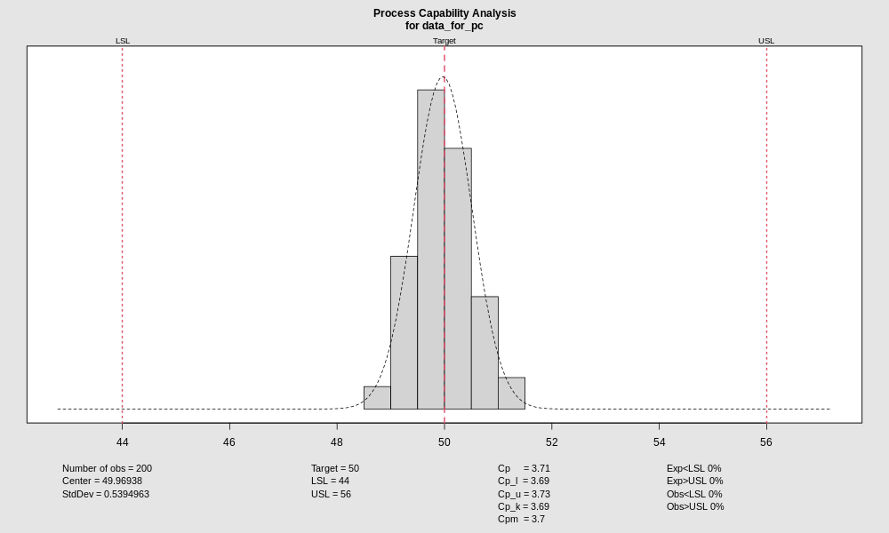
  This plot shows how well the process output for PartLength meets specification limits. Cp (Process Potential) and Cpk (Process Performance) values indicate the capability.
   
  **Note:** Specification Limits (LSL, USL, Target) are assumed for demonstration. For accurate analysis, replace them with actual engineering specifications.

---
### PartLength Analysis for Machine 2 at 338 K, 200 kPa

  #### Individual Control Chart
  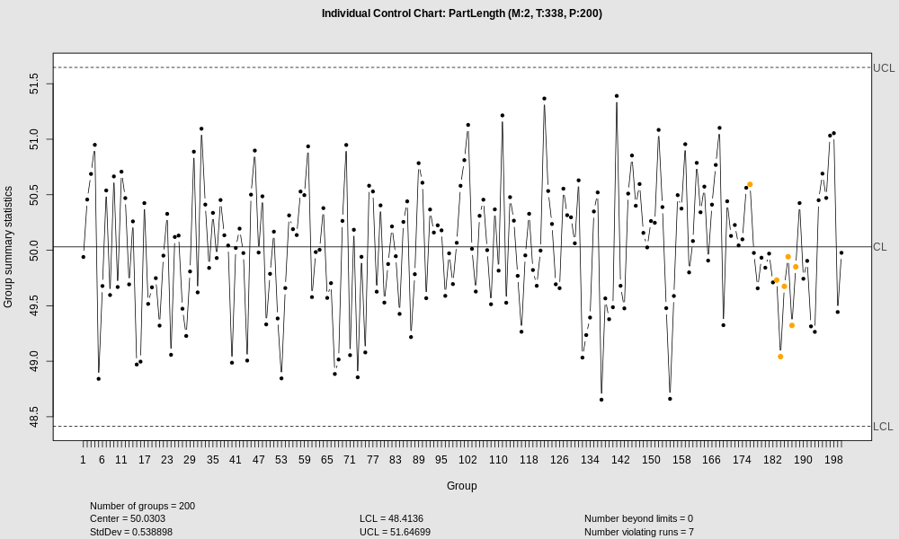
  The individual control chart assesses the stability of the process for PartLength under these conditions. Points outside control limits (red lines) indicate special cause variation.

  #### Process Capability
  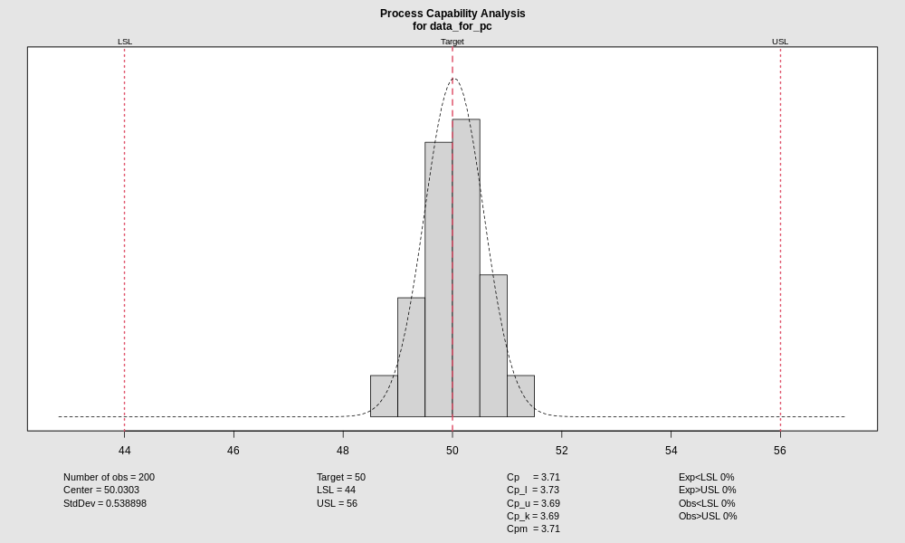
  This plot shows how well the process output for PartLength meets specification limits. Cp (Process Potential) and Cpk (Process Performance) values indicate the capability.
   
  **Note:** Specification Limits (LSL, USL, Target) are assumed for demonstration. For accurate analysis, replace them with actual engineering specifications.

---
### PartLength Analysis for Machine 2 at 338 K, 300 kPa

  #### Individual Control Chart
  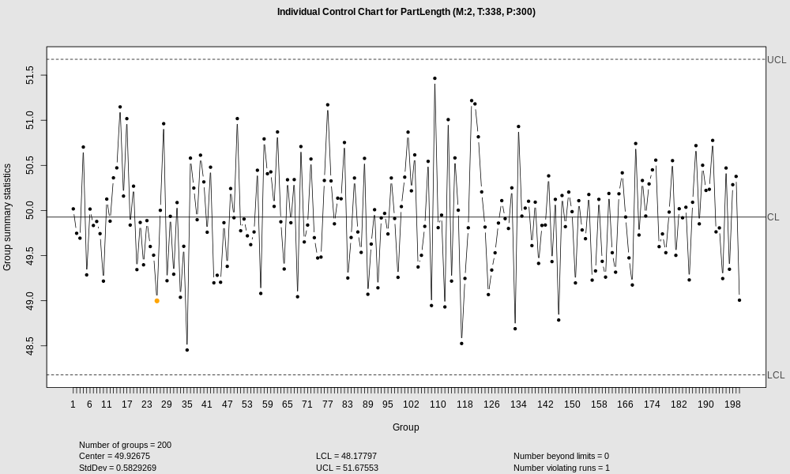
  The individual control chart assesses the stability of the process for PartLength under these conditions. Points outside control limits (red lines) indicate special cause variation.

  #### Process Capability
  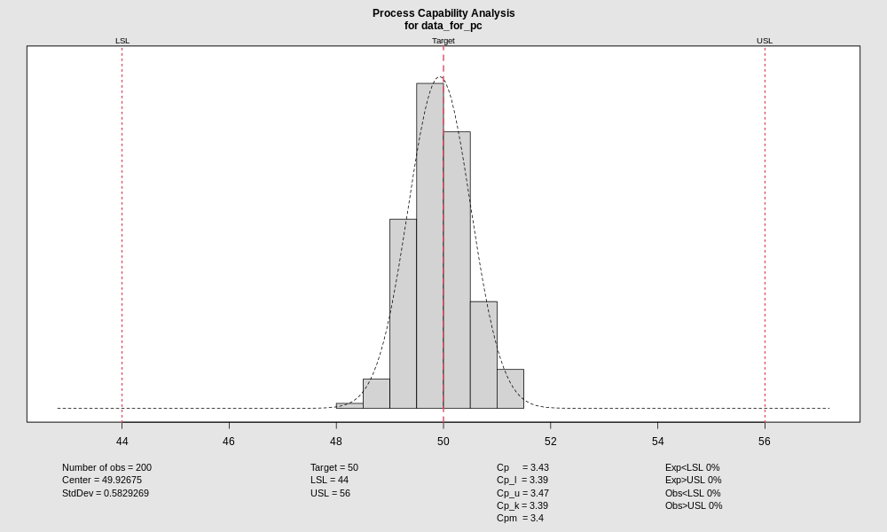
  This plot shows how well the process output for PartLength meets specification limits. Cp (Process Potential) and Cpk (Process Performance) values indicate the capability.
   
  **Note:** Specification Limits (LSL, USL, Target) are assumed for demonstration. For accurate analysis, replace them with actual engineering specifications.

---
### PartLength Analysis for Machine 2 at 373 K, 100 kPa

  #### Individual Control Chart
  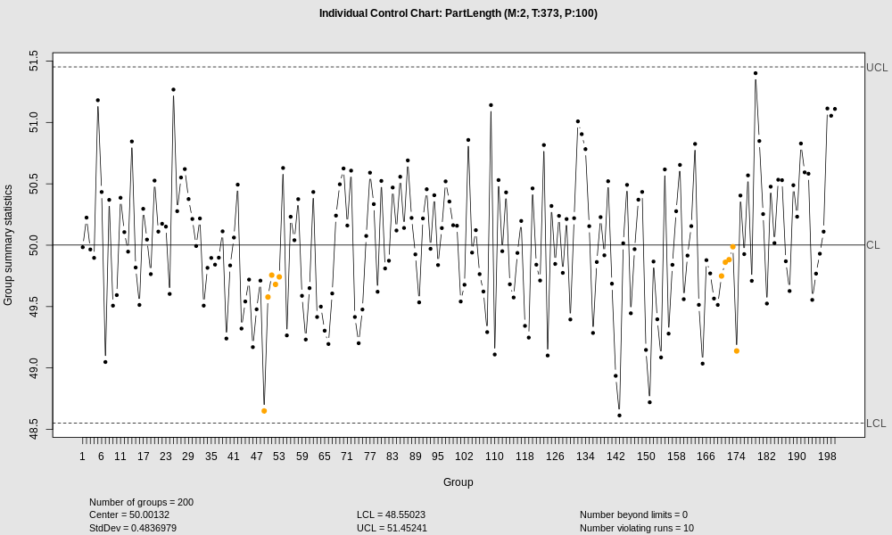
  The individual control chart assesses the stability of the process for PartLength under these conditions. Points outside control limits (red lines) indicate special cause variation.

  #### Process Capability
  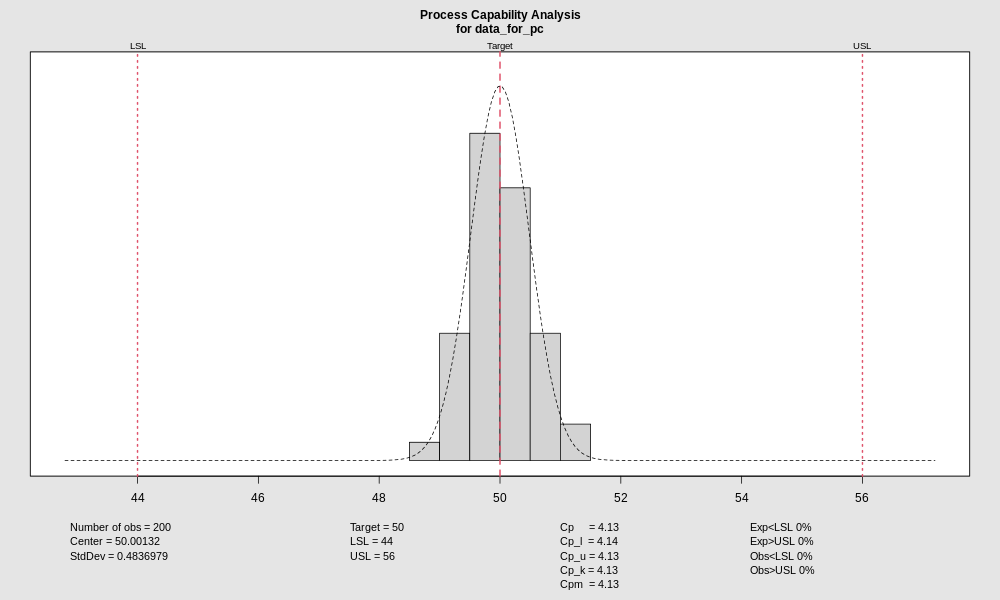
  This plot shows how well the process output for PartLength meets specification limits. Cp (Process Potential) and Cpk (Process Performance) values indicate the capability.
   
  **Note:** Specification Limits (LSL, USL, Target) are assumed for demonstration. For accurate analysis, replace them with actual engineering specifications.

---
### PartLength Analysis for Machine 2 at 373 K, 200 kPa

  #### Individual Control Chart
  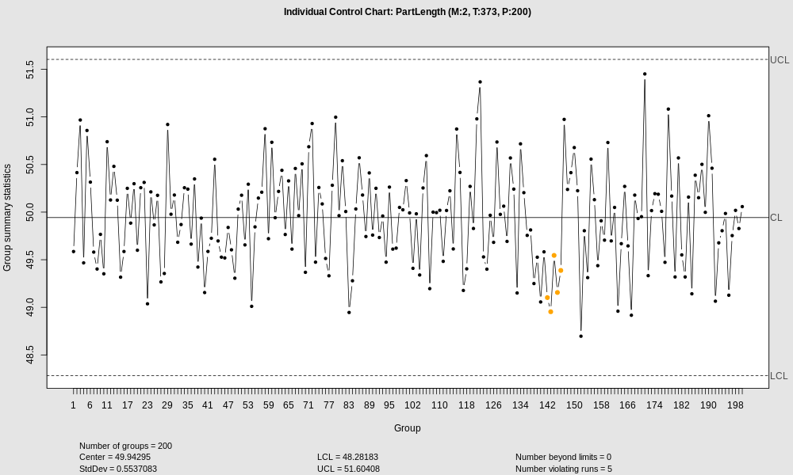
  The individual control chart assesses the stability of the process for PartLength under these conditions. Points outside control limits (red lines) indicate special cause variation.

  #### Process Capability
  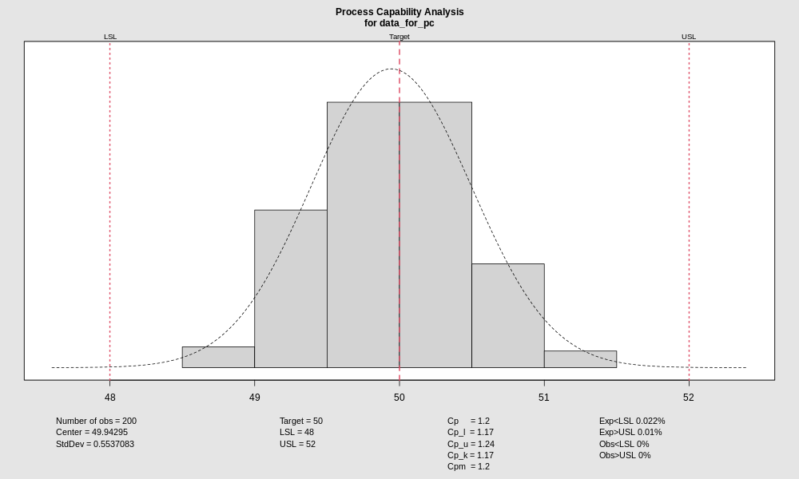
  This plot shows how well the process output for PartLength meets specification limits. Cp (Process Potential) and Cpk (Process Performance) values indicate the capability.
   
  **Note:** Specification Limits (LSL, USL, Target) are assumed for demonstration. For accurate analysis, replace them with actual engineering specifications.

---
### PartLength Analysis for Machine 2 at 373 K, 300 kPa

  #### Individual Control Chart
  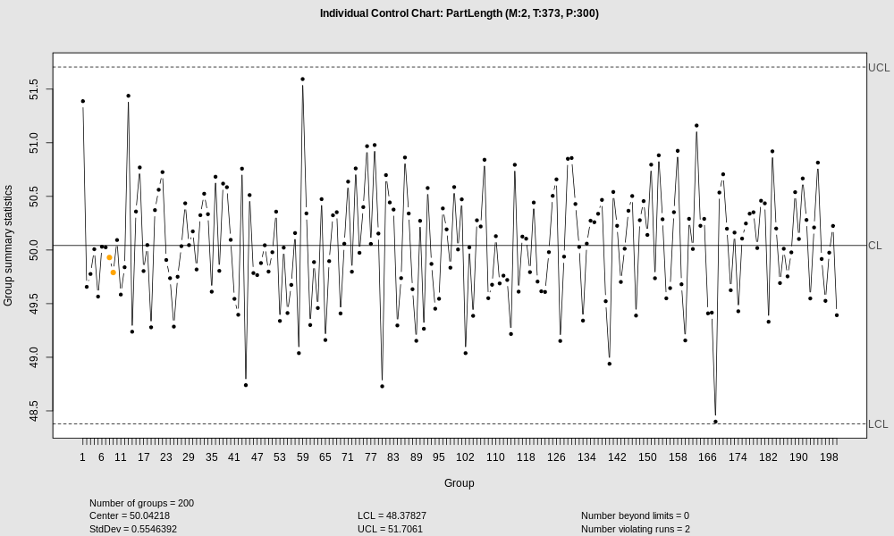
  The individual control chart assesses the stability of the process for PartLength under these conditions. Points outside control limits (red lines) indicate special cause variation.

  #### Process Capability
  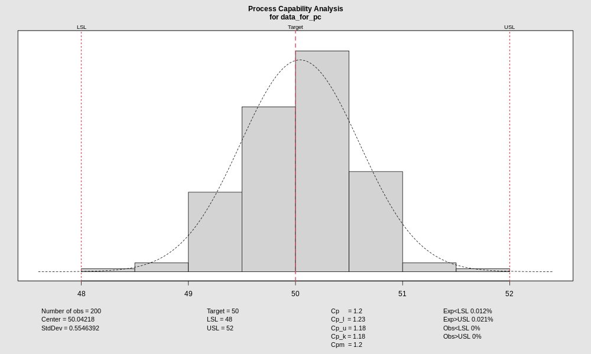
  This plot shows how well the process output for PartLength meets specification limits. Cp (Process Potential) and Cpk (Process Performance) values indicate the capability.
   
  **Note:** Specification Limits (LSL, USL, Target) are assumed for demonstration. For accurate analysis, replace them with actual engineering specifications.

---
### PartLength Analysis for Machine 3 at 303 K, 100 kPa

  #### Individual Control Chart
  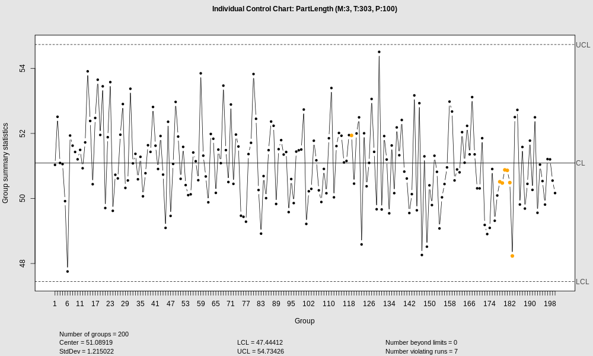
  The individual control chart assesses the stability of the process for PartLength under these conditions. Points outside control limits (red lines) indicate special cause variation.

  #### Process Capability
  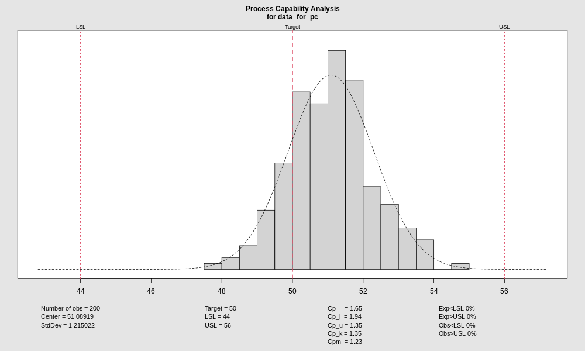
  This plot shows how well the process output for PartLength meets specification limits. Cp (Process Potential) and Cpk (Process Performance) values indicate the capability.
   
  **Note:** Specification Limits (LSL, USL, Target) are assumed for demonstration. For accurate analysis, replace them with actual engineering specifications.

---
### PartLength Analysis for Machine 3 at 303 K, 200 kPa

  #### Individual Control Chart
  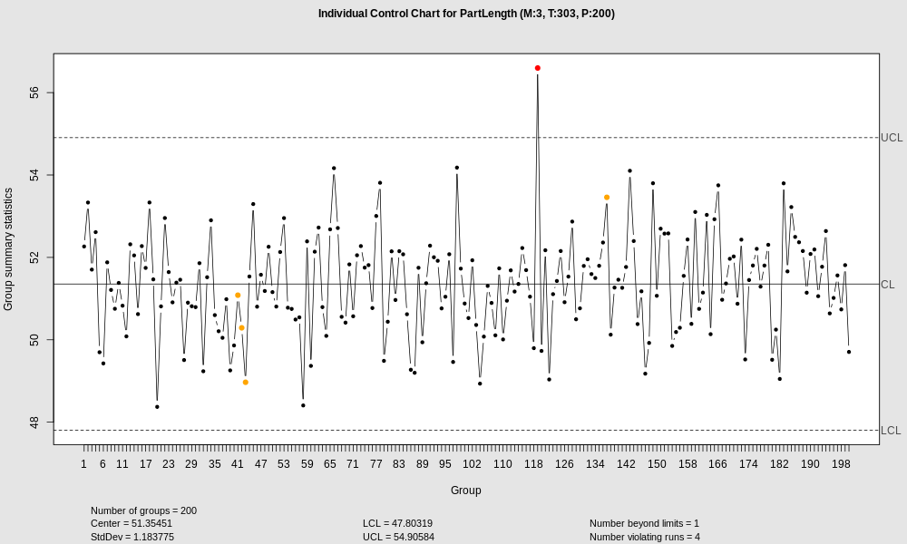
  The individual control chart assesses the stability of the process for PartLength under these conditions. Points outside control limits (red lines) indicate special cause variation.

  #### Process Capability
  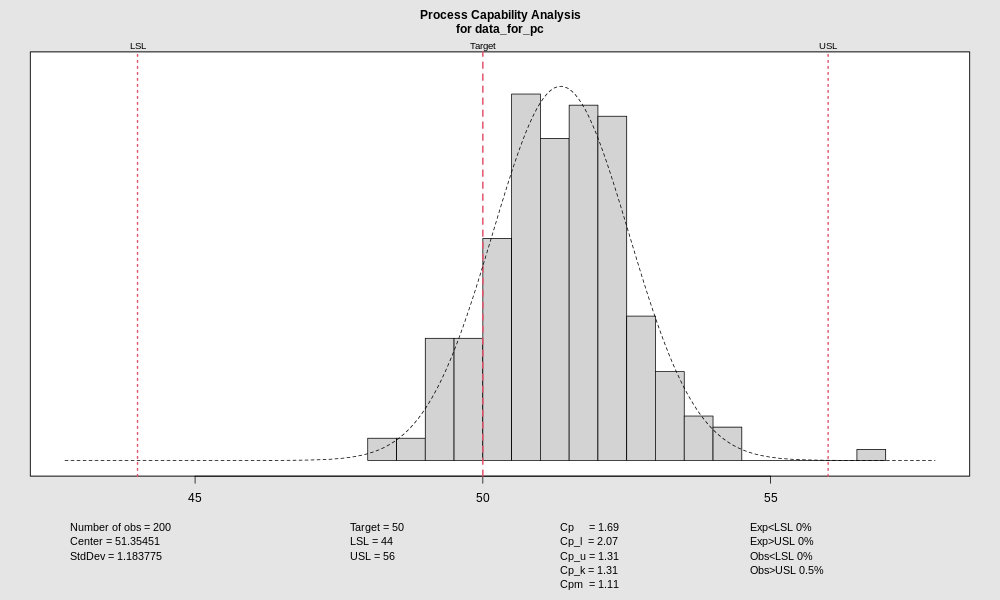
  This plot shows how well the process output for PartLength meets specification limits. Cp (Process Potential) and Cpk (Process Performance) values indicate the capability.
   
  **Note:** Specification Limits (LSL, USL, Target) are assumed for demonstration. For accurate analysis, replace them with actual engineering specifications.

---
### PartLength Analysis for Machine 3 at 303 K, 300 kPa

  #### Individual Control Chart
  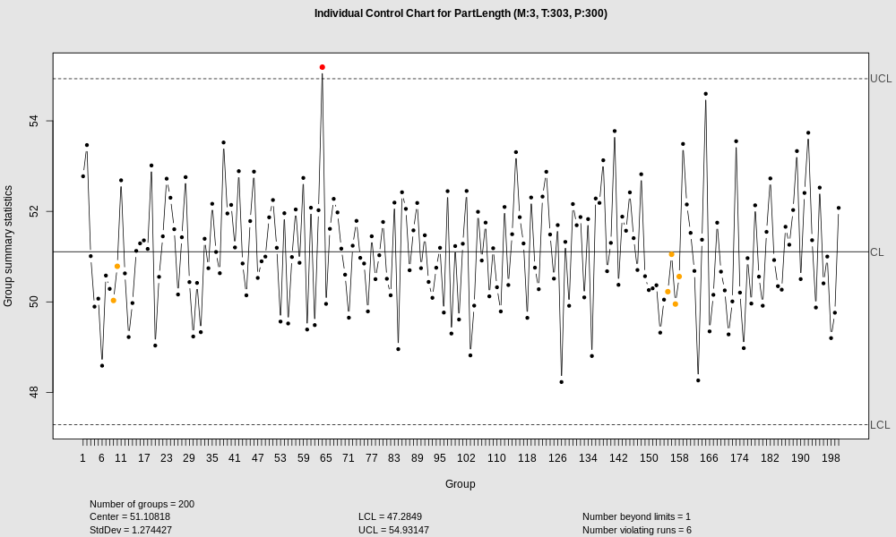
  The individual control chart assesses the stability of the process for PartLength under these conditions. Points outside control limits (red lines) indicate special cause variation.

  #### Process Capability
  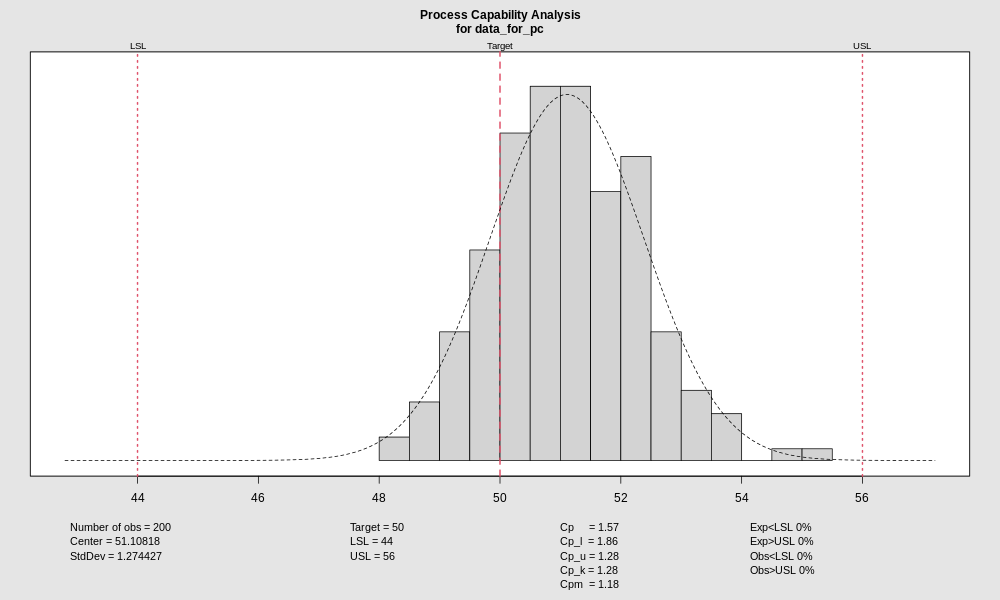
  This plot shows how well the process output for PartLength meets specification limits. Cp (Process Potential) and Cpk (Process Performance) values indicate the capability.
   
  **Note:** Specification Limits (LSL, USL, Target) are assumed for demonstration. For accurate analysis, replace them with actual engineering specifications.

---
### PartLength Analysis for Machine 3 at 338 K, 100 kPa

  #### Individual Control Chart
  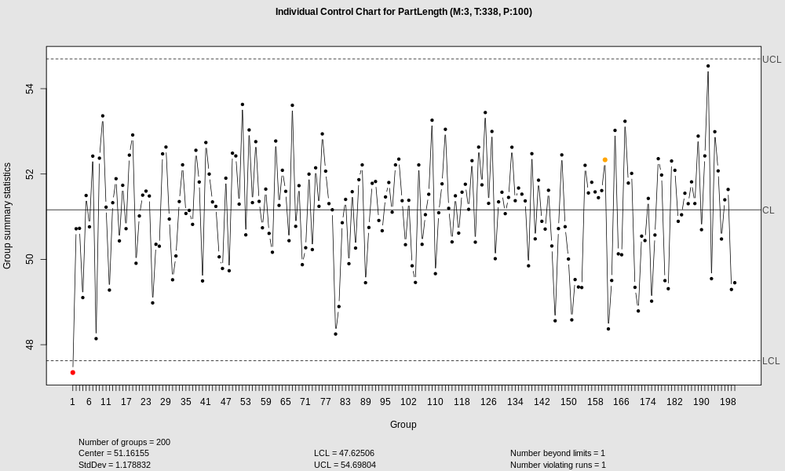
  The individual control chart assesses the stability of the process for PartLength under these conditions. Points outside control limits (red lines) indicate special cause variation.

  #### Process Capability
  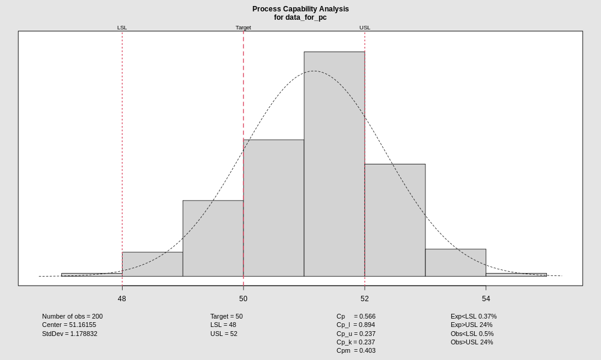
  This plot shows how well the process output for PartLength meets specification limits. Cp (Process Potential) and Cpk (Process Performance) values indicate the capability.
   
  **Note:** Specification Limits (LSL, USL, Target) are assumed for demonstration. For accurate analysis, replace them with actual engineering specifications.

---
### PartLength Analysis for Machine 3 at 338 K, 200 kPa

  #### Individual Control Chart
  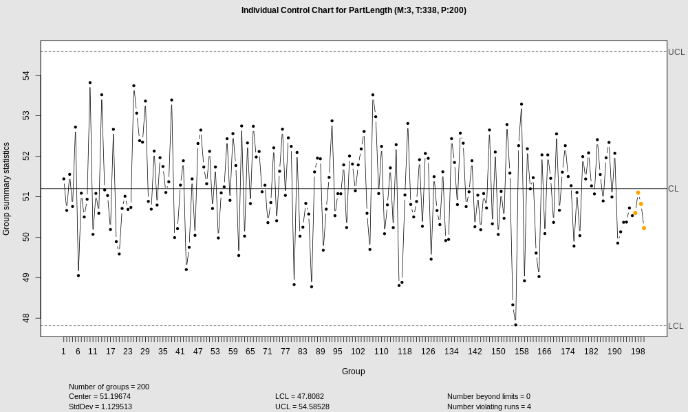
  The individual control chart assesses the stability of the process for PartLength under these conditions. Points outside control limits (red lines) indicate special cause variation.

  #### Process Capability
  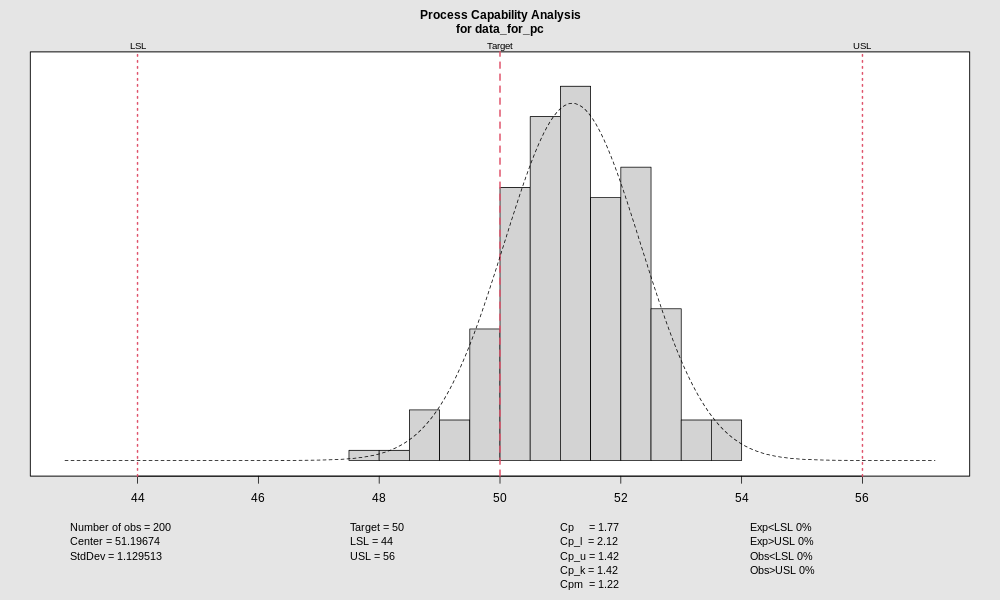
  This plot shows how well the process output for PartLength meets specification limits. Cp (Process Potential) and Cpk (Process Performance) values indicate the capability.
   
  **Note:** Specification Limits (LSL, USL, Target) are assumed for demonstration. For accurate analysis, replace them with actual engineering specifications.

---
### PartLength Analysis for Machine 3 at 338 K, 300 kPa

  #### Individual Control Chart
  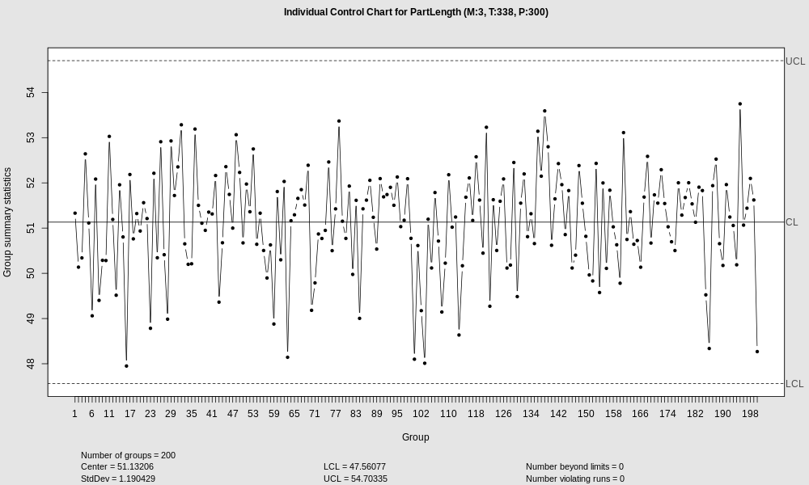
  The individual control chart assesses the stability of the process for PartLength under these conditions. Points outside control limits (red lines) indicate special cause variation.

  #### Process Capability
  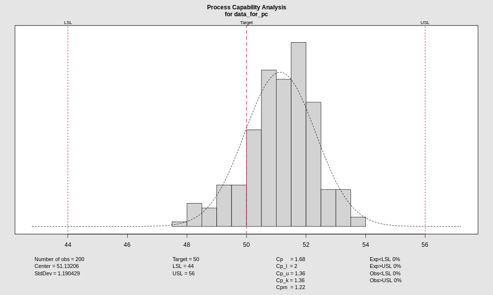
  This plot shows how well the process output for PartLength meets specification limits. Cp (Process Potential) and Cpk (Process Performance) values indicate the capability.
   
  **Note:** Specification Limits (LSL, USL, Target) are assumed for demonstration. For accurate analysis, replace them with actual engineering specifications.

---
### PartLength Analysis for Machine 3 at 373 K, 100 kPa

  #### Individual Control Chart
  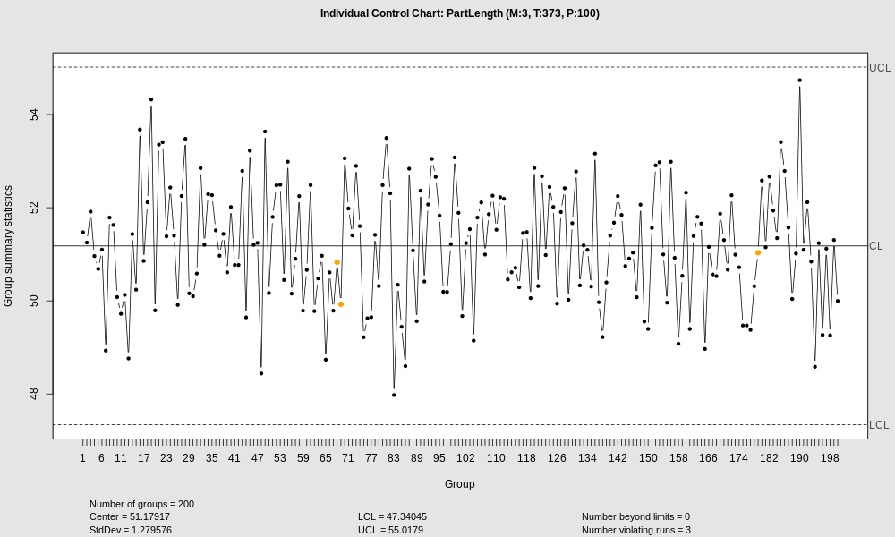
  The individual control chart assesses the stability of the process for PartLength under these conditions. Points outside control limits (red lines) indicate special cause variation.

  #### Process Capability
  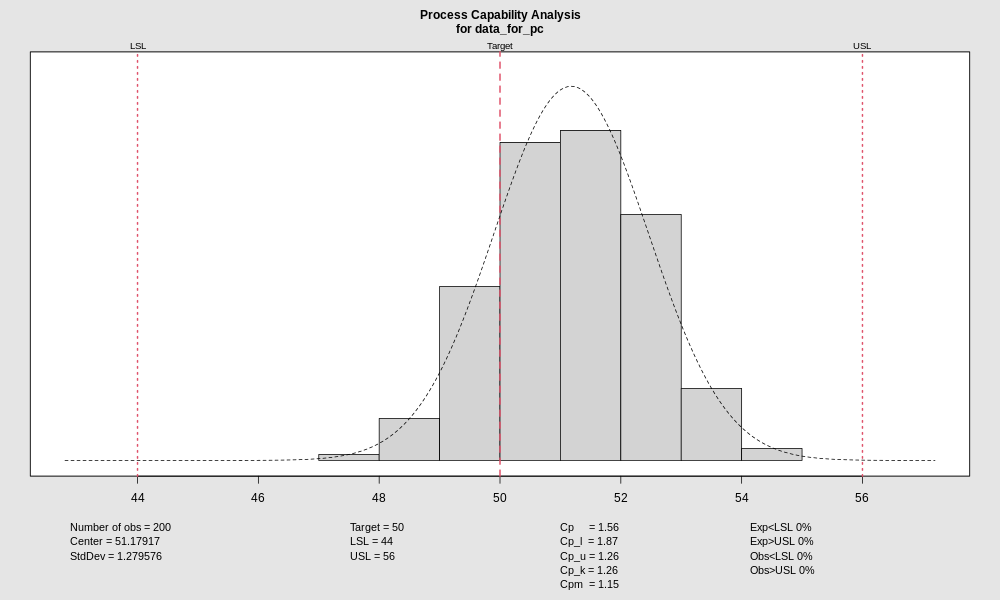
  This plot shows how well the process output for PartLength meets specification limits. Cp (Process Potential) and Cpk (Process Performance) values indicate the capability.
   
  **Note:** Specification Limits (LSL, USL, Target) are assumed for demonstration. For accurate analysis, replace them with actual engineering specifications.

---
### PartLength Analysis for Machine 3 at 373 K, 200 kPa

  #### Individual Control Chart
  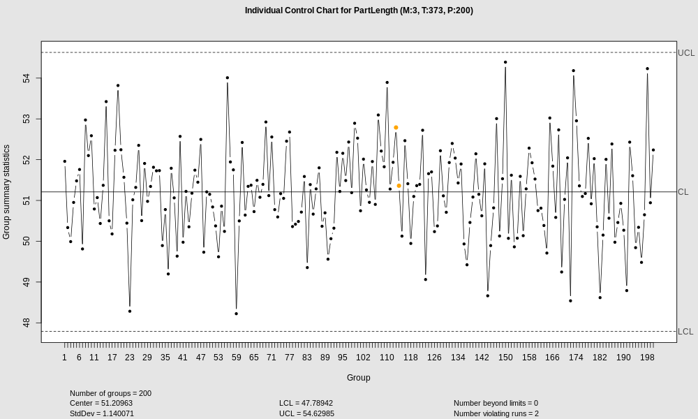
  The individual control chart assesses the stability of the process for PartLength under these conditions. Points outside control limits (red lines) indicate special cause variation.

  #### Process Capability
  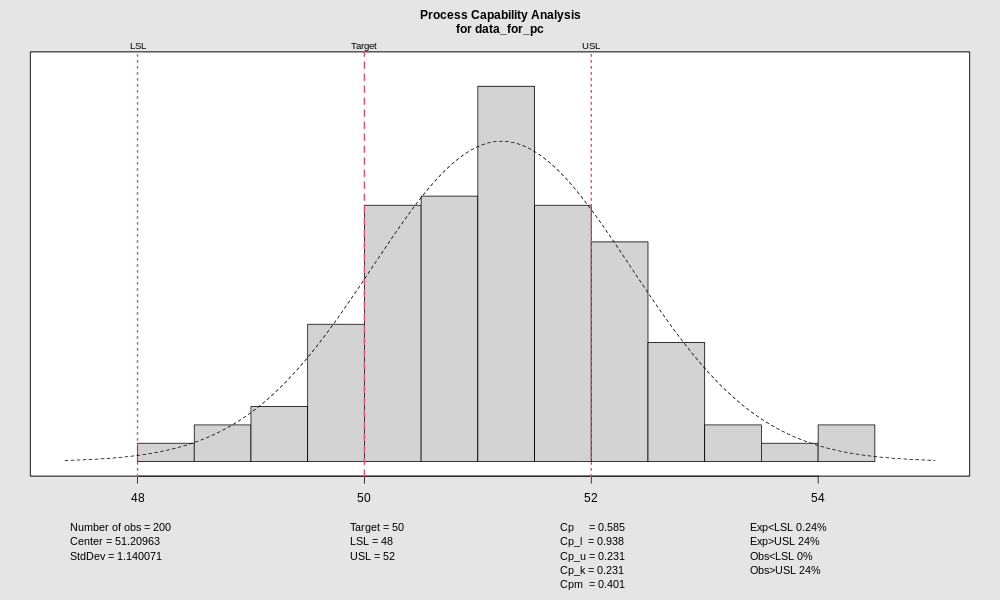
  This plot shows how well the process output for PartLength meets specification limits. Cp (Process Potential) and Cpk (Process Performance) values indicate the capability.
   
  **Note:** Specification Limits (LSL, USL, Target) are assumed for demonstration. For accurate analysis, replace them with actual engineering specifications.

---
### PartLength Analysis for Machine 3 at 373 K, 300 kPa

  #### Individual Control Chart
  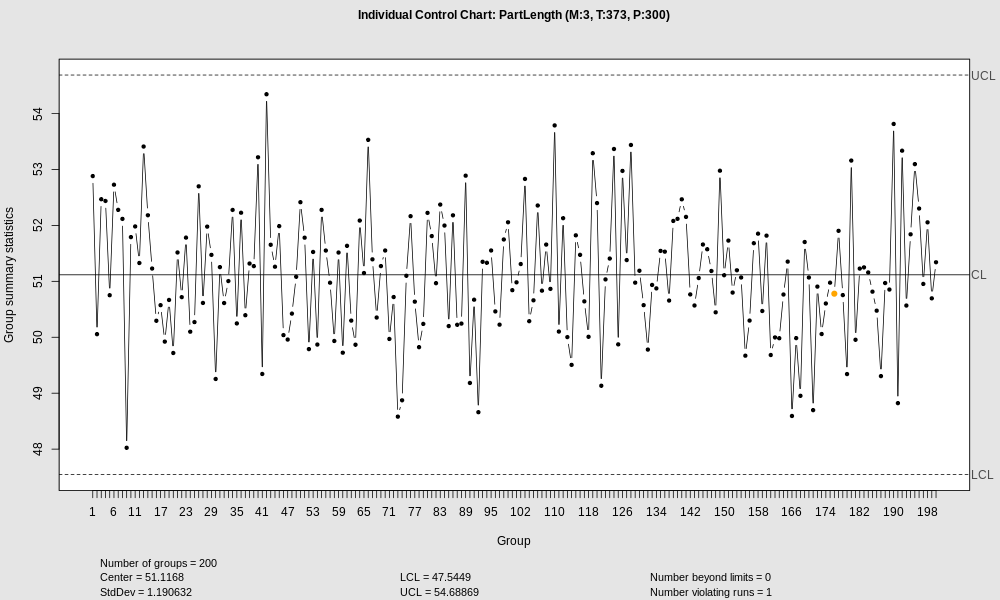
  The individual control chart assesses the stability of the process for PartLength under these conditions. Points outside control limits (red lines) indicate special cause variation.

  #### Process Capability
  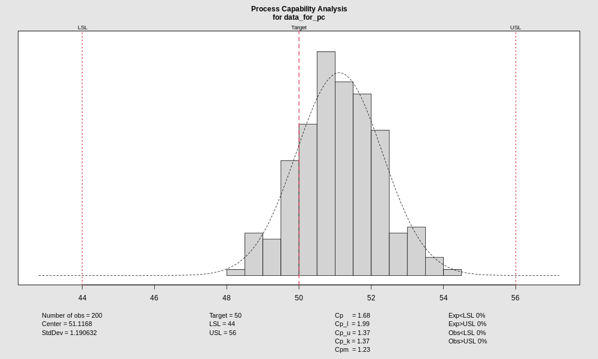
  This plot shows how well the process output for PartLength meets specification limits. Cp (Process Potential) and Cpk (Process Performance) values indicate the capability.
   
  **Note:** Specification Limits (LSL, USL, Target) are assumed for demonstration. For accurate analysis, replace them with actual engineering specifications.

---
### PartResistance Analysis for Machine 1 at 303 K, 100 kPa

  #### Individual Control Chart
  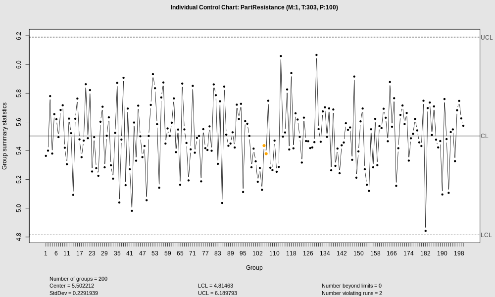
  The individual control chart assesses the stability of the process for PartResistance under these conditions. Points outside control limits (red lines) indicate special cause variation.

  #### Process Capability
  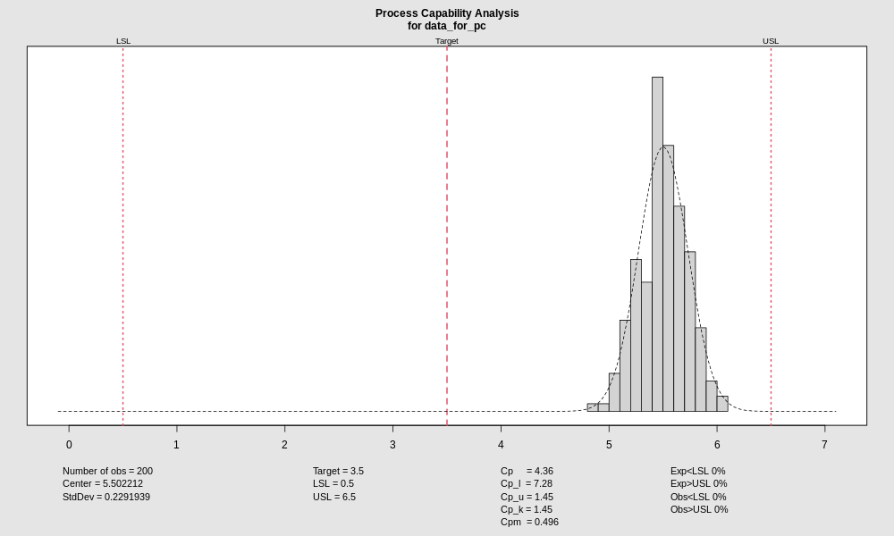
  This plot shows how well the process output for PartResistance meets specification limits. Cp (Process Potential) and Cpk (Process Performance) values indicate the capability.
   
  **Note:** Specification Limits (LSL, USL, Target) are assumed for demonstration. For accurate analysis, replace them with actual engineering specifications.

---
### PartResistance Analysis for Machine 1 at 303 K, 200 kPa

  #### Individual Control Chart
  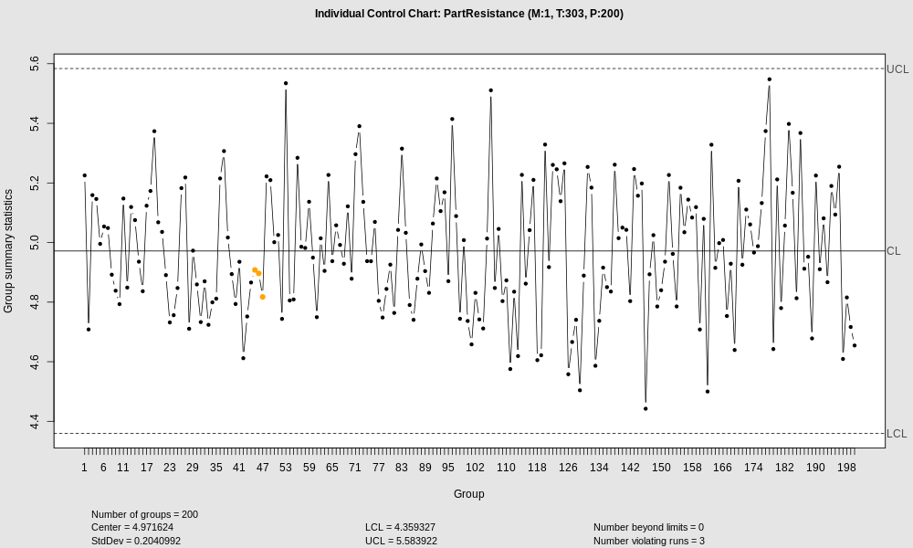
  The individual control chart assesses the stability of the process for PartResistance under these conditions. Points outside control limits (red lines) indicate special cause variation.

  #### Process Capability
  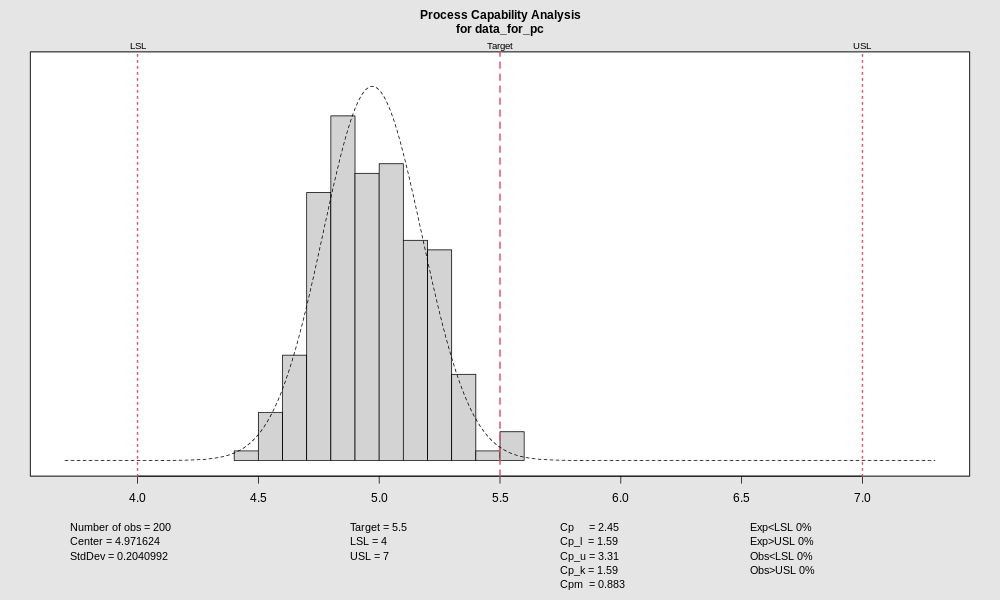
  This plot shows how well the process output for PartResistance meets specification limits. Cp (Process Potential) and Cpk (Process Performance) values indicate the capability.
   
  **Note:** Specification Limits (LSL, USL, Target) are assumed for demonstration. For accurate analysis, replace them with actual engineering specifications.

---
### PartResistance Analysis for Machine 1 at 303 K, 300 kPa

  #### Individual Control Chart
  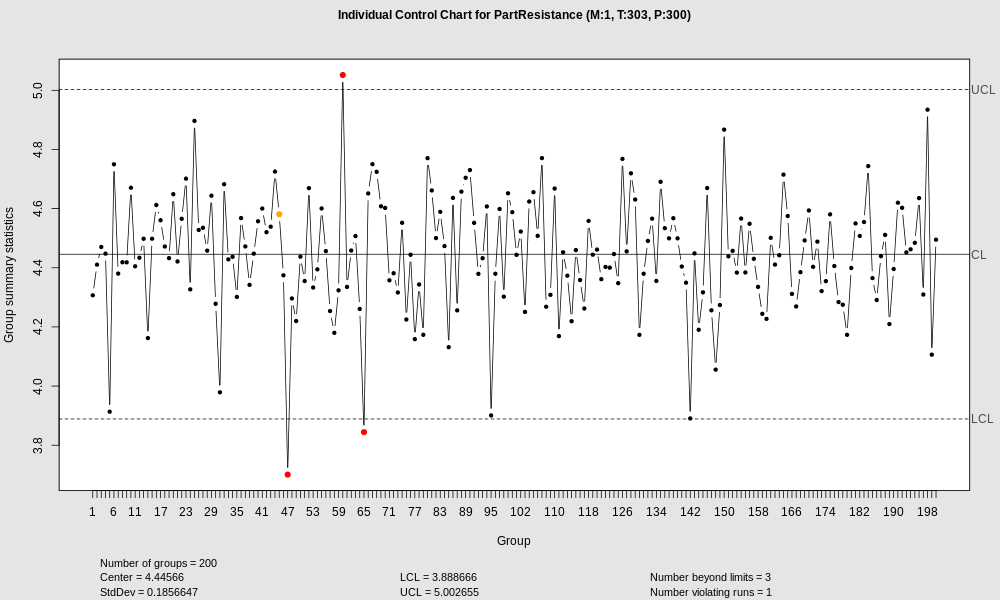
  The individual control chart assesses the stability of the process for PartResistance under these conditions. Points outside control limits (red lines) indicate special cause variation.

  #### Process Capability
  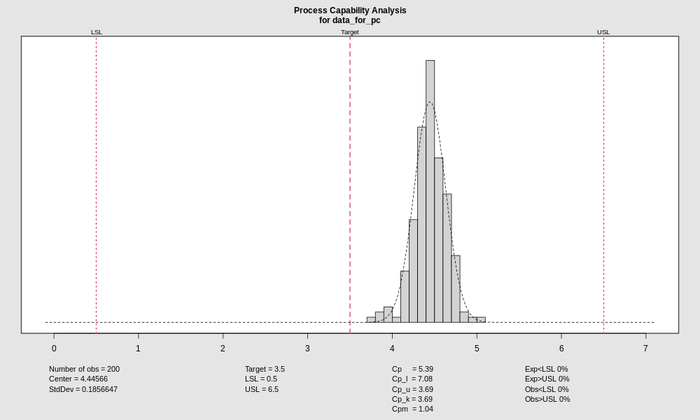
  This plot shows how well the process output for PartResistance meets specification limits. Cp (Process Potential) and Cpk (Process Performance) values indicate the capability.
   
  **Note:** Specification Limits (LSL, USL, Target) are assumed for demonstration. For accurate analysis, replace them with actual engineering specifications.

---
### PartResistance Analysis for Machine 1 at 338 K, 100 kPa

  #### Individual Control Chart
  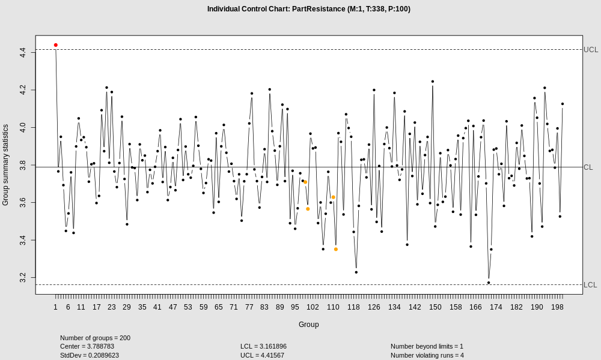
  The individual control chart assesses the stability of the process for PartResistance under these conditions. Points outside control limits (red lines) indicate special cause variation.

  #### Process Capability
  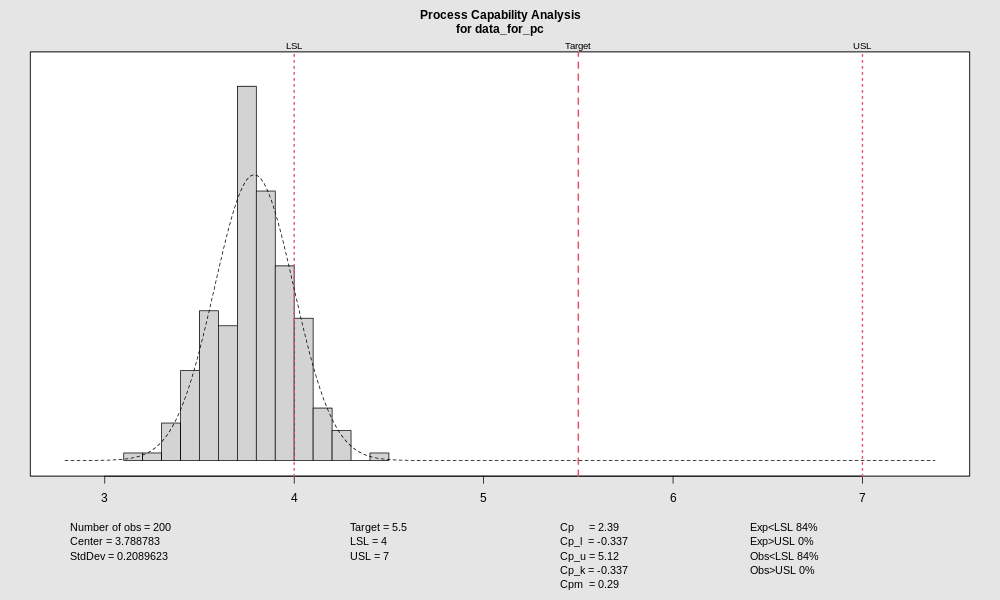
  This plot shows how well the process output for PartResistance meets specification limits. Cp (Process Potential) and Cpk (Process Performance) values indicate the capability.
   
  **Note:** Specification Limits (LSL, USL, Target) are assumed for demonstration. For accurate analysis, replace them with actual engineering specifications.

---
### PartResistance Analysis for Machine 1 at 338 K, 200 kPa

  #### Individual Control Chart
  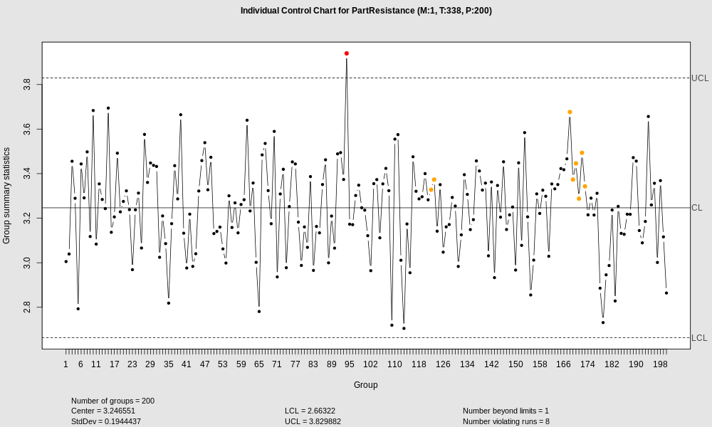
  The individual control chart assesses the stability of the process for PartResistance under these conditions. Points outside control limits (red lines) indicate special cause variation.

  #### Process Capability
  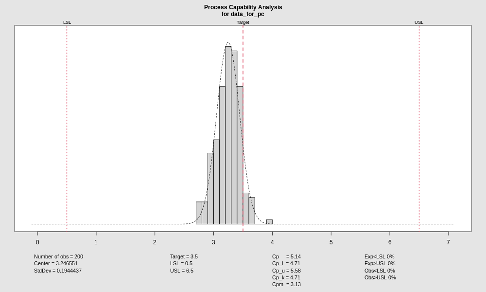
  This plot shows how well the process output for PartResistance meets specification limits. Cp (Process Potential) and Cpk (Process Performance) values indicate the capability.
   
  **Note:** Specification Limits (LSL, USL, Target) are assumed for demonstration. For accurate analysis, replace them with actual engineering specifications.

---
### PartResistance Analysis for Machine 1 at 338 K, 300 kPa

  #### Individual Control Chart
  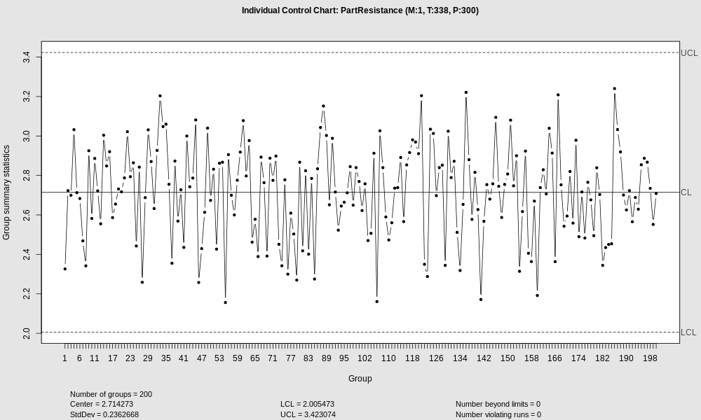
  The individual control chart assesses the stability of the process for PartResistance under these conditions. Points outside control limits (red lines) indicate special cause variation.

  #### Process Capability
  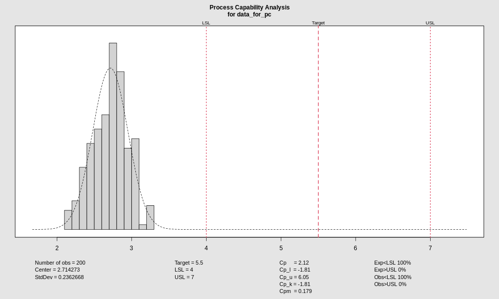
  This plot shows how well the process output for PartResistance meets specification limits. Cp (Process Potential) and Cpk (Process Performance) values indicate the capability.
   
  **Note:** Specification Limits (LSL, USL, Target) are assumed for demonstration. For accurate analysis, replace them with actual engineering specifications.

---
### PartResistance Analysis for Machine 1 at 373 K, 100 kPa

  #### Individual Control Chart
  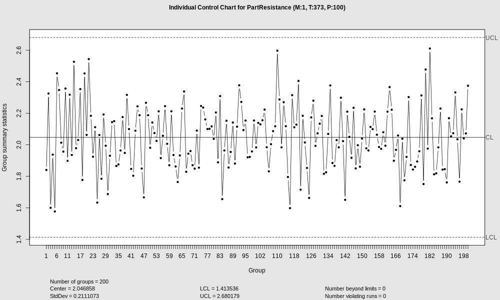
  The individual control chart assesses the stability of the process for PartResistance under these conditions. Points outside control limits (red lines) indicate special cause variation.

  #### Process Capability
  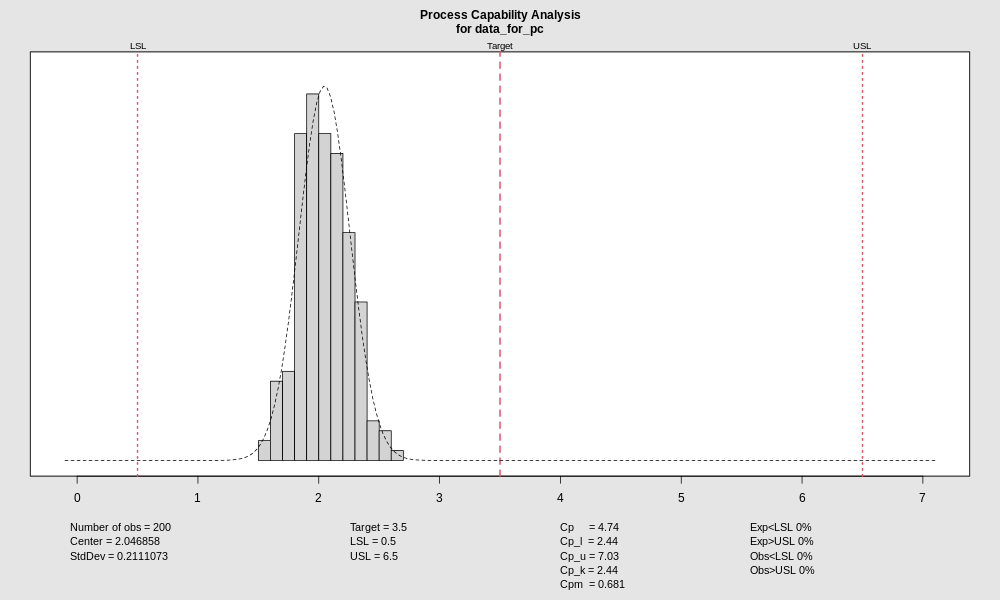
  This plot shows how well the process output for PartResistance meets specification limits. Cp (Process Potential) and Cpk (Process Performance) values indicate the capability.
   
  **Note:** Specification Limits (LSL, USL, Target) are assumed for demonstration. For accurate analysis, replace them with actual engineering specifications.

---
### PartResistance Analysis for Machine 1 at 373 K, 200 kPa

  #### Individual Control Chart
  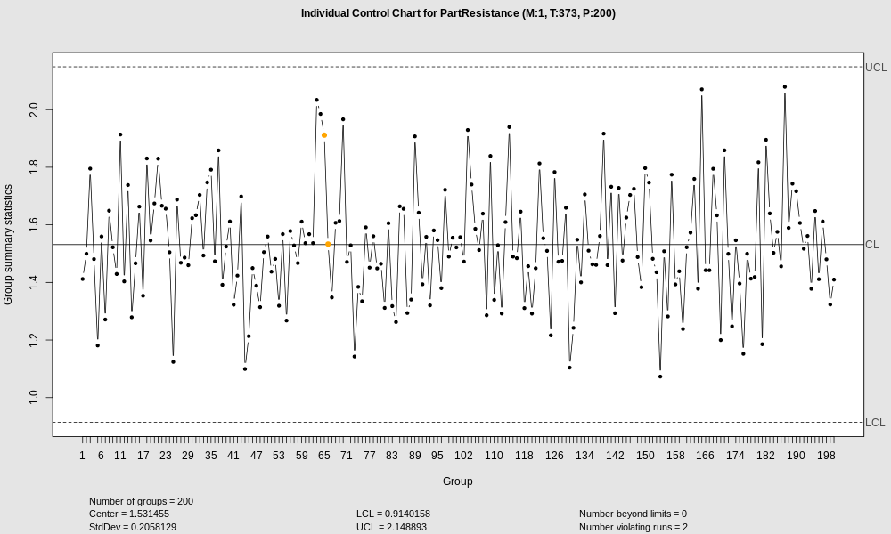
  The individual control chart assesses the stability of the process for PartResistance under these conditions. Points outside control limits (red lines) indicate special cause variation.

  #### Process Capability
  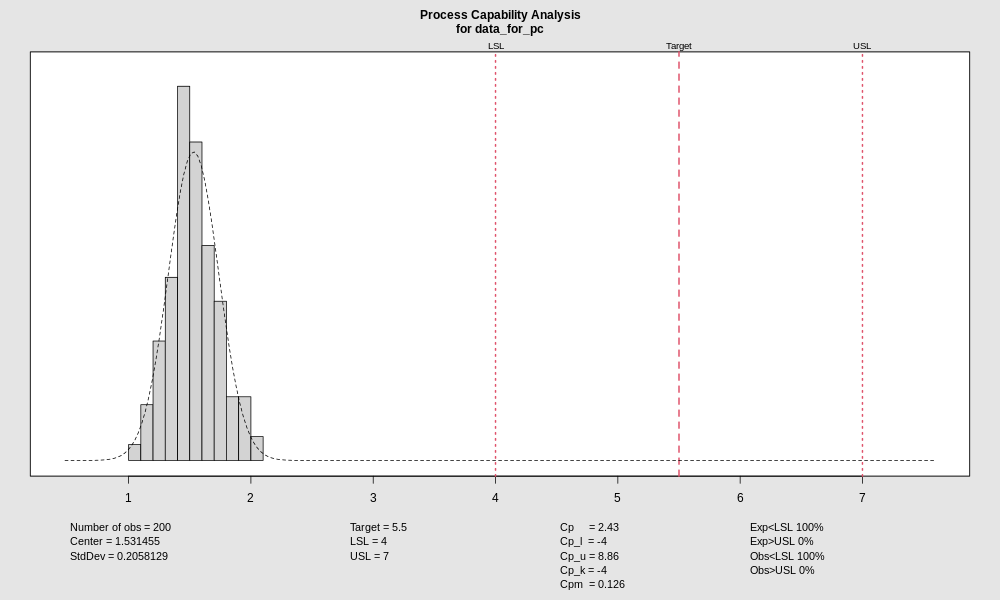
  This plot shows how well the process output for PartResistance meets specification limits. Cp (Process Potential) and Cpk (Process Performance) values indicate the capability.
   
  **Note:** Specification Limits (LSL, USL, Target) are assumed for demonstration. For accurate analysis, replace them with actual engineering specifications.

---
### PartResistance Analysis for Machine 1 at 373 K, 300 kPa

  #### Individual Control Chart
  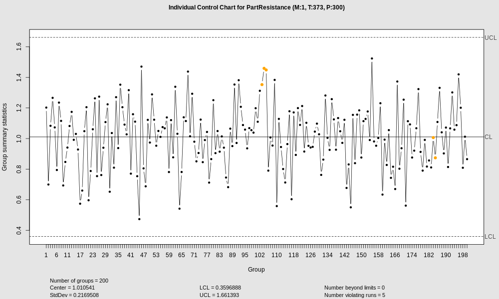
  The individual control chart assesses the stability of the process for PartResistance under these conditions. Points outside control limits (red lines) indicate special cause variation.

  #### Process Capability
  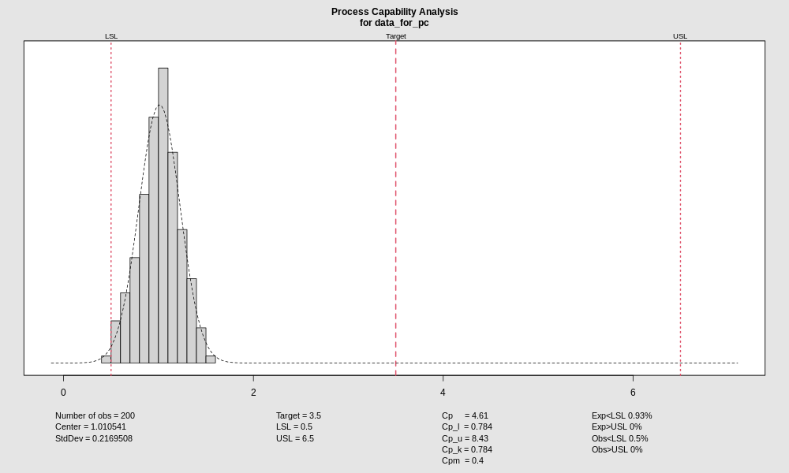
  This plot shows how well the process output for PartResistance meets specification limits. Cp (Process Potential) and Cpk (Process Performance) values indicate the capability.
   
  **Note:** Specification Limits (LSL, USL, Target) are assumed for demonstration. For accurate analysis, replace them with actual engineering specifications.

---
### PartResistance Analysis for Machine 2 at 303 K, 100 kPa

  #### Individual Control Chart
  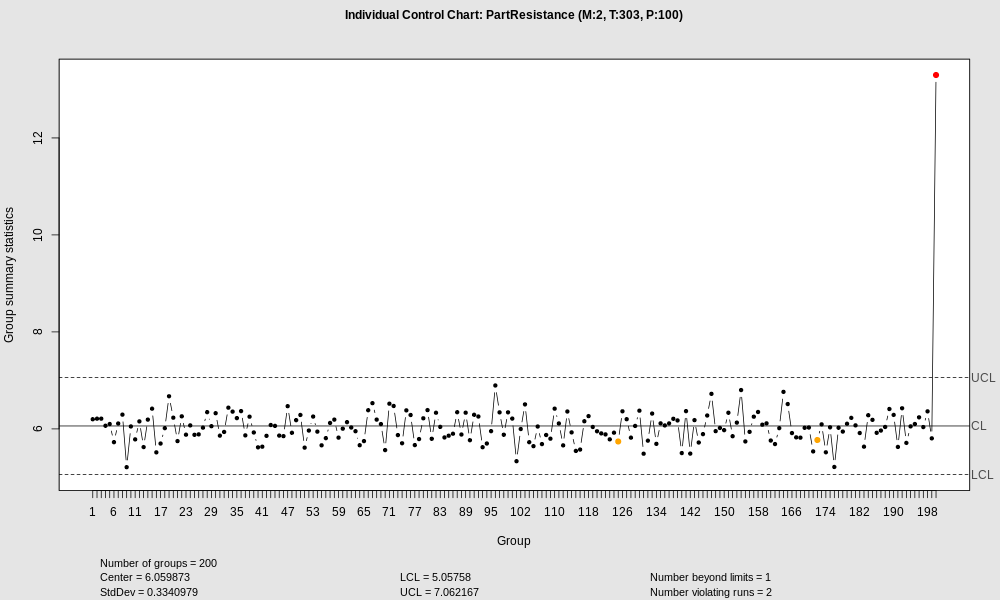
  The individual control chart assesses the stability of the process for PartResistance under these conditions. Points outside control limits (red lines) indicate special cause variation.

  #### Process Capability
  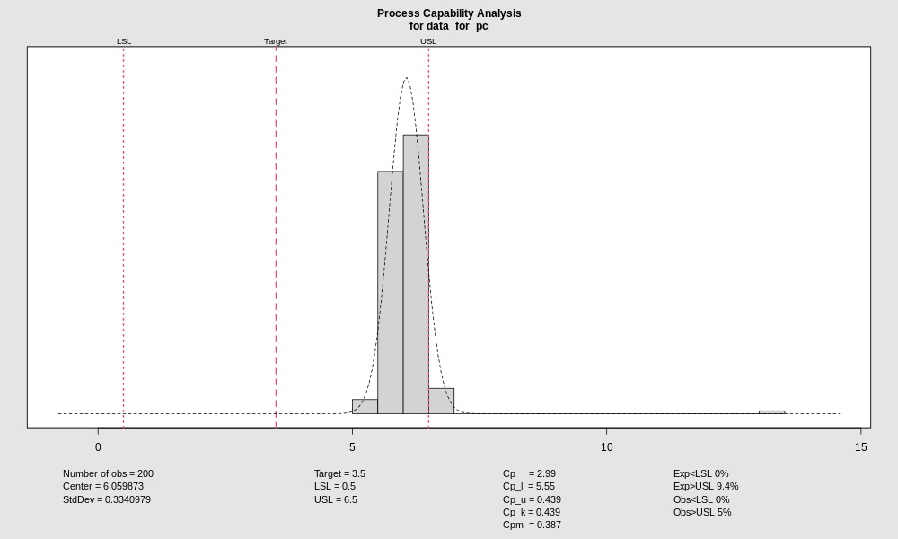
  This plot shows how well the process output for PartResistance meets specification limits. Cp (Process Potential) and Cpk (Process Performance) values indicate the capability.
   
  **Note:** Specification Limits (LSL, USL, Target) are assumed for demonstration. For accurate analysis, replace them with actual engineering specifications.

---
### PartResistance Analysis for Machine 2 at 303 K, 200 kPa

  #### Individual Control Chart
  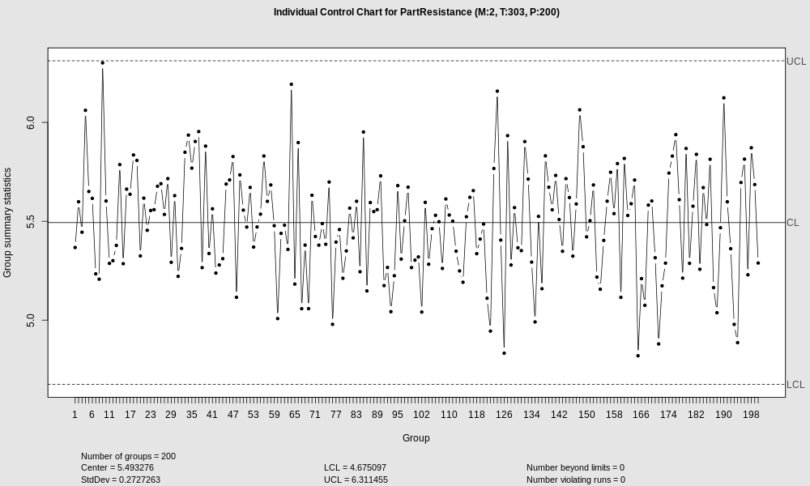
  The individual control chart assesses the stability of the process for PartResistance under these conditions. Points outside control limits (red lines) indicate special cause variation.

  #### Process Capability
  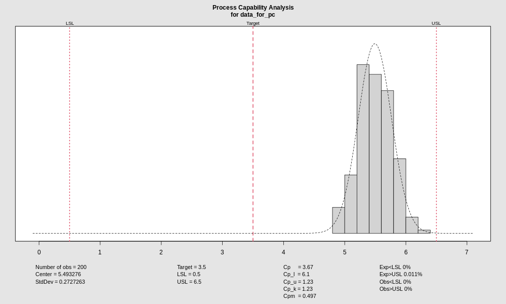
  This plot shows how well the process output for PartResistance meets specification limits. Cp (Process Potential) and Cpk (Process Performance) values indicate the capability.
   
  **Note:** Specification Limits (LSL, USL, Target) are assumed for demonstration. For accurate analysis, replace them with actual engineering specifications.

---
### PartResistance Analysis for Machine 2 at 303 K, 300 kPa

  #### Individual Control Chart
  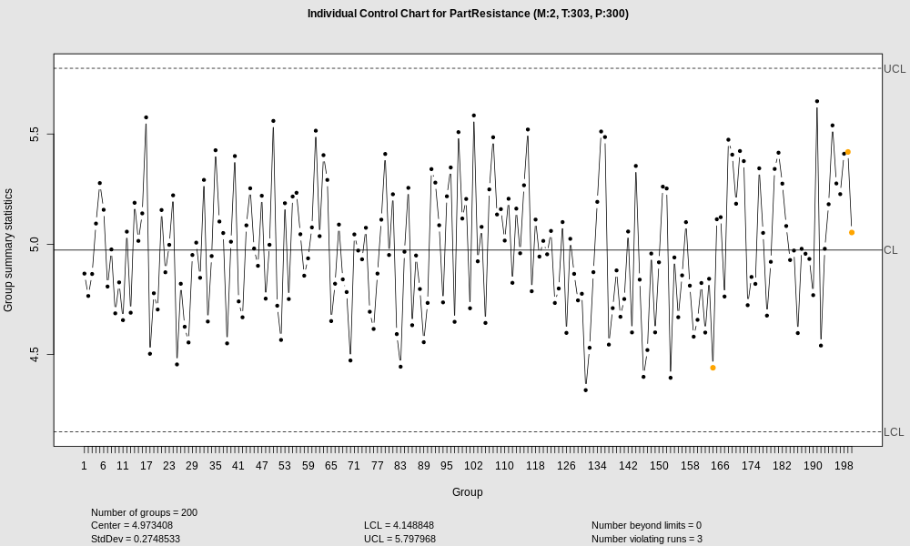
  The individual control chart assesses the stability of the process for PartResistance under these conditions. Points outside control limits (red lines) indicate special cause variation.

  #### Process Capability
  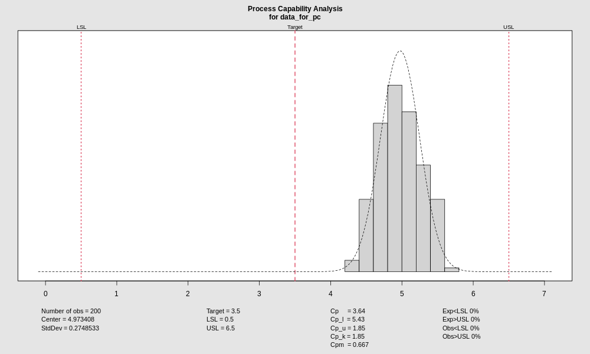
  This plot shows how well the process output for PartResistance meets specification limits. Cp (Process Potential) and Cpk (Process Performance) values indicate the capability.
   
  **Note:** Specification Limits (LSL, USL, Target) are assumed for demonstration. For accurate analysis, replace them with actual engineering specifications.

---
### PartResistance Analysis for Machine 2 at 338 K, 100 kPa

  #### Individual Control Chart
  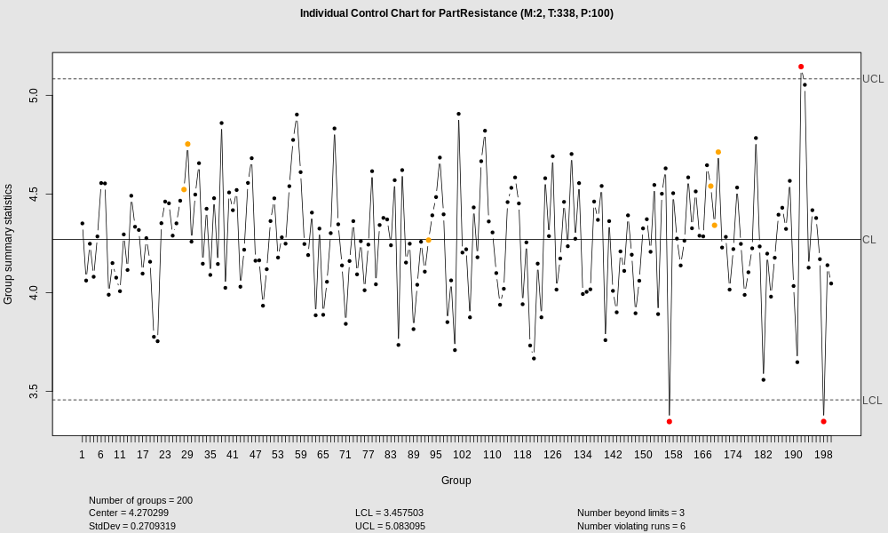
  The individual control chart assesses the stability of the process for PartResistance under these conditions. Points outside control limits (red lines) indicate special cause variation.

  #### Process Capability
  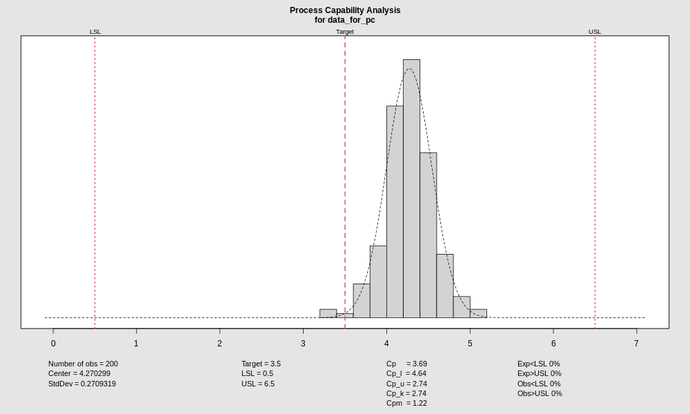
  This plot shows how well the process output for PartResistance meets specification limits. Cp (Process Potential) and Cpk (Process Performance) values indicate the capability.
   
  **Note:** Specification Limits (LSL, USL, Target) are assumed for demonstration. For accurate analysis, replace them with actual engineering specifications.

---
### PartResistance Analysis for Machine 2 at 338 K, 200 kPa

  #### Individual Control Chart
  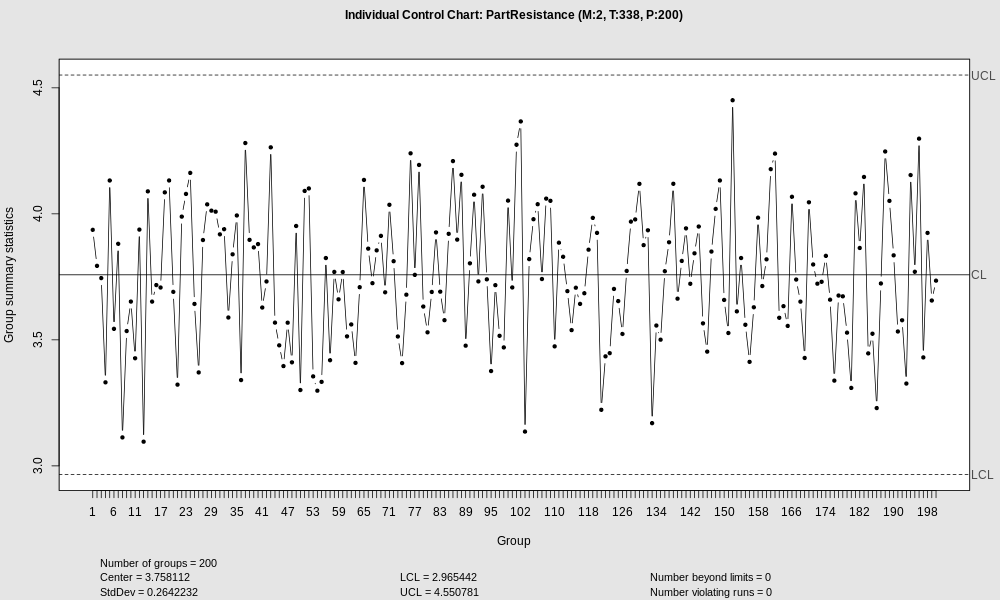
  The individual control chart assesses the stability of the process for PartResistance under these conditions. Points outside control limits (red lines) indicate special cause variation.

  #### Process Capability
  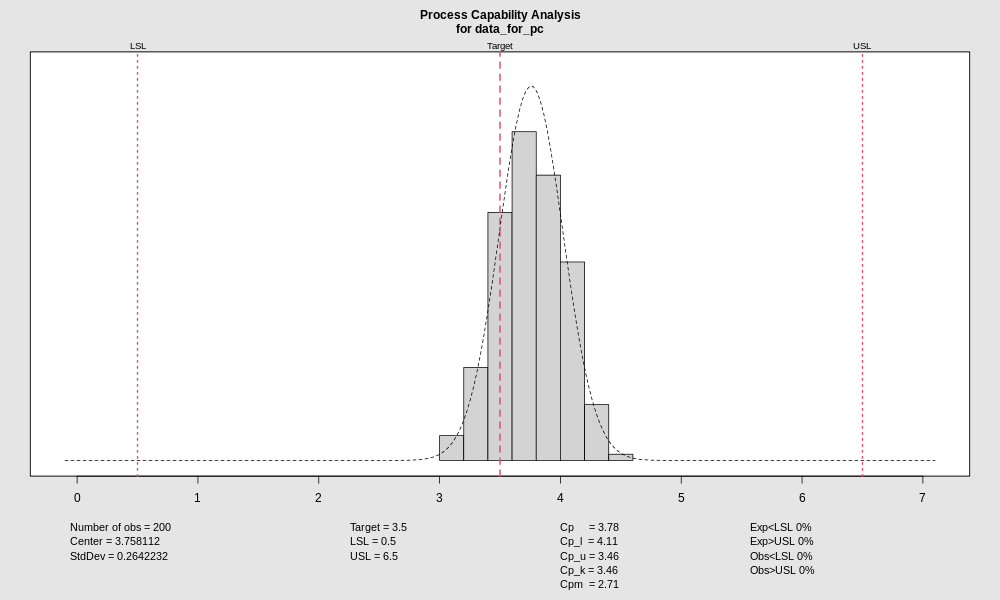
  This plot shows how well the process output for PartResistance meets specification limits. Cp (Process Potential) and Cpk (Process Performance) values indicate the capability.
   
  **Note:** Specification Limits (LSL, USL, Target) are assumed for demonstration. For accurate analysis, replace them with actual engineering specifications.

---
### PartResistance Analysis for Machine 2 at 338 K, 300 kPa

  #### Individual Control Chart
  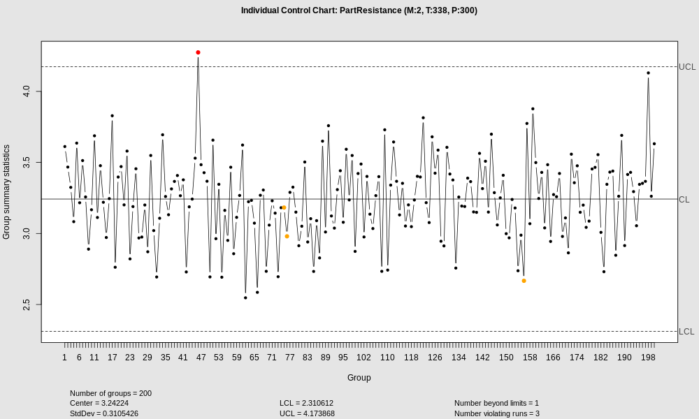
  The individual control chart assesses the stability of the process for PartResistance under these conditions. Points outside control limits (red lines) indicate special cause variation.

  #### Process Capability
  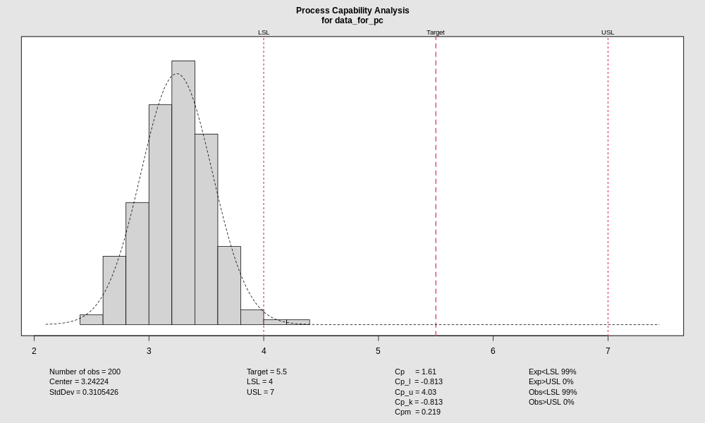
  This plot shows how well the process output for PartResistance meets specification limits. Cp (Process Potential) and Cpk (Process Performance) values indicate the capability.
   
  **Note:** Specification Limits (LSL, USL, Target) are assumed for demonstration. For accurate analysis, replace them with actual engineering specifications.

---
### PartResistance Analysis for Machine 2 at 373 K, 100 kPa

  #### Individual Control Chart
  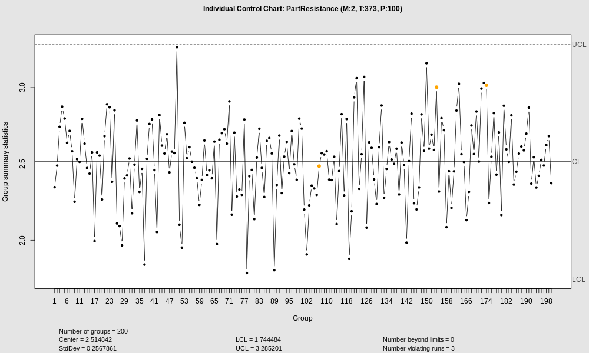
  The individual control chart assesses the stability of the process for PartResistance under these conditions. Points outside control limits (red lines) indicate special cause variation.

  #### Process Capability
  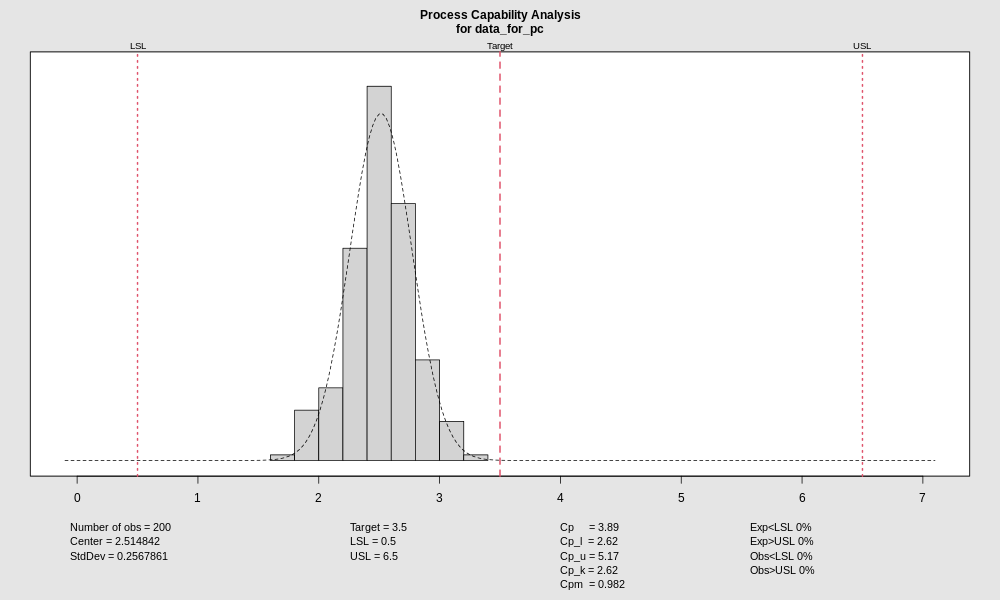
  This plot shows how well the process output for PartResistance meets specification limits. Cp (Process Potential) and Cpk (Process Performance) values indicate the capability.
   
  **Note:** Specification Limits (LSL, USL, Target) are assumed for demonstration. For accurate analysis, replace them with actual engineering specifications.

---
### PartResistance Analysis for Machine 2 at 373 K, 200 kPa

  #### Individual Control Chart
  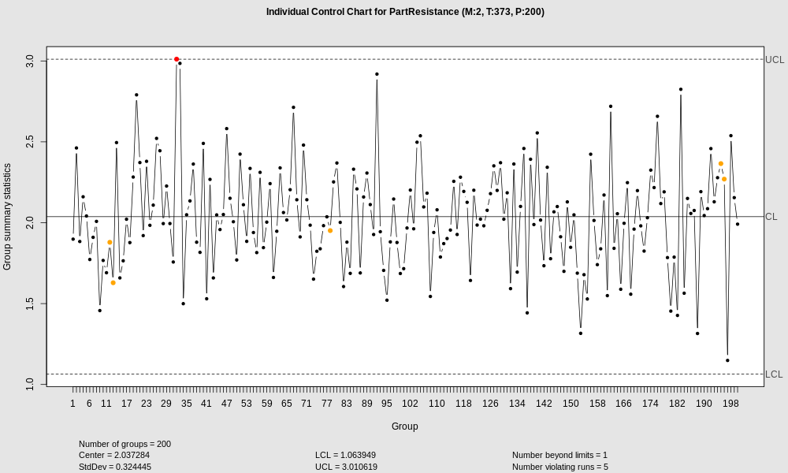
  The individual control chart assesses the stability of the process for PartResistance under these conditions. Points outside control limits (red lines) indicate special cause variation.

  #### Process Capability
  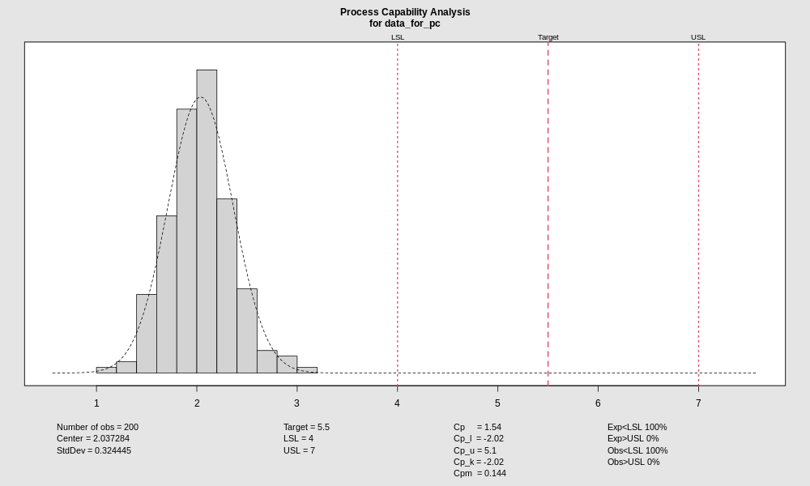
  This plot shows how well the process output for PartResistance meets specification limits. Cp (Process Potential) and Cpk (Process Performance) values indicate the capability.
   
  **Note:** Specification Limits (LSL, USL, Target) are assumed for demonstration. For accurate analysis, replace them with actual engineering specifications.

---
### PartResistance Analysis for Machine 2 at 373 K, 300 kPa

  #### Individual Control Chart
  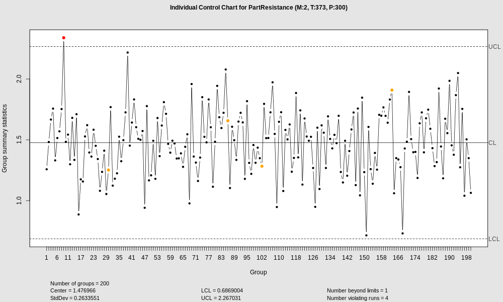
  The individual control chart assesses the stability of the process for PartResistance under these conditions. Points outside control limits (red lines) indicate special cause variation.

  #### Process Capability
  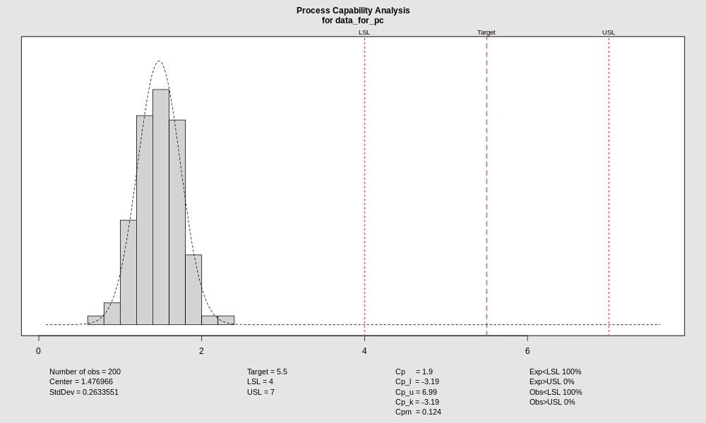
  This plot shows how well the process output for PartResistance meets specification limits. Cp (Process Potential) and Cpk (Process Performance) values indicate the capability.
   
  **Note:** Specification Limits (LSL, USL, Target) are assumed for demonstration. For accurate analysis, replace them with actual engineering specifications.

---
### PartResistance Analysis for Machine 3 at 303 K, 100 kPa

  #### Individual Control Chart
  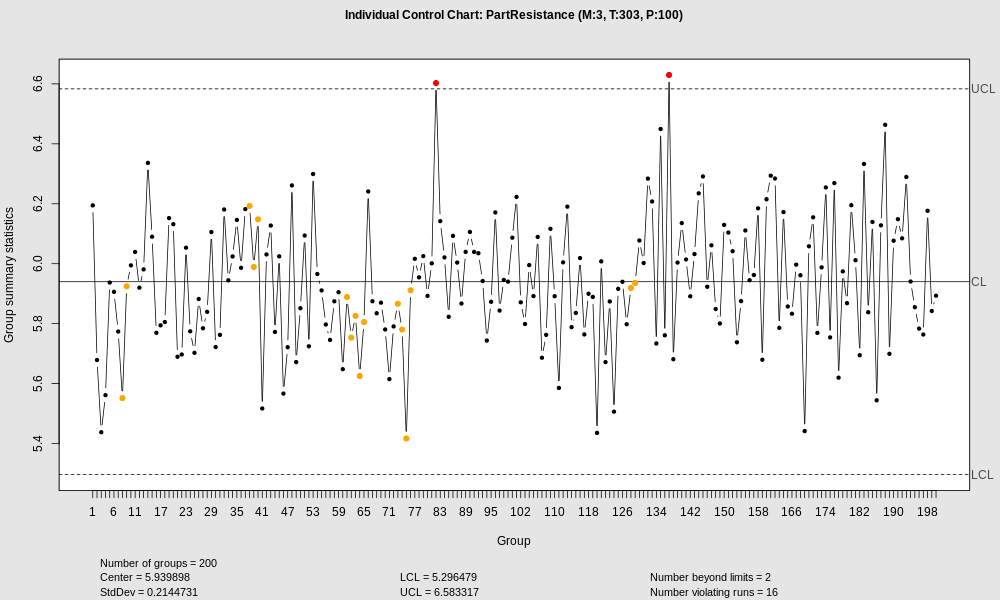
  The individual control chart assesses the stability of the process for PartResistance under these conditions. Points outside control limits (red lines) indicate special cause variation.

  #### Process Capability
  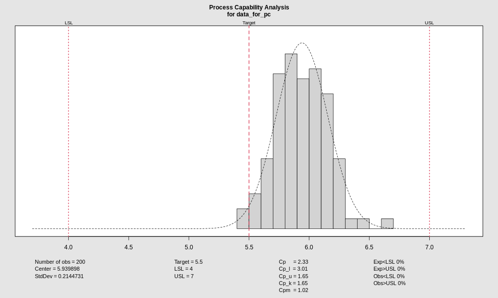
  This plot shows how well the process output for PartResistance meets specification limits. Cp (Process Potential) and Cpk (Process Performance) values indicate the capability.
   
  **Note:** Specification Limits (LSL, USL, Target) are assumed for demonstration. For accurate analysis, replace them with actual engineering specifications.

---
### PartResistance Analysis for Machine 3 at 303 K, 200 kPa

  #### Individual Control Chart
  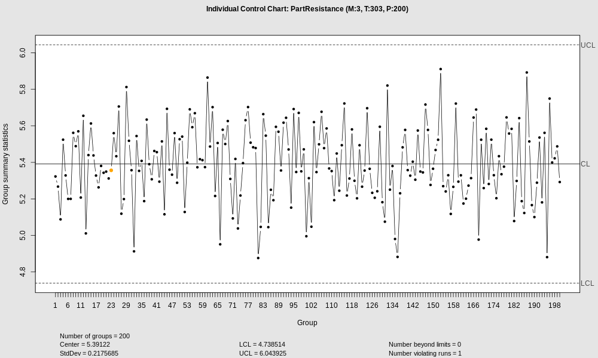
  The individual control chart assesses the stability of the process for PartResistance under these conditions. Points outside control limits (red lines) indicate special cause variation.

  #### Process Capability
  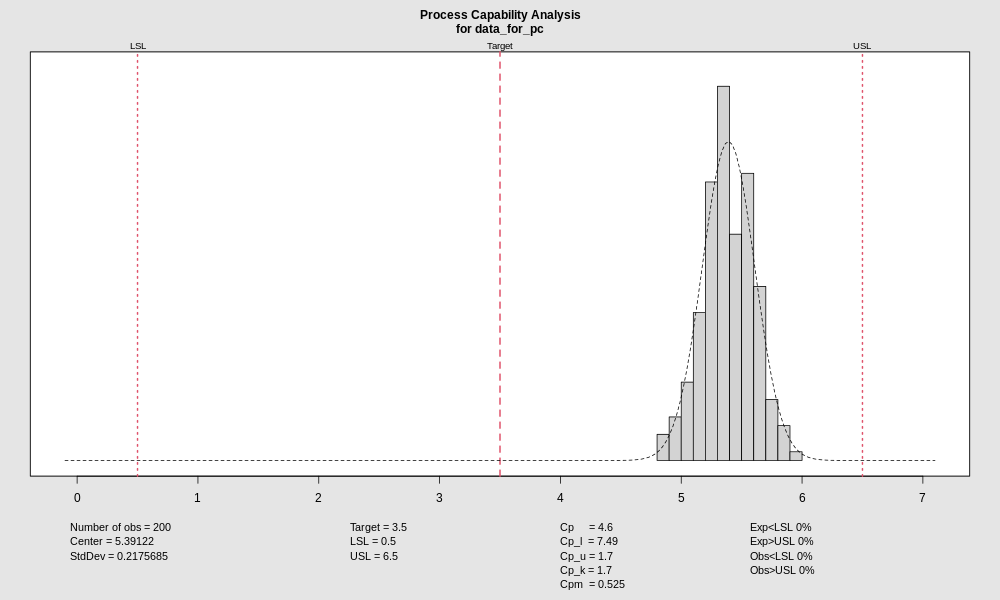
  This plot shows how well the process output for PartResistance meets specification limits. Cp (Process Potential) and Cpk (Process Performance) values indicate the capability.
   
  **Note:** Specification Limits (LSL, USL, Target) are assumed for demonstration. For accurate analysis, replace them with actual engineering specifications.

---
### PartResistance Analysis for Machine 3 at 303 K, 300 kPa

  #### Individual Control Chart
  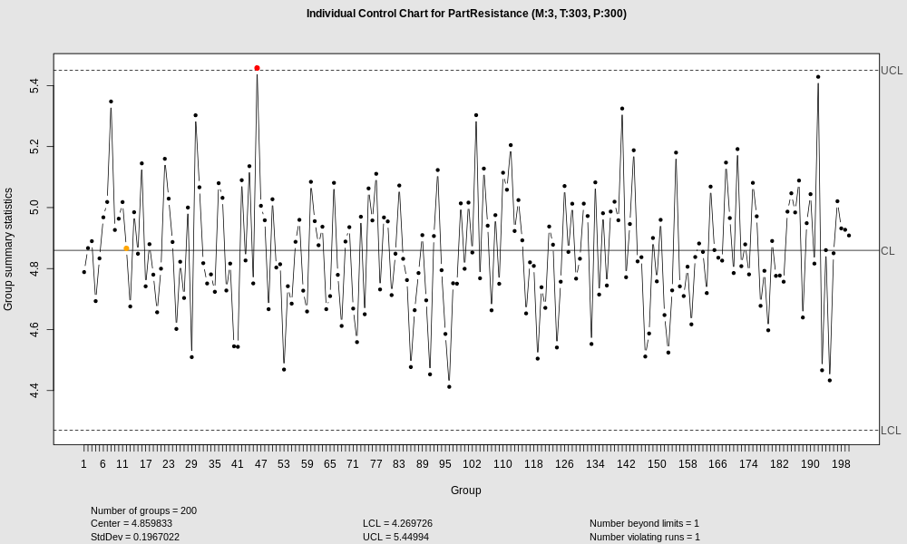
  The individual control chart assesses the stability of the process for PartResistance under these conditions. Points outside control limits (red lines) indicate special cause variation.

  #### Process Capability
  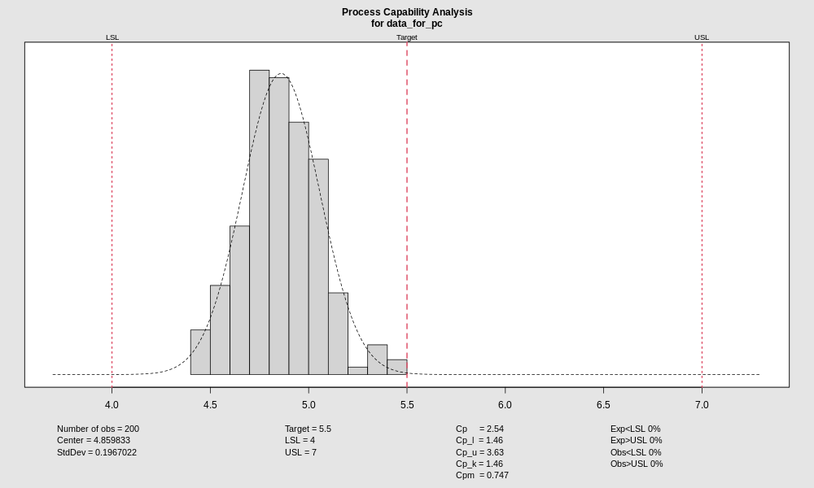
  This plot shows how well the process output for PartResistance meets specification limits. Cp (Process Potential) and Cpk (Process Performance) values indicate the capability.
   
  **Note:** Specification Limits (LSL, USL, Target) are assumed for demonstration. For accurate analysis, replace them with actual engineering specifications.

---
### PartResistance Analysis for Machine 3 at 338 K, 100 kPa

  #### Individual Control Chart
  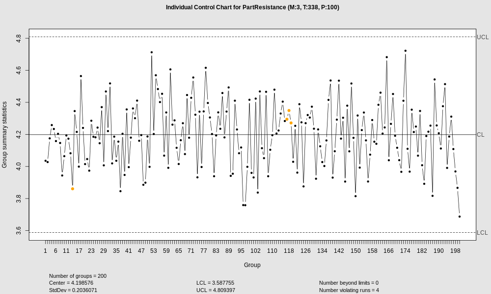
  The individual control chart assesses the stability of the process for PartResistance under these conditions. Points outside control limits (red lines) indicate special cause variation.

  #### Process Capability
  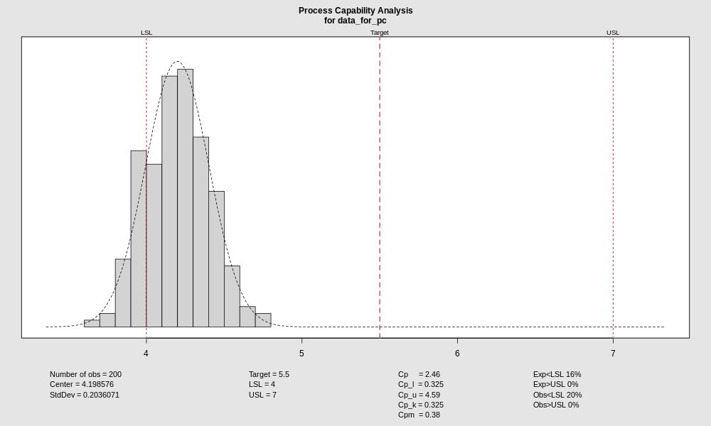
  This plot shows how well the process output for PartResistance meets specification limits. Cp (Process Potential) and Cpk (Process Performance) values indicate the capability.
   
  **Note:** Specification Limits (LSL, USL, Target) are assumed for demonstration. For accurate analysis, replace them with actual engineering specifications.

---
### PartResistance Analysis for Machine 3 at 338 K, 200 kPa

  #### Individual Control Chart
  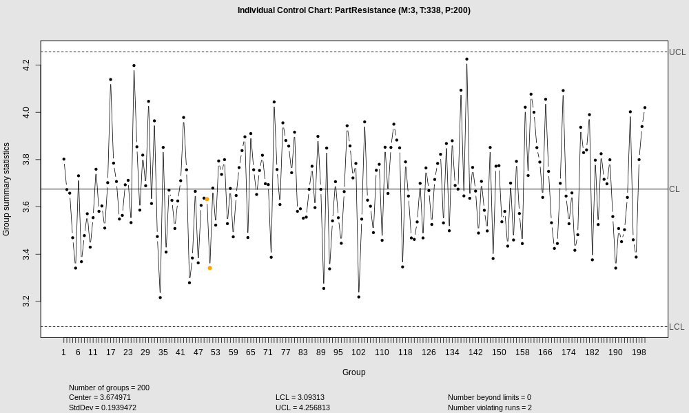
  The individual control chart assesses the stability of the process for PartResistance under these conditions. Points outside control limits (red lines) indicate special cause variation.

  #### Process Capability
  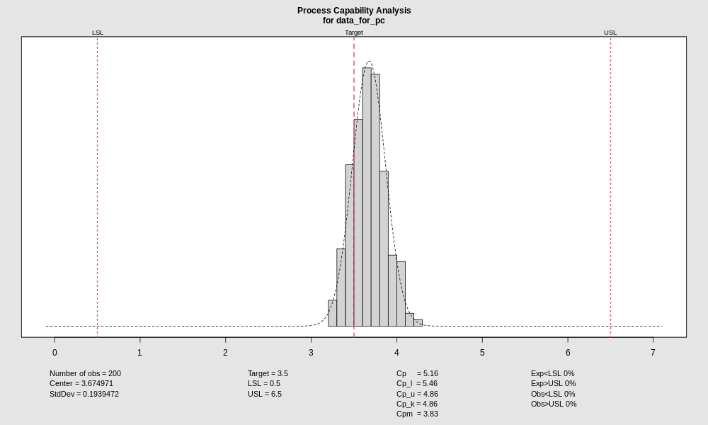
  This plot shows how well the process output for PartResistance meets specification limits. Cp (Process Potential) and Cpk (Process Performance) values indicate the capability.
   
  **Note:** Specification Limits (LSL, USL, Target) are assumed for demonstration. For accurate analysis, replace them with actual engineering specifications.

---
### PartResistance Analysis for Machine 3 at 338 K, 300 kPa

  #### Individual Control Chart
  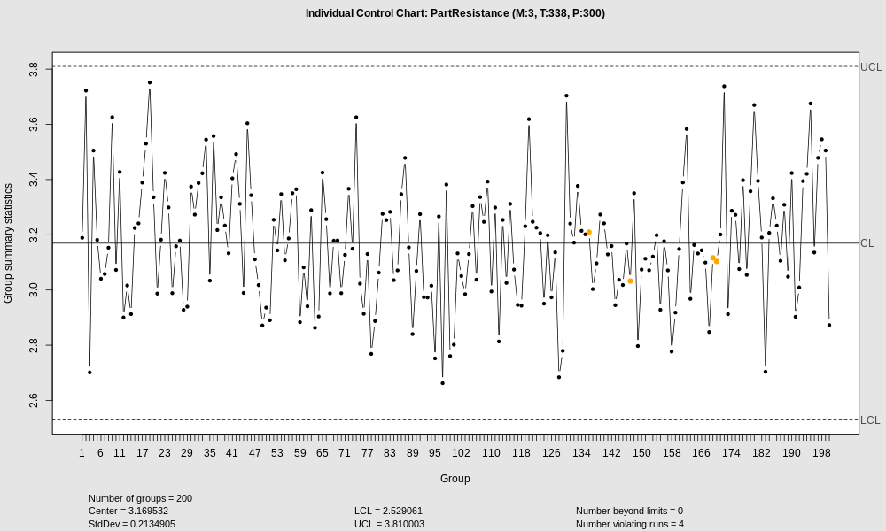
  The individual control chart assesses the stability of the process for PartResistance under these conditions. Points outside control limits (red lines) indicate special cause variation.

  #### Process Capability
  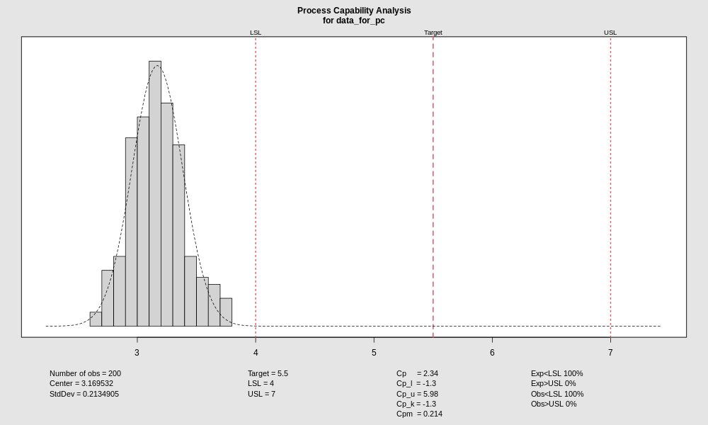
  This plot shows how well the process output for PartResistance meets specification limits. Cp (Process Potential) and Cpk (Process Performance) values indicate the capability.
   
  **Note:** Specification Limits (LSL, USL, Target) are assumed for demonstration. For accurate analysis, replace them with actual engineering specifications.

---
### PartResistance Analysis for Machine 3 at 373 K, 100 kPa

  #### Individual Control Chart
  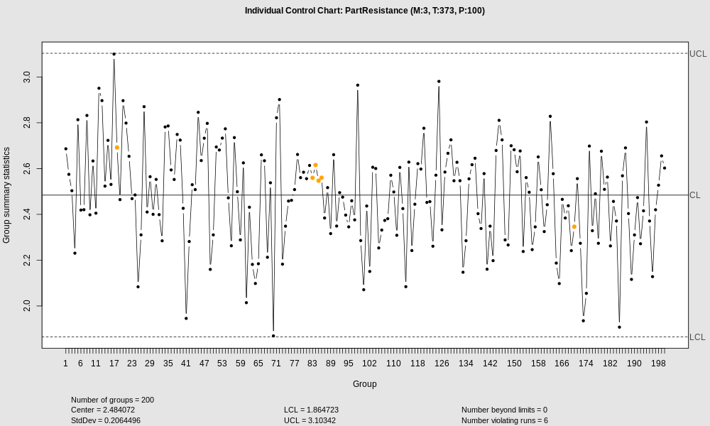
  The individual control chart assesses the stability of the process for PartResistance under these conditions. Points outside control limits (red lines) indicate special cause variation.

  #### Process Capability
  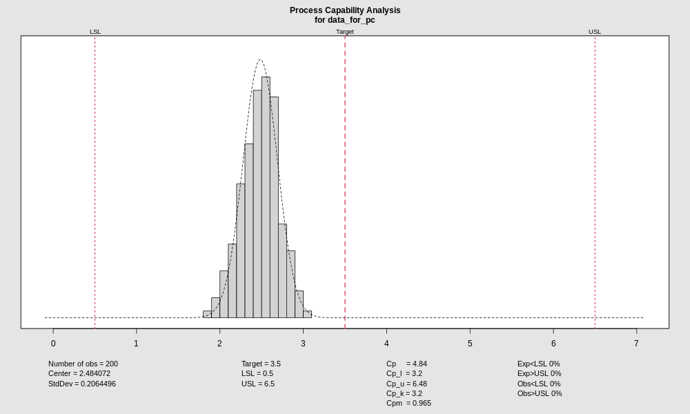
  This plot shows how well the process output for PartResistance meets specification limits. Cp (Process Potential) and Cpk (Process Performance) values indicate the capability.
   
  **Note:** Specification Limits (LSL, USL, Target) are assumed for demonstration. For accurate analysis, replace them with actual engineering specifications.

---
### PartResistance Analysis for Machine 3 at 373 K, 200 kPa

  #### Individual Control Chart
  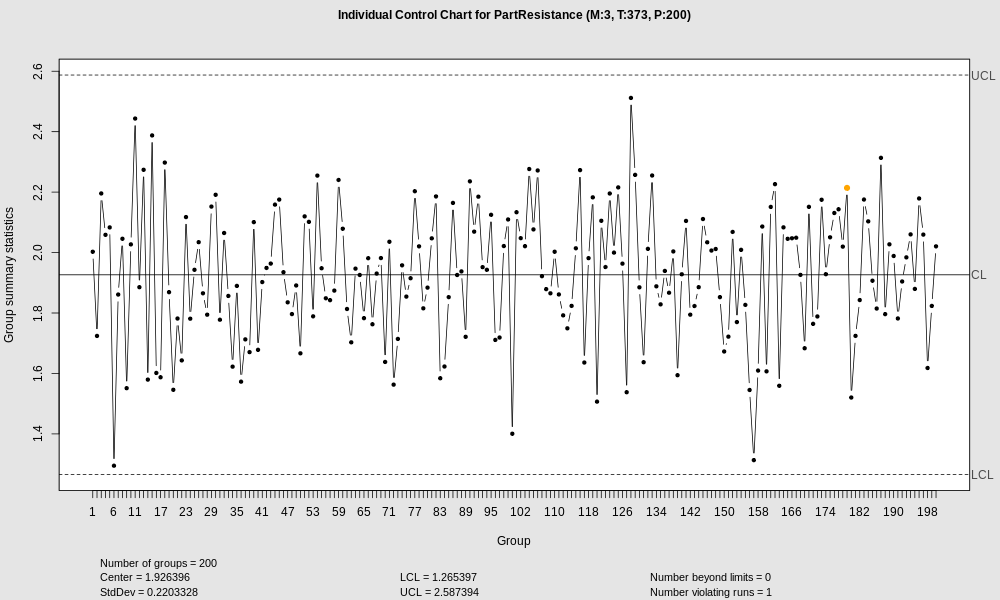
  The individual control chart assesses the stability of the process for PartResistance under these conditions. Points outside control limits (red lines) indicate special cause variation.

  #### Process Capability
  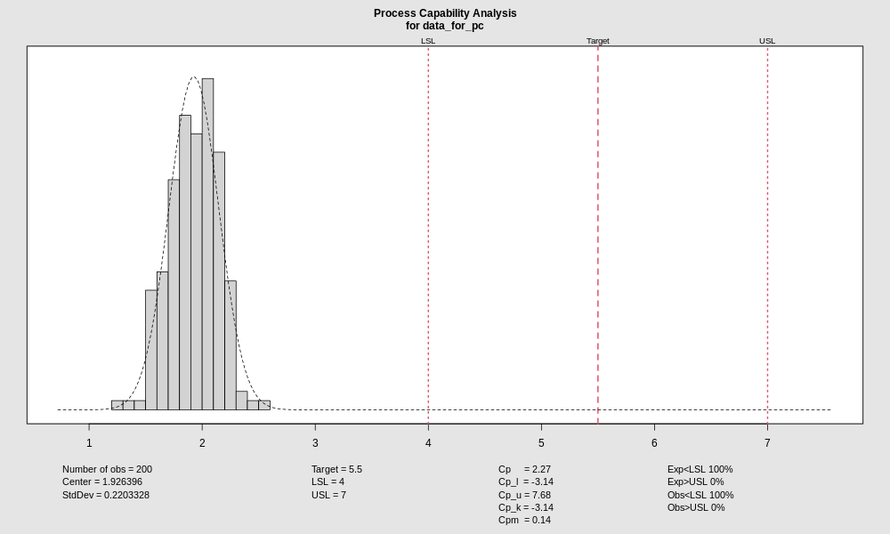
  This plot shows how well the process output for PartResistance meets specification limits. Cp (Process Potential) and Cpk (Process Performance) values indicate the capability.
   
  **Note:** Specification Limits (LSL, USL, Target) are assumed for demonstration. For accurate analysis, replace them with actual engineering specifications.

---
### PartResistance Analysis for Machine 3 at 373 K, 300 kPa

  #### Individual Control Chart
  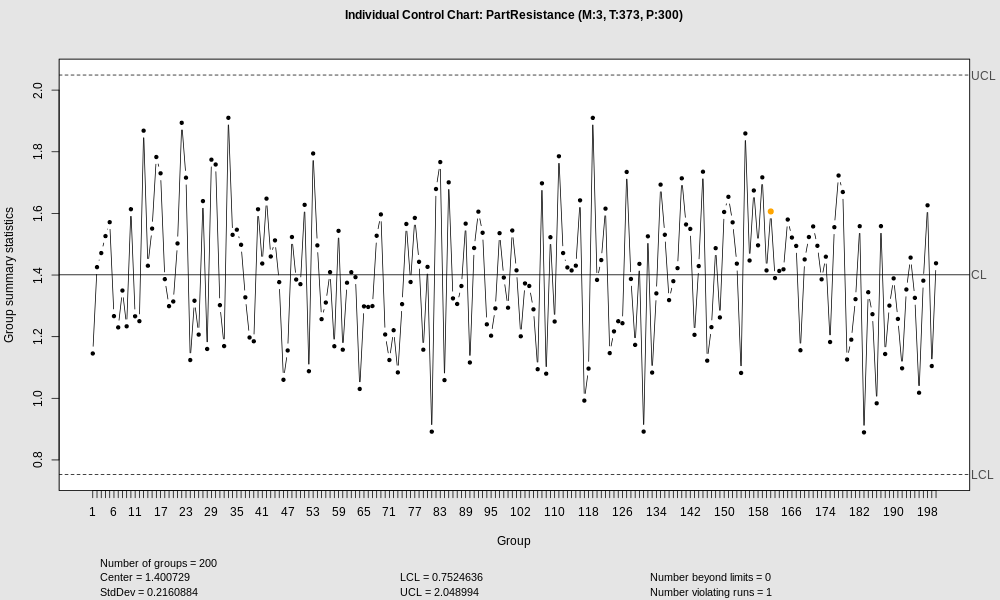
  The individual control chart assesses the stability of the process for PartResistance under these conditions. Points outside control limits (red lines) indicate special cause variation.

  #### Process Capability
  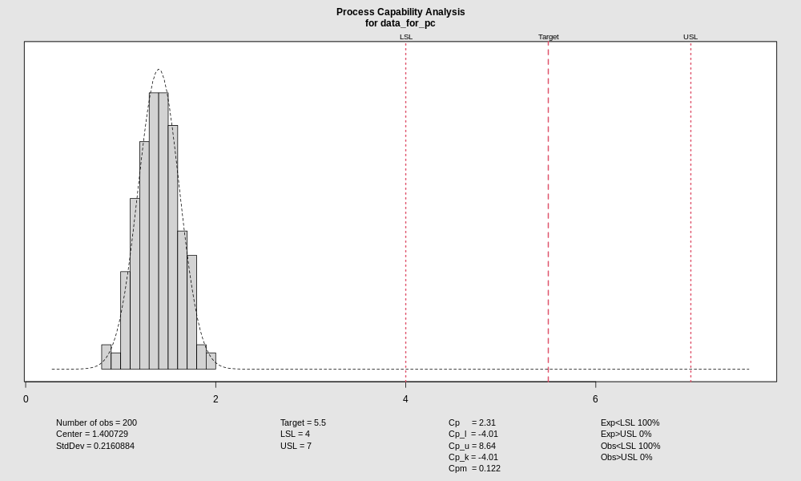
  This plot shows how well the process output for PartResistance meets specification limits. Cp (Process Potential) and Cpk (Process Performance) values indicate the capability.
   
  **Note:** Specification Limits (LSL, USL, Target) are assumed for demonstration. For accurate analysis, replace them with actual engineering specifications.

---
## Machine Process Analysis: Control Charts & Capability

---
### PartLength Analysis for Machine 1 at 303 K, 100 kPa

  #### Individual Control Chart
  
  The individual control chart assesses the stability of the process for PartLength under these conditions. Points outside control limits (red lines) indicate special cause variation.

  #### Process Capability
  
  This plot shows how well the process output for PartLength meets specification limits. Cp (Process Potential) and Cpk (Process Performance) values indicate the capability.
   
  **Note:** Specification Limits (LSL, USL, Target) are assumed for demonstration. For accurate analysis, replace them with actual engineering specifications.

---
### PartLength Analysis for Machine 1 at 303 K, 200 kPa

  #### Individual Control Chart
  
  The individual control chart assesses the stability of the process for PartLength under these conditions. Points outside control limits (red lines) indicate special cause variation.

  #### Process Capability
  
  This plot shows how well the process output for PartLength meets specification limits. Cp (Process Potential) and Cpk (Process Performance) values indicate the capability.
   
  **Note:** Specification Limits (LSL, USL, Target) are assumed for demonstration. For accurate analysis, replace them with actual engineering specifications.

---
### PartLength Analysis for Machine 1 at 303 K, 300 kPa

  #### Individual Control Chart
  
  The individual control chart assesses the stability of the process for PartLength under these conditions. Points outside control limits (red lines) indicate special cause variation.

  #### Process Capability
  
  This plot shows how well the process output for PartLength meets specification limits. Cp (Process Potential) and Cpk (Process Performance) values indicate the capability.
   
  **Note:** Specification Limits (LSL, USL, Target) are assumed for demonstration. For accurate analysis, replace them with actual engineering specifications.

---
### PartLength Analysis for Machine 1 at 338 K, 100 kPa

  #### Individual Control Chart
  
  The individual control chart assesses the stability of the process for PartLength under these conditions. Points outside control limits (red lines) indicate special cause variation.

  #### Process Capability
  
  This plot shows how well the process output for PartLength meets specification limits. Cp (Process Potential) and Cpk (Process Performance) values indicate the capability.
   
  **Note:** Specification Limits (LSL, USL, Target) are assumed for demonstration. For accurate analysis, replace them with actual engineering specifications.

---
### PartLength Analysis for Machine 1 at 338 K, 200 kPa

  #### Individual Control Chart
  
  The individual control chart assesses the stability of the process for PartLength under these conditions. Points outside control limits (red lines) indicate special cause variation.

  #### Process Capability
  
  This plot shows how well the process output for PartLength meets specification limits. Cp (Process Potential) and Cpk (Process Performance) values indicate the capability.
   
  **Note:** Specification Limits (LSL, USL, Target) are assumed for demonstration. For accurate analysis, replace them with actual engineering specifications.

---
### PartLength Analysis for Machine 1 at 338 K, 300 kPa

  #### Individual Control Chart
  
  The individual control chart assesses the stability of the process for PartLength under these conditions. Points outside control limits (red lines) indicate special cause variation.

  #### Process Capability
  
  This plot shows how well the process output for PartLength meets specification limits. Cp (Process Potential) and Cpk (Process Performance) values indicate the capability.
   
  **Note:** Specification Limits (LSL, USL, Target) are assumed for demonstration. For accurate analysis, replace them with actual engineering specifications.

---
### PartLength Analysis for Machine 1 at 373 K, 100 kPa

  #### Individual Control Chart
  
  The individual control chart assesses the stability of the process for PartLength under these conditions. Points outside control limits (red lines) indicate special cause variation.

  #### Process Capability
  
  This plot shows how well the process output for PartLength meets specification limits. Cp (Process Potential) and Cpk (Process Performance) values indicate the capability.
   
  **Note:** Specification Limits (LSL, USL, Target) are assumed for demonstration. For accurate analysis, replace them with actual engineering specifications.

---
### PartLength Analysis for Machine 1 at 373 K, 200 kPa

  #### Individual Control Chart
  
  The individual control chart assesses the stability of the process for PartLength under these conditions. Points outside control limits (red lines) indicate special cause variation.

  #### Process Capability
  
  This plot shows how well the process output for PartLength meets specification limits. Cp (Process Potential) and Cpk (Process Performance) values indicate the capability.
   
  **Note:** Specification Limits (LSL, USL, Target) are assumed for demonstration. For accurate analysis, replace them with actual engineering specifications.

---
### PartLength Analysis for Machine 1 at 373 K, 300 kPa

  #### Individual Control Chart
  
  The individual control chart assesses the stability of the process for PartLength under these conditions. Points outside control limits (red lines) indicate special cause variation.

  #### Process Capability
  
  This plot shows how well the process output for PartLength meets specification limits. Cp (Process Potential) and Cpk (Process Performance) values indicate the capability.
   
  **Note:** Specification Limits (LSL, USL, Target) are assumed for demonstration. For accurate analysis, replace them with actual engineering specifications.

---
### PartLength Analysis for Machine 2 at 303 K, 100 kPa

  #### Individual Control Chart
  
  The individual control chart assesses the stability of the process for PartLength under these conditions. Points outside control limits (red lines) indicate special cause variation.

  #### Process Capability
  
  This plot shows how well the process output for PartLength meets specification limits. Cp (Process Potential) and Cpk (Process Performance) values indicate the capability.
   
  **Note:** Specification Limits (LSL, USL, Target) are assumed for demonstration. For accurate analysis, replace them with actual engineering specifications.

---
### PartLength Analysis for Machine 2 at 303 K, 200 kPa

  #### Individual Control Chart
  
  The individual control chart assesses the stability of the process for PartLength under these conditions. Points outside control limits (red lines) indicate special cause variation.

  #### Process Capability
  
  This plot shows how well the process output for PartLength meets specification limits. Cp (Process Potential) and Cpk (Process Performance) values indicate the capability.
   
  **Note:** Specification Limits (LSL, USL, Target) are assumed for demonstration. For accurate analysis, replace them with actual engineering specifications.

---
### PartLength Analysis for Machine 2 at 303 K, 300 kPa

  #### Individual Control Chart
  
  The individual control chart assesses the stability of the process for PartLength under these conditions. Points outside control limits (red lines) indicate special cause variation.

  #### Process Capability
  
  This plot shows how well the process output for PartLength meets specification limits. Cp (Process Potential) and Cpk (Process Performance) values indicate the capability.
   
  **Note:** Specification Limits (LSL, USL, Target) are assumed for demonstration. For accurate analysis, replace them with actual engineering specifications.

---
### PartLength Analysis for Machine 2 at 338 K, 100 kPa

  #### Individual Control Chart
  
  The individual control chart assesses the stability of the process for PartLength under these conditions. Points outside control limits (red lines) indicate special cause variation.

  #### Process Capability
  
  This plot shows how well the process output for PartLength meets specification limits. Cp (Process Potential) and Cpk (Process Performance) values indicate the capability.
   
  **Note:** Specification Limits (LSL, USL, Target) are assumed for demonstration. For accurate analysis, replace them with actual engineering specifications.

---
### PartLength Analysis for Machine 2 at 338 K, 200 kPa

  #### Individual Control Chart
  
  The individual control chart assesses the stability of the process for PartLength under these conditions. Points outside control limits (red lines) indicate special cause variation.

  #### Process Capability
  
  This plot shows how well the process output for PartLength meets specification limits. Cp (Process Potential) and Cpk (Process Performance) values indicate the capability.
   
  **Note:** Specification Limits (LSL, USL, Target) are assumed for demonstration. For accurate analysis, replace them with actual engineering specifications.

---
### PartLength Analysis for Machine 2 at 338 K, 300 kPa

  #### Individual Control Chart
  
  The individual control chart assesses the stability of the process for PartLength under these conditions. Points outside control limits (red lines) indicate special cause variation.

  #### Process Capability
  
  This plot shows how well the process output for PartLength meets specification limits. Cp (Process Potential) and Cpk (Process Performance) values indicate the capability.
   
  **Note:** Specification Limits (LSL, USL, Target) are assumed for demonstration. For accurate analysis, replace them with actual engineering specifications.

---
### PartLength Analysis for Machine 2 at 373 K, 100 kPa

  #### Individual Control Chart
  
  The individual control chart assesses the stability of the process for PartLength under these conditions. Points outside control limits (red lines) indicate special cause variation.

  #### Process Capability
  
  This plot shows how well the process output for PartLength meets specification limits. Cp (Process Potential) and Cpk (Process Performance) values indicate the capability.
   
  **Note:** Specification Limits (LSL, USL, Target) are assumed for demonstration. For accurate analysis, replace them with actual engineering specifications.

---
### PartLength Analysis for Machine 2 at 373 K, 200 kPa

  #### Individual Control Chart
  
  The individual control chart assesses the stability of the process for PartLength under these conditions. Points outside control limits (red lines) indicate special cause variation.

  #### Process Capability
  
  This plot shows how well the process output for PartLength meets specification limits. Cp (Process Potential) and Cpk (Process Performance) values indicate the capability.
   
  **Note:** Specification Limits (LSL, USL, Target) are assumed for demonstration. For accurate analysis, replace them with actual engineering specifications.

---
### PartLength Analysis for Machine 2 at 373 K, 300 kPa

  #### Individual Control Chart
  
  The individual control chart assesses the stability of the process for PartLength under these conditions. Points outside control limits (red lines) indicate special cause variation.

  #### Process Capability
  
  This plot shows how well the process output for PartLength meets specification limits. Cp (Process Potential) and Cpk (Process Performance) values indicate the capability.
   
  **Note:** Specification Limits (LSL, USL, Target) are assumed for demonstration. For accurate analysis, replace them with actual engineering specifications.

---
### PartLength Analysis for Machine 3 at 303 K, 100 kPa

  #### Individual Control Chart
  
  The individual control chart assesses the stability of the process for PartLength under these conditions. Points outside control limits (red lines) indicate special cause variation.

  #### Process Capability
  
  This plot shows how well the process output for PartLength meets specification limits. Cp (Process Potential) and Cpk (Process Performance) values indicate the capability.
   
  **Note:** Specification Limits (LSL, USL, Target) are assumed for demonstration. For accurate analysis, replace them with actual engineering specifications.

---
### PartLength Analysis for Machine 3 at 303 K, 200 kPa

  #### Individual Control Chart
  
  The individual control chart assesses the stability of the process for PartLength under these conditions. Points outside control limits (red lines) indicate special cause variation.

  #### Process Capability
  
  This plot shows how well the process output for PartLength meets specification limits. Cp (Process Potential) and Cpk (Process Performance) values indicate the capability.
   
  **Note:** Specification Limits (LSL, USL, Target) are assumed for demonstration. For accurate analysis, replace them with actual engineering specifications.

---
### PartLength Analysis for Machine 3 at 303 K, 300 kPa

  #### Individual Control Chart
  
  The individual control chart assesses the stability of the process for PartLength under these conditions. Points outside control limits (red lines) indicate special cause variation.

  #### Process Capability
  
  This plot shows how well the process output for PartLength meets specification limits. Cp (Process Potential) and Cpk (Process Performance) values indicate the capability.
   
  **Note:** Specification Limits (LSL, USL, Target) are assumed for demonstration. For accurate analysis, replace them with actual engineering specifications.

---
### PartLength Analysis for Machine 3 at 338 K, 100 kPa

  #### Individual Control Chart
  
  The individual control chart assesses the stability of the process for PartLength under these conditions. Points outside control limits (red lines) indicate special cause variation.

  #### Process Capability
  
  This plot shows how well the process output for PartLength meets specification limits. Cp (Process Potential) and Cpk (Process Performance) values indicate the capability.
   
  **Note:** Specification Limits (LSL, USL, Target) are assumed for demonstration. For accurate analysis, replace them with actual engineering specifications.

---
### PartLength Analysis for Machine 3 at 338 K, 200 kPa

  #### Individual Control Chart
  
  The individual control chart assesses the stability of the process for PartLength under these conditions. Points outside control limits (red lines) indicate special cause variation.

  #### Process Capability
  
  This plot shows how well the process output for PartLength meets specification limits. Cp (Process Potential) and Cpk (Process Performance) values indicate the capability.
   
  **Note:** Specification Limits (LSL, USL, Target) are assumed for demonstration. For accurate analysis, replace them with actual engineering specifications.

---
### PartLength Analysis for Machine 3 at 338 K, 300 kPa

  #### Individual Control Chart
  
  The individual control chart assesses the stability of the process for PartLength under these conditions. Points outside control limits (red lines) indicate special cause variation.

  #### Process Capability
  
  This plot shows how well the process output for PartLength meets specification limits. Cp (Process Potential) and Cpk (Process Performance) values indicate the capability.
   
  **Note:** Specification Limits (LSL, USL, Target) are assumed for demonstration. For accurate analysis, replace them with actual engineering specifications.

---
### PartLength Analysis for Machine 3 at 373 K, 100 kPa

  #### Individual Control Chart
  
  The individual control chart assesses the stability of the process for PartLength under these conditions. Points outside control limits (red lines) indicate special cause variation.

  #### Process Capability
  
  This plot shows how well the process output for PartLength meets specification limits. Cp (Process Potential) and Cpk (Process Performance) values indicate the capability.
   
  **Note:** Specification Limits (LSL, USL, Target) are assumed for demonstration. For accurate analysis, replace them with actual engineering specifications.

---
### PartLength Analysis for Machine 3 at 373 K, 200 kPa

  #### Individual Control Chart
  
  The individual control chart assesses the stability of the process for PartLength under these conditions. Points outside control limits (red lines) indicate special cause variation.

  #### Process Capability
  
  This plot shows how well the process output for PartLength meets specification limits. Cp (Process Potential) and Cpk (Process Performance) values indicate the capability.
   
  **Note:** Specification Limits (LSL, USL, Target) are assumed for demonstration. For accurate analysis, replace them with actual engineering specifications.

---
### PartLength Analysis for Machine 3 at 373 K, 300 kPa

  #### Individual Control Chart
  
  The individual control chart assesses the stability of the process for PartLength under these conditions. Points outside control limits (red lines) indicate special cause variation.

  #### Process Capability
  
  This plot shows how well the process output for PartLength meets specification limits. Cp (Process Potential) and Cpk (Process Performance) values indicate the capability.
   
  **Note:** Specification Limits (LSL, USL, Target) are assumed for demonstration. For accurate analysis, replace them with actual engineering specifications.

---
### PartResistance Analysis for Machine 1 at 303 K, 100 kPa

  #### Individual Control Chart
  
  The individual control chart assesses the stability of the process for PartResistance under these conditions. Points outside control limits (red lines) indicate special cause variation.

  #### Process Capability
  
  This plot shows how well the process output for PartResistance meets specification limits. Cp (Process Potential) and Cpk (Process Performance) values indicate the capability.
   
  **Note:** Specification Limits (LSL, USL, Target) are assumed for demonstration. For accurate analysis, replace them with actual engineering specifications.

---
### PartResistance Analysis for Machine 1 at 303 K, 200 kPa

  #### Individual Control Chart
  
  The individual control chart assesses the stability of the process for PartResistance under these conditions. Points outside control limits (red lines) indicate special cause variation.

  #### Process Capability
  
  This plot shows how well the process output for PartResistance meets specification limits. Cp (Process Potential) and Cpk (Process Performance) values indicate the capability.
   
  **Note:** Specification Limits (LSL, USL, Target) are assumed for demonstration. For accurate analysis, replace them with actual engineering specifications.

---
### PartResistance Analysis for Machine 1 at 303 K, 300 kPa

  #### Individual Control Chart
  
  The individual control chart assesses the stability of the process for PartResistance under these conditions. Points outside control limits (red lines) indicate special cause variation.

  #### Process Capability
  
  This plot shows how well the process output for PartResistance meets specification limits. Cp (Process Potential) and Cpk (Process Performance) values indicate the capability.
   
  **Note:** Specification Limits (LSL, USL, Target) are assumed for demonstration. For accurate analysis, replace them with actual engineering specifications.

---
### PartResistance Analysis for Machine 1 at 338 K, 100 kPa

  #### Individual Control Chart
  
  The individual control chart assesses the stability of the process for PartResistance under these conditions. Points outside control limits (red lines) indicate special cause variation.

  #### Process Capability
  
  This plot shows how well the process output for PartResistance meets specification limits. Cp (Process Potential) and Cpk (Process Performance) values indicate the capability.
   
  **Note:** Specification Limits (LSL, USL, Target) are assumed for demonstration. For accurate analysis, replace them with actual engineering specifications.

---
### PartResistance Analysis for Machine 1 at 338 K, 200 kPa

  #### Individual Control Chart
  
  The individual control chart assesses the stability of the process for PartResistance under these conditions. Points outside control limits (red lines) indicate special cause variation.

  #### Process Capability
  
  This plot shows how well the process output for PartResistance meets specification limits. Cp (Process Potential) and Cpk (Process Performance) values indicate the capability.
   
  **Note:** Specification Limits (LSL, USL, Target) are assumed for demonstration. For accurate analysis, replace them with actual engineering specifications.

---
### PartResistance Analysis for Machine 1 at 338 K, 300 kPa

  #### Individual Control Chart
  
  The individual control chart assesses the stability of the process for PartResistance under these conditions. Points outside control limits (red lines) indicate special cause variation.

  #### Process Capability
  
  This plot shows how well the process output for PartResistance meets specification limits. Cp (Process Potential) and Cpk (Process Performance) values indicate the capability.
   
  **Note:** Specification Limits (LSL, USL, Target) are assumed for demonstration. For accurate analysis, replace them with actual engineering specifications.

---
### PartResistance Analysis for Machine 1 at 373 K, 100 kPa

  #### Individual Control Chart
  
  The individual control chart assesses the stability of the process for PartResistance under these conditions. Points outside control limits (red lines) indicate special cause variation.

  #### Process Capability
  
  This plot shows how well the process output for PartResistance meets specification limits. Cp (Process Potential) and Cpk (Process Performance) values indicate the capability.
   
  **Note:** Specification Limits (LSL, USL, Target) are assumed for demonstration. For accurate analysis, replace them with actual engineering specifications.

---
### PartResistance Analysis for Machine 1 at 373 K, 200 kPa

  #### Individual Control Chart
  
  The individual control chart assesses the stability of the process for PartResistance under these conditions. Points outside control limits (red lines) indicate special cause variation.

  #### Process Capability
  
  This plot shows how well the process output for PartResistance meets specification limits. Cp (Process Potential) and Cpk (Process Performance) values indicate the capability.
   
  **Note:** Specification Limits (LSL, USL, Target) are assumed for demonstration. For accurate analysis, replace them with actual engineering specifications.

---
### PartResistance Analysis for Machine 1 at 373 K, 300 kPa

  #### Individual Control Chart
  
  The individual control chart assesses the stability of the process for PartResistance under these conditions. Points outside control limits (red lines) indicate special cause variation.

  #### Process Capability
  
  This plot shows how well the process output for PartResistance meets specification limits. Cp (Process Potential) and Cpk (Process Performance) values indicate the capability.
   
  **Note:** Specification Limits (LSL, USL, Target) are assumed for demonstration. For accurate analysis, replace them with actual engineering specifications.

---
### PartResistance Analysis for Machine 2 at 303 K, 100 kPa

  #### Individual Control Chart
  
  The individual control chart assesses the stability of the process for PartResistance under these conditions. Points outside control limits (red lines) indicate special cause variation.

  #### Process Capability
  
  This plot shows how well the process output for PartResistance meets specification limits. Cp (Process Potential) and Cpk (Process Performance) values indicate the capability.
   
  **Note:** Specification Limits (LSL, USL, Target) are assumed for demonstration. For accurate analysis, replace them with actual engineering specifications.

---
### PartResistance Analysis for Machine 2 at 303 K, 200 kPa

  #### Individual Control Chart
  
  The individual control chart assesses the stability of the process for PartResistance under these conditions. Points outside control limits (red lines) indicate special cause variation.

  #### Process Capability
  
  This plot shows how well the process output for PartResistance meets specification limits. Cp (Process Potential) and Cpk (Process Performance) values indicate the capability.
   
  **Note:** Specification Limits (LSL, USL, Target) are assumed for demonstration. For accurate analysis, replace them with actual engineering specifications.

---
### PartResistance Analysis for Machine 2 at 303 K, 300 kPa

  #### Individual Control Chart
  
  The individual control chart assesses the stability of the process for PartResistance under these conditions. Points outside control limits (red lines) indicate special cause variation.

  #### Process Capability
  
  This plot shows how well the process output for PartResistance meets specification limits. Cp (Process Potential) and Cpk (Process Performance) values indicate the capability.
   
  **Note:** Specification Limits (LSL, USL, Target) are assumed for demonstration. For accurate analysis, replace them with actual engineering specifications.

---
### PartResistance Analysis for Machine 2 at 338 K, 100 kPa

  #### Individual Control Chart
  
  The individual control chart assesses the stability of the process for PartResistance under these conditions. Points outside control limits (red lines) indicate special cause variation.

  #### Process Capability
  
  This plot shows how well the process output for PartResistance meets specification limits. Cp (Process Potential) and Cpk (Process Performance) values indicate the capability.
   
  **Note:** Specification Limits (LSL, USL, Target) are assumed for demonstration. For accurate analysis, replace them with actual engineering specifications.

---
### PartResistance Analysis for Machine 2 at 338 K, 200 kPa

  #### Individual Control Chart
  
  The individual control chart assesses the stability of the process for PartResistance under these conditions. Points outside control limits (red lines) indicate special cause variation.

  #### Process Capability
  
  This plot shows how well the process output for PartResistance meets specification limits. Cp (Process Potential) and Cpk (Process Performance) values indicate the capability.
   
  **Note:** Specification Limits (LSL, USL, Target) are assumed for demonstration. For accurate analysis, replace them with actual engineering specifications.

---
### PartResistance Analysis for Machine 2 at 338 K, 300 kPa

  #### Individual Control Chart
  
  The individual control chart assesses the stability of the process for PartResistance under these conditions. Points outside control limits (red lines) indicate special cause variation.

  #### Process Capability
  
  This plot shows how well the process output for PartResistance meets specification limits. Cp (Process Potential) and Cpk (Process Performance) values indicate the capability.
   
  **Note:** Specification Limits (LSL, USL, Target) are assumed for demonstration. For accurate analysis, replace them with actual engineering specifications.

---
### PartResistance Analysis for Machine 2 at 373 K, 100 kPa

  #### Individual Control Chart
  
  The individual control chart assesses the stability of the process for PartResistance under these conditions. Points outside control limits (red lines) indicate special cause variation.

  #### Process Capability
  
  This plot shows how well the process output for PartResistance meets specification limits. Cp (Process Potential) and Cpk (Process Performance) values indicate the capability.
   
  **Note:** Specification Limits (LSL, USL, Target) are assumed for demonstration. For accurate analysis, replace them with actual engineering specifications.

---
### PartResistance Analysis for Machine 2 at 373 K, 200 kPa

  #### Individual Control Chart
  
  The individual control chart assesses the stability of the process for PartResistance under these conditions. Points outside control limits (red lines) indicate special cause variation.

  #### Process Capability
  
  This plot shows how well the process output for PartResistance meets specification limits. Cp (Process Potential) and Cpk (Process Performance) values indicate the capability.
   
  **Note:** Specification Limits (LSL, USL, Target) are assumed for demonstration. For accurate analysis, replace them with actual engineering specifications.

---
### PartResistance Analysis for Machine 2 at 373 K, 300 kPa

  #### Individual Control Chart
  
  The individual control chart assesses the stability of the process for PartResistance under these conditions. Points outside control limits (red lines) indicate special cause variation.

  #### Process Capability
  
  This plot shows how well the process output for PartResistance meets specification limits. Cp (Process Potential) and Cpk (Process Performance) values indicate the capability.
   
  **Note:** Specification Limits (LSL, USL, Target) are assumed for demonstration. For accurate analysis, replace them with actual engineering specifications.

---
### PartResistance Analysis for Machine 3 at 303 K, 100 kPa

  #### Individual Control Chart
  
  The individual control chart assesses the stability of the process for PartResistance under these conditions. Points outside control limits (red lines) indicate special cause variation.

  #### Process Capability
  
  This plot shows how well the process output for PartResistance meets specification limits. Cp (Process Potential) and Cpk (Process Performance) values indicate the capability.
   
  **Note:** Specification Limits (LSL, USL, Target) are assumed for demonstration. For accurate analysis, replace them with actual engineering specifications.

---
### PartResistance Analysis for Machine 3 at 303 K, 200 kPa

  #### Individual Control Chart
  
  The individual control chart assesses the stability of the process for PartResistance under these conditions. Points outside control limits (red lines) indicate special cause variation.

  #### Process Capability
  
  This plot shows how well the process output for PartResistance meets specification limits. Cp (Process Potential) and Cpk (Process Performance) values indicate the capability.
   
  **Note:** Specification Limits (LSL, USL, Target) are assumed for demonstration. For accurate analysis, replace them with actual engineering specifications.

---
### PartResistance Analysis for Machine 3 at 303 K, 300 kPa

  #### Individual Control Chart
  
  The individual control chart assesses the stability of the process for PartResistance under these conditions. Points outside control limits (red lines) indicate special cause variation.

  #### Process Capability
  
  This plot shows how well the process output for PartResistance meets specification limits. Cp (Process Potential) and Cpk (Process Performance) values indicate the capability.
   
  **Note:** Specification Limits (LSL, USL, Target) are assumed for demonstration. For accurate analysis, replace them with actual engineering specifications.

---
### PartResistance Analysis for Machine 3 at 338 K, 100 kPa

  #### Individual Control Chart
  
  The individual control chart assesses the stability of the process for PartResistance under these conditions. Points outside control limits (red lines) indicate special cause variation.

  #### Process Capability
  
  This plot shows how well the process output for PartResistance meets specification limits. Cp (Process Potential) and Cpk (Process Performance) values indicate the capability.
   
  **Note:** Specification Limits (LSL, USL, Target) are assumed for demonstration. For accurate analysis, replace them with actual engineering specifications.

---
### PartResistance Analysis for Machine 3 at 338 K, 200 kPa

  #### Individual Control Chart
  
  The individual control chart assesses the stability of the process for PartResistance under these conditions. Points outside control limits (red lines) indicate special cause variation.

  #### Process Capability
  
  This plot shows how well the process output for PartResistance meets specification limits. Cp (Process Potential) and Cpk (Process Performance) values indicate the capability.
   
  **Note:** Specification Limits (LSL, USL, Target) are assumed for demonstration. For accurate analysis, replace them with actual engineering specifications.

---
### PartResistance Analysis for Machine 3 at 338 K, 300 kPa

  #### Individual Control Chart
  
  The individual control chart assesses the stability of the process for PartResistance under these conditions. Points outside control limits (red lines) indicate special cause variation.

  #### Process Capability
  
  This plot shows how well the process output for PartResistance meets specification limits. Cp (Process Potential) and Cpk (Process Performance) values indicate the capability.
   
  **Note:** Specification Limits (LSL, USL, Target) are assumed for demonstration. For accurate analysis, replace them with actual engineering specifications.

---
### PartResistance Analysis for Machine 3 at 373 K, 100 kPa

  #### Individual Control Chart
  
  The individual control chart assesses the stability of the process for PartResistance under these conditions. Points outside control limits (red lines) indicate special cause variation.

  #### Process Capability
  
  This plot shows how well the process output for PartResistance meets specification limits. Cp (Process Potential) and Cpk (Process Performance) values indicate the capability.
   
  **Note:** Specification Limits (LSL, USL, Target) are assumed for demonstration. For accurate analysis, replace them with actual engineering specifications.

---
### PartResistance Analysis for Machine 3 at 373 K, 200 kPa

  #### Individual Control Chart
  
  The individual control chart assesses the stability of the process for PartResistance under these conditions. Points outside control limits (red lines) indicate special cause variation.

  #### Process Capability
  
  This plot shows how well the process output for PartResistance meets specification limits. Cp (Process Potential) and Cpk (Process Performance) values indicate the capability.
   
  **Note:** Specification Limits (LSL, USL, Target) are assumed for demonstration. For accurate analysis, replace them with actual engineering specifications.

---
### PartResistance Analysis for Machine 3 at 373 K, 300 kPa

  #### Individual Control Chart
  
  The individual control chart assesses the stability of the process for PartResistance under these conditions. Points outside control limits (red lines) indicate special cause variation.

  #### Process Capability
  
  This plot shows how well the process output for PartResistance meets specification limits. Cp (Process Potential) and Cpk (Process Performance) values indicate the capability.
   
  **Note:** Specification Limits (LSL, USL, Target) are assumed for demonstration. For accurate analysis, replace them with actual engineering specifications.

## Machine Process Analysis: Control Charts & Capability

---
### PartLength Analysis for Machine 1 at 303 K, 100 kPa

  #### Individual Control Chart
  
  The individual control chart assesses the stability of the process for PartLength under these conditions. Points outside control limits (red lines) indicate special cause variation.

  #### Process Capability
  
  This plot shows how well the process output for PartLength meets specification limits. Cp (Process Potential) and Cpk (Process Performance) values indicate the capability.
   
  **Note:** Specification Limits (LSL, USL, Target) are assumed for demonstration. For accurate analysis, replace them with actual engineering specifications.

---
### PartLength Analysis for Machine 1 at 303 K, 200 kPa

  #### Individual Control Chart
  
  The individual control chart assesses the stability of the process for PartLength under these conditions. Points outside control limits (red lines) indicate special cause variation.

  #### Process Capability
  
  This plot shows how well the process output for PartLength meets specification limits. Cp (Process Potential) and Cpk (Process Performance) values indicate the capability.
   
  **Note:** Specification Limits (LSL, USL, Target) are assumed for demonstration. For accurate analysis, replace them with actual engineering specifications.

---
### PartLength Analysis for Machine 1 at 303 K, 300 kPa

  #### Individual Control Chart
  
  The individual control chart assesses the stability of the process for PartLength under these conditions. Points outside control limits (red lines) indicate special cause variation.

  #### Process Capability
  
  This plot shows how well the process output for PartLength meets specification limits. Cp (Process Potential) and Cpk (Process Performance) values indicate the capability.
   
  **Note:** Specification Limits (LSL, USL, Target) are assumed for demonstration. For accurate analysis, replace them with actual engineering specifications.

---
### PartLength Analysis for Machine 1 at 338 K, 100 kPa

  #### Individual Control Chart
  
  The individual control chart assesses the stability of the process for PartLength under these conditions. Points outside control limits (red lines) indicate special cause variation.

  #### Process Capability
  
  This plot shows how well the process output for PartLength meets specification limits. Cp (Process Potential) and Cpk (Process Performance) values indicate the capability.
   
  **Note:** Specification Limits (LSL, USL, Target) are assumed for demonstration. For accurate analysis, replace them with actual engineering specifications.

---
### PartLength Analysis for Machine 1 at 338 K, 200 kPa

  #### Individual Control Chart
  
  The individual control chart assesses the stability of the process for PartLength under these conditions. Points outside control limits (red lines) indicate special cause variation.

  #### Process Capability
  
  This plot shows how well the process output for PartLength meets specification limits. Cp (Process Potential) and Cpk (Process Performance) values indicate the capability.
   
  **Note:** Specification Limits (LSL, USL, Target) are assumed for demonstration. For accurate analysis, replace them with actual engineering specifications.

---
### PartLength Analysis for Machine 1 at 338 K, 300 kPa

  #### Individual Control Chart
  
  The individual control chart assesses the stability of the process for PartLength under these conditions. Points outside control limits (red lines) indicate special cause variation.

  #### Process Capability
  
  This plot shows how well the process output for PartLength meets specification limits. Cp (Process Potential) and Cpk (Process Performance) values indicate the capability.
   
  **Note:** Specification Limits (LSL, USL, Target) are assumed for demonstration. For accurate analysis, replace them with actual engineering specifications.

---
### PartLength Analysis for Machine 1 at 373 K, 100 kPa

  #### Individual Control Chart
  
  The individual control chart assesses the stability of the process for PartLength under these conditions. Points outside control limits (red lines) indicate special cause variation.

  #### Process Capability
  
  This plot shows how well the process output for PartLength meets specification limits. Cp (Process Potential) and Cpk (Process Performance) values indicate the capability.
   
  **Note:** Specification Limits (LSL, USL, Target) are assumed for demonstration. For accurate analysis, replace them with actual engineering specifications.

---
### PartLength Analysis for Machine 1 at 373 K, 200 kPa

  #### Individual Control Chart
  
  The individual control chart assesses the stability of the process for PartLength under these conditions. Points outside control limits (red lines) indicate special cause variation.

  #### Process Capability
  
  This plot shows how well the process output for PartLength meets specification limits. Cp (Process Potential) and Cpk (Process Performance) values indicate the capability.
   
  **Note:** Specification Limits (LSL, USL, Target) are assumed for demonstration. For accurate analysis, replace them with actual engineering specifications.

---
### PartLength Analysis for Machine 1 at 373 K, 300 kPa

  #### Individual Control Chart
  
  The individual control chart assesses the stability of the process for PartLength under these conditions. Points outside control limits (red lines) indicate special cause variation.

  #### Process Capability
  
  This plot shows how well the process output for PartLength meets specification limits. Cp (Process Potential) and Cpk (Process Performance) values indicate the capability.
   
  **Note:** Specification Limits (LSL, USL, Target) are assumed for demonstration. For accurate analysis, replace them with actual engineering specifications.

---
### PartLength Analysis for Machine 2 at 303 K, 100 kPa

  #### Individual Control Chart
  
  The individual control chart assesses the stability of the process for PartLength under these conditions. Points outside control limits (red lines) indicate special cause variation.

  #### Process Capability
  
  This plot shows how well the process output for PartLength meets specification limits. Cp (Process Potential) and Cpk (Process Performance) values indicate the capability.
   
  **Note:** Specification Limits (LSL, USL, Target) are assumed for demonstration. For accurate analysis, replace them with actual engineering specifications.

---
### PartLength Analysis for Machine 2 at 303 K, 200 kPa

  #### Individual Control Chart
  
  The individual control chart assesses the stability of the process for PartLength under these conditions. Points outside control limits (red lines) indicate special cause variation.

  #### Process Capability
  
  This plot shows how well the process output for PartLength meets specification limits. Cp (Process Potential) and Cpk (Process Performance) values indicate the capability.
   
  **Note:** Specification Limits (LSL, USL, Target) are assumed for demonstration. For accurate analysis, replace them with actual engineering specifications.

---
### PartLength Analysis for Machine 2 at 303 K, 300 kPa

  #### Individual Control Chart
  
  The individual control chart assesses the stability of the process for PartLength under these conditions. Points outside control limits (red lines) indicate special cause variation.

  #### Process Capability
  
  This plot shows how well the process output for PartLength meets specification limits. Cp (Process Potential) and Cpk (Process Performance) values indicate the capability.
   
  **Note:** Specification Limits (LSL, USL, Target) are assumed for demonstration. For accurate analysis, replace them with actual engineering specifications.

---
### PartLength Analysis for Machine 2 at 338 K, 100 kPa

  #### Individual Control Chart
  
  The individual control chart assesses the stability of the process for PartLength under these conditions. Points outside control limits (red lines) indicate special cause variation.

  #### Process Capability
  
  This plot shows how well the process output for PartLength meets specification limits. Cp (Process Potential) and Cpk (Process Performance) values indicate the capability.
   
  **Note:** Specification Limits (LSL, USL, Target) are assumed for demonstration. For accurate analysis, replace them with actual engineering specifications.

---
### PartLength Analysis for Machine 2 at 338 K, 200 kPa

  #### Individual Control Chart
  
  The individual control chart assesses the stability of the process for PartLength under these conditions. Points outside control limits (red lines) indicate special cause variation.

  #### Process Capability
  
  This plot shows how well the process output for PartLength meets specification limits. Cp (Process Potential) and Cpk (Process Performance) values indicate the capability.
   
  **Note:** Specification Limits (LSL, USL, Target) are assumed for demonstration. For accurate analysis, replace them with actual engineering specifications.

---
### PartLength Analysis for Machine 2 at 338 K, 300 kPa

  #### Individual Control Chart
  
  The individual control chart assesses the stability of the process for PartLength under these conditions. Points outside control limits (red lines) indicate special cause variation.

  #### Process Capability
  
  This plot shows how well the process output for PartLength meets specification limits. Cp (Process Potential) and Cpk (Process Performance) values indicate the capability.
   
  **Note:** Specification Limits (LSL, USL, Target) are assumed for demonstration. For accurate analysis, replace them with actual engineering specifications.

---
### PartLength Analysis for Machine 2 at 373 K, 100 kPa

  #### Individual Control Chart
  
  The individual control chart assesses the stability of the process for PartLength under these conditions. Points outside control limits (red lines) indicate special cause variation.

  #### Process Capability
  
  This plot shows how well the process output for PartLength meets specification limits. Cp (Process Potential) and Cpk (Process Performance) values indicate the capability.
   
  **Note:** Specification Limits (LSL, USL, Target) are assumed for demonstration. For accurate analysis, replace them with actual engineering specifications.

---
### PartLength Analysis for Machine 2 at 373 K, 200 kPa

  #### Individual Control Chart
  
  The individual control chart assesses the stability of the process for PartLength under these conditions. Points outside control limits (red lines) indicate special cause variation.

  #### Process Capability
  
  This plot shows how well the process output for PartLength meets specification limits. Cp (Process Potential) and Cpk (Process Performance) values indicate the capability.
   
  **Note:** Specification Limits (LSL, USL, Target) are assumed for demonstration. For accurate analysis, replace them with actual engineering specifications.

---
### PartLength Analysis for Machine 2 at 373 K, 300 kPa

  #### Individual Control Chart
  
  The individual control chart assesses the stability of the process for PartLength under these conditions. Points outside control limits (red lines) indicate special cause variation.

  #### Process Capability
  
  This plot shows how well the process output for PartLength meets specification limits. Cp (Process Potential) and Cpk (Process Performance) values indicate the capability.
   
  **Note:** Specification Limits (LSL, USL, Target) are assumed for demonstration. For accurate analysis, replace them with actual engineering specifications.

---
### PartLength Analysis for Machine 3 at 303 K, 100 kPa

  #### Individual Control Chart
  
  The individual control chart assesses the stability of the process for PartLength under these conditions. Points outside control limits (red lines) indicate special cause variation.

  #### Process Capability
  
  This plot shows how well the process output for PartLength meets specification limits. Cp (Process Potential) and Cpk (Process Performance) values indicate the capability.
   
  **Note:** Specification Limits (LSL, USL, Target) are assumed for demonstration. For accurate analysis, replace them with actual engineering specifications.

---
### PartLength Analysis for Machine 3 at 303 K, 200 kPa

  #### Individual Control Chart
  
  The individual control chart assesses the stability of the process for PartLength under these conditions. Points outside control limits (red lines) indicate special cause variation.

  #### Process Capability
  
  This plot shows how well the process output for PartLength meets specification limits. Cp (Process Potential) and Cpk (Process Performance) values indicate the capability.
   
  **Note:** Specification Limits (LSL, USL, Target) are assumed for demonstration. For accurate analysis, replace them with actual engineering specifications.

---
### PartLength Analysis for Machine 3 at 303 K, 300 kPa

  #### Individual Control Chart
  
  The individual control chart assesses the stability of the process for PartLength under these conditions. Points outside control limits (red lines) indicate special cause variation.

  #### Process Capability
  
  This plot shows how well the process output for PartLength meets specification limits. Cp (Process Potential) and Cpk (Process Performance) values indicate the capability.
   
  **Note:** Specification Limits (LSL, USL, Target) are assumed for demonstration. For accurate analysis, replace them with actual engineering specifications.

---
### PartLength Analysis for Machine 3 at 338 K, 100 kPa

  #### Individual Control Chart
  
  The individual control chart assesses the stability of the process for PartLength under these conditions. Points outside control limits (red lines) indicate special cause variation.

  #### Process Capability
  
  This plot shows how well the process output for PartLength meets specification limits. Cp (Process Potential) and Cpk (Process Performance) values indicate the capability.
   
  **Note:** Specification Limits (LSL, USL, Target) are assumed for demonstration. For accurate analysis, replace them with actual engineering specifications.

---
### PartLength Analysis for Machine 3 at 338 K, 200 kPa

  #### Individual Control Chart
  
  The individual control chart assesses the stability of the process for PartLength under these conditions. Points outside control limits (red lines) indicate special cause variation.

  #### Process Capability
  
  This plot shows how well the process output for PartLength meets specification limits. Cp (Process Potential) and Cpk (Process Performance) values indicate the capability.
   
  **Note:** Specification Limits (LSL, USL, Target) are assumed for demonstration. For accurate analysis, replace them with actual engineering specifications.

---
### PartLength Analysis for Machine 3 at 338 K, 300 kPa

  #### Individual Control Chart
  
  The individual control chart assesses the stability of the process for PartLength under these conditions. Points outside control limits (red lines) indicate special cause variation.

  #### Process Capability
  
  This plot shows how well the process output for PartLength meets specification limits. Cp (Process Potential) and Cpk (Process Performance) values indicate the capability.
   
  **Note:** Specification Limits (LSL, USL, Target) are assumed for demonstration. For accurate analysis, replace them with actual engineering specifications.

---
### PartLength Analysis for Machine 3 at 373 K, 100 kPa

  #### Individual Control Chart
  
  The individual control chart assesses the stability of the process for PartLength under these conditions. Points outside control limits (red lines) indicate special cause variation.

  #### Process Capability
  
  This plot shows how well the process output for PartLength meets specification limits. Cp (Process Potential) and Cpk (Process Performance) values indicate the capability.
   
  **Note:** Specification Limits (LSL, USL, Target) are assumed for demonstration. For accurate analysis, replace them with actual engineering specifications.

---
### PartLength Analysis for Machine 3 at 373 K, 200 kPa

  #### Individual Control Chart
  
  The individual control chart assesses the stability of the process for PartLength under these conditions. Points outside control limits (red lines) indicate special cause variation.

  #### Process Capability
  
  This plot shows how well the process output for PartLength meets specification limits. Cp (Process Potential) and Cpk (Process Performance) values indicate the capability.
   
  **Note:** Specification Limits (LSL, USL, Target) are assumed for demonstration. For accurate analysis, replace them with actual engineering specifications.

---
### PartLength Analysis for Machine 3 at 373 K, 300 kPa

  #### Individual Control Chart
  
  The individual control chart assesses the stability of the process for PartLength under these conditions. Points outside control limits (red lines) indicate special cause variation.

  #### Process Capability
  
  This plot shows how well the process output for PartLength meets specification limits. Cp (Process Potential) and Cpk (Process Performance) values indicate the capability.
   
  **Note:** Specification Limits (LSL, USL, Target) are assumed for demonstration. For accurate analysis, replace them with actual engineering specifications.

---
### PartResistance Analysis for Machine 1 at 303 K, 100 kPa

  #### Individual Control Chart
  
  The individual control chart assesses the stability of the process for PartResistance under these conditions. Points outside control limits (red lines) indicate special cause variation.

  #### Process Capability
  
  This plot shows how well the process output for PartResistance meets specification limits. Cp (Process Potential) and Cpk (Process Performance) values indicate the capability.
   
  **Note:** Specification Limits (LSL, USL, Target) are assumed for demonstration. For accurate analysis, replace them with actual engineering specifications.

---
### PartResistance Analysis for Machine 1 at 303 K, 200 kPa

  #### Individual Control Chart
  
  The individual control chart assesses the stability of the process for PartResistance under these conditions. Points outside control limits (red lines) indicate special cause variation.

  #### Process Capability
  
  This plot shows how well the process output for PartResistance meets specification limits. Cp (Process Potential) and Cpk (Process Performance) values indicate the capability.
   
  **Note:** Specification Limits (LSL, USL, Target) are assumed for demonstration. For accurate analysis, replace them with actual engineering specifications.

---
### PartResistance Analysis for Machine 1 at 303 K, 300 kPa

  #### Individual Control Chart
  
  The individual control chart assesses the stability of the process for PartResistance under these conditions. Points outside control limits (red lines) indicate special cause variation.

  #### Process Capability
  
  This plot shows how well the process output for PartResistance meets specification limits. Cp (Process Potential) and Cpk (Process Performance) values indicate the capability.
   
  **Note:** Specification Limits (LSL, USL, Target) are assumed for demonstration. For accurate analysis, replace them with actual engineering specifications.

---
### PartResistance Analysis for Machine 1 at 338 K, 100 kPa

  #### Individual Control Chart
  
  The individual control chart assesses the stability of the process for PartResistance under these conditions. Points outside control limits (red lines) indicate special cause variation.

  #### Process Capability
  
  This plot shows how well the process output for PartResistance meets specification limits. Cp (Process Potential) and Cpk (Process Performance) values indicate the capability.
   
  **Note:** Specification Limits (LSL, USL, Target) are assumed for demonstration. For accurate analysis, replace them with actual engineering specifications.

---
### PartResistance Analysis for Machine 1 at 338 K, 200 kPa

  #### Individual Control Chart
  
  The individual control chart assesses the stability of the process for PartResistance under these conditions. Points outside control limits (red lines) indicate special cause variation.

  #### Process Capability
  
  This plot shows how well the process output for PartResistance meets specification limits. Cp (Process Potential) and Cpk (Process Performance) values indicate the capability.
   
  **Note:** Specification Limits (LSL, USL, Target) are assumed for demonstration. For accurate analysis, replace them with actual engineering specifications.

---
### PartResistance Analysis for Machine 1 at 338 K, 300 kPa

  #### Individual Control Chart
  
  The individual control chart assesses the stability of the process for PartResistance under these conditions. Points outside control limits (red lines) indicate special cause variation.

  #### Process Capability
  
  This plot shows how well the process output for PartResistance meets specification limits. Cp (Process Potential) and Cpk (Process Performance) values indicate the capability.
   
  **Note:** Specification Limits (LSL, USL, Target) are assumed for demonstration. For accurate analysis, replace them with actual engineering specifications.

---
### PartResistance Analysis for Machine 1 at 373 K, 100 kPa

  #### Individual Control Chart
  
  The individual control chart assesses the stability of the process for PartResistance under these conditions. Points outside control limits (red lines) indicate special cause variation.

  #### Process Capability
  
  This plot shows how well the process output for PartResistance meets specification limits. Cp (Process Potential) and Cpk (Process Performance) values indicate the capability.
   
  **Note:** Specification Limits (LSL, USL, Target) are assumed for demonstration. For accurate analysis, replace them with actual engineering specifications.

---
### PartResistance Analysis for Machine 1 at 373 K, 200 kPa

  #### Individual Control Chart
  
  The individual control chart assesses the stability of the process for PartResistance under these conditions. Points outside control limits (red lines) indicate special cause variation.

  #### Process Capability
  
  This plot shows how well the process output for PartResistance meets specification limits. Cp (Process Potential) and Cpk (Process Performance) values indicate the capability.
   
  **Note:** Specification Limits (LSL, USL, Target) are assumed for demonstration. For accurate analysis, replace them with actual engineering specifications.

---
### PartResistance Analysis for Machine 1 at 373 K, 300 kPa

  #### Individual Control Chart
  
  The individual control chart assesses the stability of the process for PartResistance under these conditions. Points outside control limits (red lines) indicate special cause variation.

  #### Process Capability
  
  This plot shows how well the process output for PartResistance meets specification limits. Cp (Process Potential) and Cpk (Process Performance) values indicate the capability.
   
  **Note:** Specification Limits (LSL, USL, Target) are assumed for demonstration. For accurate analysis, replace them with actual engineering specifications.

---
### PartResistance Analysis for Machine 2 at 303 K, 100 kPa

  #### Individual Control Chart
  
  The individual control chart assesses the stability of the process for PartResistance under these conditions. Points outside control limits (red lines) indicate special cause variation.

  #### Process Capability
  
  This plot shows how well the process output for PartResistance meets specification limits. Cp (Process Potential) and Cpk (Process Performance) values indicate the capability.
   
  **Note:** Specification Limits (LSL, USL, Target) are assumed for demonstration. For accurate analysis, replace them with actual engineering specifications.

---
### PartResistance Analysis for Machine 2 at 303 K, 200 kPa

  #### Individual Control Chart
  
  The individual control chart assesses the stability of the process for PartResistance under these conditions. Points outside control limits (red lines) indicate special cause variation.

  #### Process Capability
  
  This plot shows how well the process output for PartResistance meets specification limits. Cp (Process Potential) and Cpk (Process Performance) values indicate the capability.
   
  **Note:** Specification Limits (LSL, USL, Target) are assumed for demonstration. For accurate analysis, replace them with actual engineering specifications.

---
### PartResistance Analysis for Machine 2 at 303 K, 300 kPa

  #### Individual Control Chart
  
  The individual control chart assesses the stability of the process for PartResistance under these conditions. Points outside control limits (red lines) indicate special cause variation.

  #### Process Capability
  
  This plot shows how well the process output for PartResistance meets specification limits. Cp (Process Potential) and Cpk (Process Performance) values indicate the capability.
   
  **Note:** Specification Limits (LSL, USL, Target) are assumed for demonstration. For accurate analysis, replace them with actual engineering specifications.

---
### PartResistance Analysis for Machine 2 at 338 K, 100 kPa

  #### Individual Control Chart
  
  The individual control chart assesses the stability of the process for PartResistance under these conditions. Points outside control limits (red lines) indicate special cause variation.

  #### Process Capability
  
  This plot shows how well the process output for PartResistance meets specification limits. Cp (Process Potential) and Cpk (Process Performance) values indicate the capability.
   
  **Note:** Specification Limits (LSL, USL, Target) are assumed for demonstration. For accurate analysis, replace them with actual engineering specifications.

---
### PartResistance Analysis for Machine 2 at 338 K, 200 kPa

  #### Individual Control Chart
  
  The individual control chart assesses the stability of the process for PartResistance under these conditions. Points outside control limits (red lines) indicate special cause variation.

  #### Process Capability
  
  This plot shows how well the process output for PartResistance meets specification limits. Cp (Process Potential) and Cpk (Process Performance) values indicate the capability.
   
  **Note:** Specification Limits (LSL, USL, Target) are assumed for demonstration. For accurate analysis, replace them with actual engineering specifications.

---
### PartResistance Analysis for Machine 2 at 338 K, 300 kPa

  #### Individual Control Chart
  
  The individual control chart assesses the stability of the process for PartResistance under these conditions. Points outside control limits (red lines) indicate special cause variation.

  #### Process Capability
  
  This plot shows how well the process output for PartResistance meets specification limits. Cp (Process Potential) and Cpk (Process Performance) values indicate the capability.
   
  **Note:** Specification Limits (LSL, USL, Target) are assumed for demonstration. For accurate analysis, replace them with actual engineering specifications.

---
### PartResistance Analysis for Machine 2 at 373 K, 100 kPa

  #### Individual Control Chart
  
  The individual control chart assesses the stability of the process for PartResistance under these conditions. Points outside control limits (red lines) indicate special cause variation.

  #### Process Capability
  
  This plot shows how well the process output for PartResistance meets specification limits. Cp (Process Potential) and Cpk (Process Performance) values indicate the capability.
   
  **Note:** Specification Limits (LSL, USL, Target) are assumed for demonstration. For accurate analysis, replace them with actual engineering specifications.

---
### PartResistance Analysis for Machine 2 at 373 K, 200 kPa

  #### Individual Control Chart
  
  The individual control chart assesses the stability of the process for PartResistance under these conditions. Points outside control limits (red lines) indicate special cause variation.

  #### Process Capability
  
  This plot shows how well the process output for PartResistance meets specification limits. Cp (Process Potential) and Cpk (Process Performance) values indicate the capability.
   
  **Note:** Specification Limits (LSL, USL, Target) are assumed for demonstration. For accurate analysis, replace them with actual engineering specifications.

---
### PartResistance Analysis for Machine 2 at 373 K, 300 kPa

  #### Individual Control Chart
  
  The individual control chart assesses the stability of the process for PartResistance under these conditions. Points outside control limits (red lines) indicate special cause variation.

  #### Process Capability
  
  This plot shows how well the process output for PartResistance meets specification limits. Cp (Process Potential) and Cpk (Process Performance) values indicate the capability.
   
  **Note:** Specification Limits (LSL, USL, Target) are assumed for demonstration. For accurate analysis, replace them with actual engineering specifications.

---
### PartResistance Analysis for Machine 3 at 303 K, 100 kPa

  #### Individual Control Chart
  
  The individual control chart assesses the stability of the process for PartResistance under these conditions. Points outside control limits (red lines) indicate special cause variation.

  #### Process Capability
  
  This plot shows how well the process output for PartResistance meets specification limits. Cp (Process Potential) and Cpk (Process Performance) values indicate the capability.
   
  **Note:** Specification Limits (LSL, USL, Target) are assumed for demonstration. For accurate analysis, replace them with actual engineering specifications.

---
### PartResistance Analysis for Machine 3 at 303 K, 200 kPa

  #### Individual Control Chart
  
  The individual control chart assesses the stability of the process for PartResistance under these conditions. Points outside control limits (red lines) indicate special cause variation.

  #### Process Capability
  
  This plot shows how well the process output for PartResistance meets specification limits. Cp (Process Potential) and Cpk (Process Performance) values indicate the capability.
   
  **Note:** Specification Limits (LSL, USL, Target) are assumed for demonstration. For accurate analysis, replace them with actual engineering specifications.

---
### PartResistance Analysis for Machine 3 at 303 K, 300 kPa

  #### Individual Control Chart
  
  The individual control chart assesses the stability of the process for PartResistance under these conditions. Points outside control limits (red lines) indicate special cause variation.

  #### Process Capability
  
  This plot shows how well the process output for PartResistance meets specification limits. Cp (Process Potential) and Cpk (Process Performance) values indicate the capability.
   
  **Note:** Specification Limits (LSL, USL, Target) are assumed for demonstration. For accurate analysis, replace them with actual engineering specifications.

---
### PartResistance Analysis for Machine 3 at 338 K, 100 kPa

  #### Individual Control Chart
  
  The individual control chart assesses the stability of the process for PartResistance under these conditions. Points outside control limits (red lines) indicate special cause variation.

  #### Process Capability
  
  This plot shows how well the process output for PartResistance meets specification limits. Cp (Process Potential) and Cpk (Process Performance) values indicate the capability.
   
  **Note:** Specification Limits (LSL, USL, Target) are assumed for demonstration. For accurate analysis, replace them with actual engineering specifications.

---
### PartResistance Analysis for Machine 3 at 338 K, 200 kPa

  #### Individual Control Chart
  
  The individual control chart assesses the stability of the process for PartResistance under these conditions. Points outside control limits (red lines) indicate special cause variation.

  #### Process Capability
  
  This plot shows how well the process output for PartResistance meets specification limits. Cp (Process Potential) and Cpk (Process Performance) values indicate the capability.
   
  **Note:** Specification Limits (LSL, USL, Target) are assumed for demonstration. For accurate analysis, replace them with actual engineering specifications.

---
### PartResistance Analysis for Machine 3 at 338 K, 300 kPa

  #### Individual Control Chart
  
  The individual control chart assesses the stability of the process for PartResistance under these conditions. Points outside control limits (red lines) indicate special cause variation.

  #### Process Capability
  
  This plot shows how well the process output for PartResistance meets specification limits. Cp (Process Potential) and Cpk (Process Performance) values indicate the capability.
   
  **Note:** Specification Limits (LSL, USL, Target) are assumed for demonstration. For accurate analysis, replace them with actual engineering specifications.

---
### PartResistance Analysis for Machine 3 at 373 K, 100 kPa

  #### Individual Control Chart
  
  The individual control chart assesses the stability of the process for PartResistance under these conditions. Points outside control limits (red lines) indicate special cause variation.

  #### Process Capability
  
  This plot shows how well the process output for PartResistance meets specification limits. Cp (Process Potential) and Cpk (Process Performance) values indicate the capability.
   
  **Note:** Specification Limits (LSL, USL, Target) are assumed for demonstration. For accurate analysis, replace them with actual engineering specifications.

---
### PartResistance Analysis for Machine 3 at 373 K, 200 kPa

  #### Individual Control Chart
  
  The individual control chart assesses the stability of the process for PartResistance under these conditions. Points outside control limits (red lines) indicate special cause variation.

  #### Process Capability
  
  This plot shows how well the process output for PartResistance meets specification limits. Cp (Process Potential) and Cpk (Process Performance) values indicate the capability.
   
  **Note:** Specification Limits (LSL, USL, Target) are assumed for demonstration. For accurate analysis, replace them with actual engineering specifications.

---
### PartResistance Analysis for Machine 3 at 373 K, 300 kPa

  #### Individual Control Chart
  
  The individual control chart assesses the stability of the process for PartResistance under these conditions. Points outside control limits (red lines) indicate special cause variation.

  #### Process Capability
  
  This plot shows how well the process output for PartResistance meets specification limits. Cp (Process Potential) and Cpk (Process Performance) values indicate the capability.
   
  **Note:** Specification Limits (LSL, USL, Target) are assumed for demonstration. For accurate analysis, replace them with actual engineering specifications.

## Machine Process Analysis: Control Charts & Capability

---
### PartLength Analysis for Machine 1 at 303 K, 100 kPa

  #### Individual Control Chart
  
  The individual control chart assesses the stability of the process for PartLength under these conditions. Points outside control limits (red lines) indicate special cause variation.

  #### Process Capability
  
  This plot shows how well the process output for PartLength meets specification limits. Cp (Process Potential) and Cpk (Process Performance) values indicate the capability.
   
  **Note:** Specification Limits (LSL, USL, Target) are assumed for demonstration. For accurate analysis, replace them with actual engineering specifications.

---
### PartLength Analysis for Machine 1 at 303 K, 200 kPa

  #### Individual Control Chart
  
  The individual control chart assesses the stability of the process for PartLength under these conditions. Points outside control limits (red lines) indicate special cause variation.

  #### Process Capability
  
  This plot shows how well the process output for PartLength meets specification limits. Cp (Process Potential) and Cpk (Process Performance) values indicate the capability.
   
  **Note:** Specification Limits (LSL, USL, Target) are assumed for demonstration. For accurate analysis, replace them with actual engineering specifications.

---
### PartLength Analysis for Machine 1 at 303 K, 300 kPa

  #### Individual Control Chart
  
  The individual control chart assesses the stability of the process for PartLength under these conditions. Points outside control limits (red lines) indicate special cause variation.

  #### Process Capability
  
  This plot shows how well the process output for PartLength meets specification limits. Cp (Process Potential) and Cpk (Process Performance) values indicate the capability.
   
  **Note:** Specification Limits (LSL, USL, Target) are assumed for demonstration. For accurate analysis, replace them with actual engineering specifications.

---
### PartLength Analysis for Machine 1 at 338 K, 100 kPa

  #### Individual Control Chart
  
  The individual control chart assesses the stability of the process for PartLength under these conditions. Points outside control limits (red lines) indicate special cause variation.

  #### Process Capability
  
  This plot shows how well the process output for PartLength meets specification limits. Cp (Process Potential) and Cpk (Process Performance) values indicate the capability.
   
  **Note:** Specification Limits (LSL, USL, Target) are assumed for demonstration. For accurate analysis, replace them with actual engineering specifications.

---
### PartLength Analysis for Machine 1 at 338 K, 200 kPa

  #### Individual Control Chart
  
  The individual control chart assesses the stability of the process for PartLength under these conditions. Points outside control limits (red lines) indicate special cause variation.

  #### Process Capability
  
  This plot shows how well the process output for PartLength meets specification limits. Cp (Process Potential) and Cpk (Process Performance) values indicate the capability.
   
  **Note:** Specification Limits (LSL, USL, Target) are assumed for demonstration. For accurate analysis, replace them with actual engineering specifications.

---
### PartLength Analysis for Machine 1 at 338 K, 300 kPa

  #### Individual Control Chart
  
  The individual control chart assesses the stability of the process for PartLength under these conditions. Points outside control limits (red lines) indicate special cause variation.

  #### Process Capability
  
  This plot shows how well the process output for PartLength meets specification limits. Cp (Process Potential) and Cpk (Process Performance) values indicate the capability.
   
  **Note:** Specification Limits (LSL, USL, Target) are assumed for demonstration. For accurate analysis, replace them with actual engineering specifications.

---
### PartLength Analysis for Machine 1 at 373 K, 100 kPa

  #### Individual Control Chart
  
  The individual control chart assesses the stability of the process for PartLength under these conditions. Points outside control limits (red lines) indicate special cause variation.

  #### Process Capability
  
  This plot shows how well the process output for PartLength meets specification limits. Cp (Process Potential) and Cpk (Process Performance) values indicate the capability.
   
  **Note:** Specification Limits (LSL, USL, Target) are assumed for demonstration. For accurate analysis, replace them with actual engineering specifications.

---
### PartLength Analysis for Machine 1 at 373 K, 200 kPa

  #### Individual Control Chart
  
  The individual control chart assesses the stability of the process for PartLength under these conditions. Points outside control limits (red lines) indicate special cause variation.

  #### Process Capability
  
  This plot shows how well the process output for PartLength meets specification limits. Cp (Process Potential) and Cpk (Process Performance) values indicate the capability.
   
  **Note:** Specification Limits (LSL, USL, Target) are assumed for demonstration. For accurate analysis, replace them with actual engineering specifications.

---
### PartLength Analysis for Machine 1 at 373 K, 300 kPa

  #### Individual Control Chart
  
  The individual control chart assesses the stability of the process for PartLength under these conditions. Points outside control limits (red lines) indicate special cause variation.

  #### Process Capability
  
  This plot shows how well the process output for PartLength meets specification limits. Cp (Process Potential) and Cpk (Process Performance) values indicate the capability.
   
  **Note:** Specification Limits (LSL, USL, Target) are assumed for demonstration. For accurate analysis, replace them with actual engineering specifications.

---
### PartLength Analysis for Machine 2 at 303 K, 100 kPa

  #### Individual Control Chart
  
  The individual control chart assesses the stability of the process for PartLength under these conditions. Points outside control limits (red lines) indicate special cause variation.

  #### Process Capability
  
  This plot shows how well the process output for PartLength meets specification limits. Cp (Process Potential) and Cpk (Process Performance) values indicate the capability.
   
  **Note:** Specification Limits (LSL, USL, Target) are assumed for demonstration. For accurate analysis, replace them with actual engineering specifications.

---
### PartLength Analysis for Machine 2 at 303 K, 200 kPa

  #### Individual Control Chart
  
  The individual control chart assesses the stability of the process for PartLength under these conditions. Points outside control limits (red lines) indicate special cause variation.

  #### Process Capability
  
  This plot shows how well the process output for PartLength meets specification limits. Cp (Process Potential) and Cpk (Process Performance) values indicate the capability.
   
  **Note:** Specification Limits (LSL, USL, Target) are assumed for demonstration. For accurate analysis, replace them with actual engineering specifications.

---
### PartLength Analysis for Machine 2 at 303 K, 300 kPa

  #### Individual Control Chart
  
  The individual control chart assesses the stability of the process for PartLength under these conditions. Points outside control limits (red lines) indicate special cause variation.

  #### Process Capability
  
  This plot shows how well the process output for PartLength meets specification limits. Cp (Process Potential) and Cpk (Process Performance) values indicate the capability.
   
  **Note:** Specification Limits (LSL, USL, Target) are assumed for demonstration. For accurate analysis, replace them with actual engineering specifications.

---
### PartLength Analysis for Machine 2 at 338 K, 100 kPa

  #### Individual Control Chart
  
  The individual control chart assesses the stability of the process for PartLength under these conditions. Points outside control limits (red lines) indicate special cause variation.

  #### Process Capability
  
  This plot shows how well the process output for PartLength meets specification limits. Cp (Process Potential) and Cpk (Process Performance) values indicate the capability.
   
  **Note:** Specification Limits (LSL, USL, Target) are assumed for demonstration. For accurate analysis, replace them with actual engineering specifications.

---
### PartLength Analysis for Machine 2 at 338 K, 200 kPa

  #### Individual Control Chart
  
  The individual control chart assesses the stability of the process for PartLength under these conditions. Points outside control limits (red lines) indicate special cause variation.

  #### Process Capability
  
  This plot shows how well the process output for PartLength meets specification limits. Cp (Process Potential) and Cpk (Process Performance) values indicate the capability.
   
  **Note:** Specification Limits (LSL, USL, Target) are assumed for demonstration. For accurate analysis, replace them with actual engineering specifications.

---
### PartLength Analysis for Machine 2 at 338 K, 300 kPa

  #### Individual Control Chart
  
  The individual control chart assesses the stability of the process for PartLength under these conditions. Points outside control limits (red lines) indicate special cause variation.

  #### Process Capability
  
  This plot shows how well the process output for PartLength meets specification limits. Cp (Process Potential) and Cpk (Process Performance) values indicate the capability.
   
  **Note:** Specification Limits (LSL, USL, Target) are assumed for demonstration. For accurate analysis, replace them with actual engineering specifications.

---
### PartLength Analysis for Machine 2 at 373 K, 100 kPa

  #### Individual Control Chart
  
  The individual control chart assesses the stability of the process for PartLength under these conditions. Points outside control limits (red lines) indicate special cause variation.

  #### Process Capability
  
  This plot shows how well the process output for PartLength meets specification limits. Cp (Process Potential) and Cpk (Process Performance) values indicate the capability.
   
  **Note:** Specification Limits (LSL, USL, Target) are assumed for demonstration. For accurate analysis, replace them with actual engineering specifications.

---
### PartLength Analysis for Machine 2 at 373 K, 200 kPa

  #### Individual Control Chart
  
  The individual control chart assesses the stability of the process for PartLength under these conditions. Points outside control limits (red lines) indicate special cause variation.

  #### Process Capability
  
  This plot shows how well the process output for PartLength meets specification limits. Cp (Process Potential) and Cpk (Process Performance) values indicate the capability.
   
  **Note:** Specification Limits (LSL, USL, Target) are assumed for demonstration. For accurate analysis, replace them with actual engineering specifications.

---
### PartLength Analysis for Machine 2 at 373 K, 300 kPa

  #### Individual Control Chart
  
  The individual control chart assesses the stability of the process for PartLength under these conditions. Points outside control limits (red lines) indicate special cause variation.

  #### Process Capability
  
  This plot shows how well the process output for PartLength meets specification limits. Cp (Process Potential) and Cpk (Process Performance) values indicate the capability.
   
  **Note:** Specification Limits (LSL, USL, Target) are assumed for demonstration. For accurate analysis, replace them with actual engineering specifications.

---
### PartLength Analysis for Machine 3 at 303 K, 100 kPa

  #### Individual Control Chart
  
  The individual control chart assesses the stability of the process for PartLength under these conditions. Points outside control limits (red lines) indicate special cause variation.

  #### Process Capability
  
  This plot shows how well the process output for PartLength meets specification limits. Cp (Process Potential) and Cpk (Process Performance) values indicate the capability.
   
  **Note:** Specification Limits (LSL, USL, Target) are assumed for demonstration. For accurate analysis, replace them with actual engineering specifications.

---
### PartLength Analysis for Machine 3 at 303 K, 200 kPa

  #### Individual Control Chart
  
  The individual control chart assesses the stability of the process for PartLength under these conditions. Points outside control limits (red lines) indicate special cause variation.

  #### Process Capability
  
  This plot shows how well the process output for PartLength meets specification limits. Cp (Process Potential) and Cpk (Process Performance) values indicate the capability.
   
  **Note:** Specification Limits (LSL, USL, Target) are assumed for demonstration. For accurate analysis, replace them with actual engineering specifications.

---
### PartLength Analysis for Machine 3 at 303 K, 300 kPa

  #### Individual Control Chart
  
  The individual control chart assesses the stability of the process for PartLength under these conditions. Points outside control limits (red lines) indicate special cause variation.

  #### Process Capability
  
  This plot shows how well the process output for PartLength meets specification limits. Cp (Process Potential) and Cpk (Process Performance) values indicate the capability.
   
  **Note:** Specification Limits (LSL, USL, Target) are assumed for demonstration. For accurate analysis, replace them with actual engineering specifications.

---
### PartLength Analysis for Machine 3 at 338 K, 100 kPa

  #### Individual Control Chart
  
  The individual control chart assesses the stability of the process for PartLength under these conditions. Points outside control limits (red lines) indicate special cause variation.

  #### Process Capability
  
  This plot shows how well the process output for PartLength meets specification limits. Cp (Process Potential) and Cpk (Process Performance) values indicate the capability.
   
  **Note:** Specification Limits (LSL, USL, Target) are assumed for demonstration. For accurate analysis, replace them with actual engineering specifications.

---
### PartLength Analysis for Machine 3 at 338 K, 200 kPa

  #### Individual Control Chart
  
  The individual control chart assesses the stability of the process for PartLength under these conditions. Points outside control limits (red lines) indicate special cause variation.

  #### Process Capability
  
  This plot shows how well the process output for PartLength meets specification limits. Cp (Process Potential) and Cpk (Process Performance) values indicate the capability.
   
  **Note:** Specification Limits (LSL, USL, Target) are assumed for demonstration. For accurate analysis, replace them with actual engineering specifications.

---
### PartLength Analysis for Machine 3 at 338 K, 300 kPa

  #### Individual Control Chart
  
  The individual control chart assesses the stability of the process for PartLength under these conditions. Points outside control limits (red lines) indicate special cause variation.

  #### Process Capability
  
  This plot shows how well the process output for PartLength meets specification limits. Cp (Process Potential) and Cpk (Process Performance) values indicate the capability.
   
  **Note:** Specification Limits (LSL, USL, Target) are assumed for demonstration. For accurate analysis, replace them with actual engineering specifications.

---
### PartLength Analysis for Machine 3 at 373 K, 100 kPa

  #### Individual Control Chart
  
  The individual control chart assesses the stability of the process for PartLength under these conditions. Points outside control limits (red lines) indicate special cause variation.

  #### Process Capability
  
  This plot shows how well the process output for PartLength meets specification limits. Cp (Process Potential) and Cpk (Process Performance) values indicate the capability.
   
  **Note:** Specification Limits (LSL, USL, Target) are assumed for demonstration. For accurate analysis, replace them with actual engineering specifications.

---
### PartLength Analysis for Machine 3 at 373 K, 200 kPa

  #### Individual Control Chart
  
  The individual control chart assesses the stability of the process for PartLength under these conditions. Points outside control limits (red lines) indicate special cause variation.

  #### Process Capability
  
  This plot shows how well the process output for PartLength meets specification limits. Cp (Process Potential) and Cpk (Process Performance) values indicate the capability.
   
  **Note:** Specification Limits (LSL, USL, Target) are assumed for demonstration. For accurate analysis, replace them with actual engineering specifications.

---
### PartLength Analysis for Machine 3 at 373 K, 300 kPa

  #### Individual Control Chart
  
  The individual control chart assesses the stability of the process for PartLength under these conditions. Points outside control limits (red lines) indicate special cause variation.

  #### Process Capability
  
  This plot shows how well the process output for PartLength meets specification limits. Cp (Process Potential) and Cpk (Process Performance) values indicate the capability.
   
  **Note:** Specification Limits (LSL, USL, Target) are assumed for demonstration. For accurate analysis, replace them with actual engineering specifications.

---
### PartResistance Analysis for Machine 1 at 303 K, 100 kPa

  #### Individual Control Chart
  
  The individual control chart assesses the stability of the process for PartResistance under these conditions. Points outside control limits (red lines) indicate special cause variation.

  #### Process Capability
  
  This plot shows how well the process output for PartResistance meets specification limits. Cp (Process Potential) and Cpk (Process Performance) values indicate the capability.
   
  **Note:** Specification Limits (LSL, USL, Target) are assumed for demonstration. For accurate analysis, replace them with actual engineering specifications.

---
### PartResistance Analysis for Machine 1 at 303 K, 200 kPa

  #### Individual Control Chart
  
  The individual control chart assesses the stability of the process for PartResistance under these conditions. Points outside control limits (red lines) indicate special cause variation.

  #### Process Capability
  
  This plot shows how well the process output for PartResistance meets specification limits. Cp (Process Potential) and Cpk (Process Performance) values indicate the capability.
   
  **Note:** Specification Limits (LSL, USL, Target) are assumed for demonstration. For accurate analysis, replace them with actual engineering specifications.

---
### PartResistance Analysis for Machine 1 at 303 K, 300 kPa

  #### Individual Control Chart
  
  The individual control chart assesses the stability of the process for PartResistance under these conditions. Points outside control limits (red lines) indicate special cause variation.

  #### Process Capability
  
  This plot shows how well the process output for PartResistance meets specification limits. Cp (Process Potential) and Cpk (Process Performance) values indicate the capability.
   
  **Note:** Specification Limits (LSL, USL, Target) are assumed for demonstration. For accurate analysis, replace them with actual engineering specifications.

---
### PartResistance Analysis for Machine 1 at 338 K, 100 kPa

  #### Individual Control Chart
  
  The individual control chart assesses the stability of the process for PartResistance under these conditions. Points outside control limits (red lines) indicate special cause variation.

  #### Process Capability
  
  This plot shows how well the process output for PartResistance meets specification limits. Cp (Process Potential) and Cpk (Process Performance) values indicate the capability.
   
  **Note:** Specification Limits (LSL, USL, Target) are assumed for demonstration. For accurate analysis, replace them with actual engineering specifications.

---
### PartResistance Analysis for Machine 1 at 338 K, 200 kPa

  #### Individual Control Chart
  
  The individual control chart assesses the stability of the process for PartResistance under these conditions. Points outside control limits (red lines) indicate special cause variation.

  #### Process Capability
  
  This plot shows how well the process output for PartResistance meets specification limits. Cp (Process Potential) and Cpk (Process Performance) values indicate the capability.
   
  **Note:** Specification Limits (LSL, USL, Target) are assumed for demonstration. For accurate analysis, replace them with actual engineering specifications.

---
### PartResistance Analysis for Machine 1 at 338 K, 300 kPa

  #### Individual Control Chart
  
  The individual control chart assesses the stability of the process for PartResistance under these conditions. Points outside control limits (red lines) indicate special cause variation.

  #### Process Capability
  
  This plot shows how well the process output for PartResistance meets specification limits. Cp (Process Potential) and Cpk (Process Performance) values indicate the capability.
   
  **Note:** Specification Limits (LSL, USL, Target) are assumed for demonstration. For accurate analysis, replace them with actual engineering specifications.

---
### PartResistance Analysis for Machine 1 at 373 K, 100 kPa

  #### Individual Control Chart
  
  The individual control chart assesses the stability of the process for PartResistance under these conditions. Points outside control limits (red lines) indicate special cause variation.

  #### Process Capability
  
  This plot shows how well the process output for PartResistance meets specification limits. Cp (Process Potential) and Cpk (Process Performance) values indicate the capability.
   
  **Note:** Specification Limits (LSL, USL, Target) are assumed for demonstration. For accurate analysis, replace them with actual engineering specifications.

---
### PartResistance Analysis for Machine 1 at 373 K, 200 kPa

  #### Individual Control Chart
  
  The individual control chart assesses the stability of the process for PartResistance under these conditions. Points outside control limits (red lines) indicate special cause variation.

  #### Process Capability
  
  This plot shows how well the process output for PartResistance meets specification limits. Cp (Process Potential) and Cpk (Process Performance) values indicate the capability.
   
  **Note:** Specification Limits (LSL, USL, Target) are assumed for demonstration. For accurate analysis, replace them with actual engineering specifications.

---
### PartResistance Analysis for Machine 1 at 373 K, 300 kPa

  #### Individual Control Chart
  
  The individual control chart assesses the stability of the process for PartResistance under these conditions. Points outside control limits (red lines) indicate special cause variation.

  #### Process Capability
  
  This plot shows how well the process output for PartResistance meets specification limits. Cp (Process Potential) and Cpk (Process Performance) values indicate the capability.
   
  **Note:** Specification Limits (LSL, USL, Target) are assumed for demonstration. For accurate analysis, replace them with actual engineering specifications.

---
### PartResistance Analysis for Machine 2 at 303 K, 100 kPa

  #### Individual Control Chart
  
  The individual control chart assesses the stability of the process for PartResistance under these conditions. Points outside control limits (red lines) indicate special cause variation.

  #### Process Capability
  
  This plot shows how well the process output for PartResistance meets specification limits. Cp (Process Potential) and Cpk (Process Performance) values indicate the capability.
   
  **Note:** Specification Limits (LSL, USL, Target) are assumed for demonstration. For accurate analysis, replace them with actual engineering specifications.

---
### PartResistance Analysis for Machine 2 at 303 K, 200 kPa

  #### Individual Control Chart
  
  The individual control chart assesses the stability of the process for PartResistance under these conditions. Points outside control limits (red lines) indicate special cause variation.

  #### Process Capability
  
  This plot shows how well the process output for PartResistance meets specification limits. Cp (Process Potential) and Cpk (Process Performance) values indicate the capability.
   
  **Note:** Specification Limits (LSL, USL, Target) are assumed for demonstration. For accurate analysis, replace them with actual engineering specifications.

---
### PartResistance Analysis for Machine 2 at 303 K, 300 kPa

  #### Individual Control Chart
  
  The individual control chart assesses the stability of the process for PartResistance under these conditions. Points outside control limits (red lines) indicate special cause variation.

  #### Process Capability
  
  This plot shows how well the process output for PartResistance meets specification limits. Cp (Process Potential) and Cpk (Process Performance) values indicate the capability.
   
  **Note:** Specification Limits (LSL, USL, Target) are assumed for demonstration. For accurate analysis, replace them with actual engineering specifications.

---
### PartResistance Analysis for Machine 2 at 338 K, 100 kPa

  #### Individual Control Chart
  
  The individual control chart assesses the stability of the process for PartResistance under these conditions. Points outside control limits (red lines) indicate special cause variation.

  #### Process Capability
  
  This plot shows how well the process output for PartResistance meets specification limits. Cp (Process Potential) and Cpk (Process Performance) values indicate the capability.
   
  **Note:** Specification Limits (LSL, USL, Target) are assumed for demonstration. For accurate analysis, replace them with actual engineering specifications.

---
### PartResistance Analysis for Machine 2 at 338 K, 200 kPa

  #### Individual Control Chart
  
  The individual control chart assesses the stability of the process for PartResistance under these conditions. Points outside control limits (red lines) indicate special cause variation.

  #### Process Capability
  
  This plot shows how well the process output for PartResistance meets specification limits. Cp (Process Potential) and Cpk (Process Performance) values indicate the capability.
   
  **Note:** Specification Limits (LSL, USL, Target) are assumed for demonstration. For accurate analysis, replace them with actual engineering specifications.

---
### PartResistance Analysis for Machine 2 at 338 K, 300 kPa

  #### Individual Control Chart
  
  The individual control chart assesses the stability of the process for PartResistance under these conditions. Points outside control limits (red lines) indicate special cause variation.

  #### Process Capability
  
  This plot shows how well the process output for PartResistance meets specification limits. Cp (Process Potential) and Cpk (Process Performance) values indicate the capability.
   
  **Note:** Specification Limits (LSL, USL, Target) are assumed for demonstration. For accurate analysis, replace them with actual engineering specifications.

---
### PartResistance Analysis for Machine 2 at 373 K, 100 kPa

  #### Individual Control Chart
  
  The individual control chart assesses the stability of the process for PartResistance under these conditions. Points outside control limits (red lines) indicate special cause variation.

  #### Process Capability
  
  This plot shows how well the process output for PartResistance meets specification limits. Cp (Process Potential) and Cpk (Process Performance) values indicate the capability.
   
  **Note:** Specification Limits (LSL, USL, Target) are assumed for demonstration. For accurate analysis, replace them with actual engineering specifications.

---
### PartResistance Analysis for Machine 2 at 373 K, 200 kPa

  #### Individual Control Chart
  
  The individual control chart assesses the stability of the process for PartResistance under these conditions. Points outside control limits (red lines) indicate special cause variation.

  #### Process Capability
  
  This plot shows how well the process output for PartResistance meets specification limits. Cp (Process Potential) and Cpk (Process Performance) values indicate the capability.
   
  **Note:** Specification Limits (LSL, USL, Target) are assumed for demonstration. For accurate analysis, replace them with actual engineering specifications.

---
### PartResistance Analysis for Machine 2 at 373 K, 300 kPa

  #### Individual Control Chart
  
  The individual control chart assesses the stability of the process for PartResistance under these conditions. Points outside control limits (red lines) indicate special cause variation.

  #### Process Capability
  
  This plot shows how well the process output for PartResistance meets specification limits. Cp (Process Potential) and Cpk (Process Performance) values indicate the capability.
   
  **Note:** Specification Limits (LSL, USL, Target) are assumed for demonstration. For accurate analysis, replace them with actual engineering specifications.

---
### PartResistance Analysis for Machine 3 at 303 K, 100 kPa

  #### Individual Control Chart
  
  The individual control chart assesses the stability of the process for PartResistance under these conditions. Points outside control limits (red lines) indicate special cause variation.

  #### Process Capability
  
  This plot shows how well the process output for PartResistance meets specification limits. Cp (Process Potential) and Cpk (Process Performance) values indicate the capability.
   
  **Note:** Specification Limits (LSL, USL, Target) are assumed for demonstration. For accurate analysis, replace them with actual engineering specifications.

---
### PartResistance Analysis for Machine 3 at 303 K, 200 kPa

  #### Individual Control Chart
  
  The individual control chart assesses the stability of the process for PartResistance under these conditions. Points outside control limits (red lines) indicate special cause variation.

  #### Process Capability
  
  This plot shows how well the process output for PartResistance meets specification limits. Cp (Process Potential) and Cpk (Process Performance) values indicate the capability.
   
  **Note:** Specification Limits (LSL, USL, Target) are assumed for demonstration. For accurate analysis, replace them with actual engineering specifications.

---
### PartResistance Analysis for Machine 3 at 303 K, 300 kPa

  #### Individual Control Chart
  
  The individual control chart assesses the stability of the process for PartResistance under these conditions. Points outside control limits (red lines) indicate special cause variation.

  #### Process Capability
  
  This plot shows how well the process output for PartResistance meets specification limits. Cp (Process Potential) and Cpk (Process Performance) values indicate the capability.
   
  **Note:** Specification Limits (LSL, USL, Target) are assumed for demonstration. For accurate analysis, replace them with actual engineering specifications.

---
### PartResistance Analysis for Machine 3 at 338 K, 100 kPa

  #### Individual Control Chart
  
  The individual control chart assesses the stability of the process for PartResistance under these conditions. Points outside control limits (red lines) indicate special cause variation.

  #### Process Capability
  
  This plot shows how well the process output for PartResistance meets specification limits. Cp (Process Potential) and Cpk (Process Performance) values indicate the capability.
   
  **Note:** Specification Limits (LSL, USL, Target) are assumed for demonstration. For accurate analysis, replace them with actual engineering specifications.

---
### PartResistance Analysis for Machine 3 at 338 K, 200 kPa

  #### Individual Control Chart
  
  The individual control chart assesses the stability of the process for PartResistance under these conditions. Points outside control limits (red lines) indicate special cause variation.

  #### Process Capability
  
  This plot shows how well the process output for PartResistance meets specification limits. Cp (Process Potential) and Cpk (Process Performance) values indicate the capability.
   
  **Note:** Specification Limits (LSL, USL, Target) are assumed for demonstration. For accurate analysis, replace them with actual engineering specifications.

---
### PartResistance Analysis for Machine 3 at 338 K, 300 kPa

  #### Individual Control Chart
  
  The individual control chart assesses the stability of the process for PartResistance under these conditions. Points outside control limits (red lines) indicate special cause variation.

  #### Process Capability
  
  This plot shows how well the process output for PartResistance meets specification limits. Cp (Process Potential) and Cpk (Process Performance) values indicate the capability.
   
  **Note:** Specification Limits (LSL, USL, Target) are assumed for demonstration. For accurate analysis, replace them with actual engineering specifications.

---
### PartResistance Analysis for Machine 3 at 373 K, 100 kPa

  #### Individual Control Chart
  
  The individual control chart assesses the stability of the process for PartResistance under these conditions. Points outside control limits (red lines) indicate special cause variation.

  #### Process Capability
  
  This plot shows how well the process output for PartResistance meets specification limits. Cp (Process Potential) and Cpk (Process Performance) values indicate the capability.
   
  **Note:** Specification Limits (LSL, USL, Target) are assumed for demonstration. For accurate analysis, replace them with actual engineering specifications.

---
### PartResistance Analysis for Machine 3 at 373 K, 200 kPa

  #### Individual Control Chart
  
  The individual control chart assesses the stability of the process for PartResistance under these conditions. Points outside control limits (red lines) indicate special cause variation.

  #### Process Capability
  
  This plot shows how well the process output for PartResistance meets specification limits. Cp (Process Potential) and Cpk (Process Performance) values indicate the capability.
   
  **Note:** Specification Limits (LSL, USL, Target) are assumed for demonstration. For accurate analysis, replace them with actual engineering specifications.

---
### PartResistance Analysis for Machine 3 at 373 K, 300 kPa

  #### Individual Control Chart
  
  The individual control chart assesses the stability of the process for PartResistance under these conditions. Points outside control limits (red lines) indicate special cause variation.

  #### Process Capability
  
  This plot shows how well the process output for PartResistance meets specification limits. Cp (Process Potential) and Cpk (Process Performance) values indicate the capability.
   
  **Note:** Specification Limits (LSL, USL, Target) are assumed for demonstration. For accurate analysis, replace them with actual engineering specifications.

## Machine Process Analysis: Control Charts & Capability

---
### PartLength Analysis for Machine 1 at 303 K, 100 kPa

  #### Individual Control Chart
  
  The individual control chart assesses the stability of the process for PartLength under these conditions. Points outside control limits (red lines) indicate special cause variation.

  #### Process Capability
  
  This plot shows how well the process output for PartLength meets specification limits. Cp (Process Potential) and Cpk (Process Performance) values indicate the capability.
   
  **Note:** Specification Limits (LSL, USL, Target) are assumed for demonstration. For accurate analysis, replace them with actual engineering specifications.

---
### PartLength Analysis for Machine 1 at 303 K, 200 kPa

  #### Individual Control Chart
  
  The individual control chart assesses the stability of the process for PartLength under these conditions. Points outside control limits (red lines) indicate special cause variation.

  #### Process Capability
  
  This plot shows how well the process output for PartLength meets specification limits. Cp (Process Potential) and Cpk (Process Performance) values indicate the capability.
   
  **Note:** Specification Limits (LSL, USL, Target) are assumed for demonstration. For accurate analysis, replace them with actual engineering specifications.

---
### PartLength Analysis for Machine 1 at 303 K, 300 kPa

  #### Individual Control Chart
  
  The individual control chart assesses the stability of the process for PartLength under these conditions. Points outside control limits (red lines) indicate special cause variation.

  #### Process Capability
  
  This plot shows how well the process output for PartLength meets specification limits. Cp (Process Potential) and Cpk (Process Performance) values indicate the capability.
   
  **Note:** Specification Limits (LSL, USL, Target) are assumed for demonstration. For accurate analysis, replace them with actual engineering specifications.

---
### PartLength Analysis for Machine 1 at 338 K, 100 kPa

  #### Individual Control Chart
  
  The individual control chart assesses the stability of the process for PartLength under these conditions. Points outside control limits (red lines) indicate special cause variation.

  #### Process Capability
  
  This plot shows how well the process output for PartLength meets specification limits. Cp (Process Potential) and Cpk (Process Performance) values indicate the capability.
   
  **Note:** Specification Limits (LSL, USL, Target) are assumed for demonstration. For accurate analysis, replace them with actual engineering specifications.

---
### PartLength Analysis for Machine 1 at 338 K, 200 kPa

  #### Individual Control Chart
  
  The individual control chart assesses the stability of the process for PartLength under these conditions. Points outside control limits (red lines) indicate special cause variation.

  #### Process Capability
  
  This plot shows how well the process output for PartLength meets specification limits. Cp (Process Potential) and Cpk (Process Performance) values indicate the capability.
   
  **Note:** Specification Limits (LSL, USL, Target) are assumed for demonstration. For accurate analysis, replace them with actual engineering specifications.

---
### PartLength Analysis for Machine 1 at 338 K, 300 kPa

  #### Individual Control Chart
  
  The individual control chart assesses the stability of the process for PartLength under these conditions. Points outside control limits (red lines) indicate special cause variation.

  #### Process Capability
  
  This plot shows how well the process output for PartLength meets specification limits. Cp (Process Potential) and Cpk (Process Performance) values indicate the capability.
   
  **Note:** Specification Limits (LSL, USL, Target) are assumed for demonstration. For accurate analysis, replace them with actual engineering specifications.

---
### PartLength Analysis for Machine 1 at 373 K, 100 kPa

  #### Individual Control Chart
  
  The individual control chart assesses the stability of the process for PartLength under these conditions. Points outside control limits (red lines) indicate special cause variation.

  #### Process Capability
  
  This plot shows how well the process output for PartLength meets specification limits. Cp (Process Potential) and Cpk (Process Performance) values indicate the capability.
   
  **Note:** Specification Limits (LSL, USL, Target) are assumed for demonstration. For accurate analysis, replace them with actual engineering specifications.

---
### PartLength Analysis for Machine 1 at 373 K, 200 kPa

  #### Individual Control Chart
  
  The individual control chart assesses the stability of the process for PartLength under these conditions. Points outside control limits (red lines) indicate special cause variation.

  #### Process Capability
  
  This plot shows how well the process output for PartLength meets specification limits. Cp (Process Potential) and Cpk (Process Performance) values indicate the capability.
   
  **Note:** Specification Limits (LSL, USL, Target) are assumed for demonstration. For accurate analysis, replace them with actual engineering specifications.

---
### PartLength Analysis for Machine 1 at 373 K, 300 kPa

  #### Individual Control Chart
  
  The individual control chart assesses the stability of the process for PartLength under these conditions. Points outside control limits (red lines) indicate special cause variation.

  #### Process Capability
  
  This plot shows how well the process output for PartLength meets specification limits. Cp (Process Potential) and Cpk (Process Performance) values indicate the capability.
   
  **Note:** Specification Limits (LSL, USL, Target) are assumed for demonstration. For accurate analysis, replace them with actual engineering specifications.

---
### PartLength Analysis for Machine 2 at 303 K, 100 kPa

  #### Individual Control Chart
  
  The individual control chart assesses the stability of the process for PartLength under these conditions. Points outside control limits (red lines) indicate special cause variation.

  #### Process Capability
  
  This plot shows how well the process output for PartLength meets specification limits. Cp (Process Potential) and Cpk (Process Performance) values indicate the capability.
   
  **Note:** Specification Limits (LSL, USL, Target) are assumed for demonstration. For accurate analysis, replace them with actual engineering specifications.

---
### PartLength Analysis for Machine 2 at 303 K, 200 kPa

  #### Individual Control Chart
  
  The individual control chart assesses the stability of the process for PartLength under these conditions. Points outside control limits (red lines) indicate special cause variation.

  #### Process Capability
  
  This plot shows how well the process output for PartLength meets specification limits. Cp (Process Potential) and Cpk (Process Performance) values indicate the capability.
   
  **Note:** Specification Limits (LSL, USL, Target) are assumed for demonstration. For accurate analysis, replace them with actual engineering specifications.

---
### PartLength Analysis for Machine 2 at 303 K, 300 kPa

  #### Individual Control Chart
  
  The individual control chart assesses the stability of the process for PartLength under these conditions. Points outside control limits (red lines) indicate special cause variation.

  #### Process Capability
  
  This plot shows how well the process output for PartLength meets specification limits. Cp (Process Potential) and Cpk (Process Performance) values indicate the capability.
   
  **Note:** Specification Limits (LSL, USL, Target) are assumed for demonstration. For accurate analysis, replace them with actual engineering specifications.

---
### PartLength Analysis for Machine 2 at 338 K, 100 kPa

  #### Individual Control Chart
  
  The individual control chart assesses the stability of the process for PartLength under these conditions. Points outside control limits (red lines) indicate special cause variation.

  #### Process Capability
  
  This plot shows how well the process output for PartLength meets specification limits. Cp (Process Potential) and Cpk (Process Performance) values indicate the capability.
   
  **Note:** Specification Limits (LSL, USL, Target) are assumed for demonstration. For accurate analysis, replace them with actual engineering specifications.

---
### PartLength Analysis for Machine 2 at 338 K, 200 kPa

  #### Individual Control Chart
  
  The individual control chart assesses the stability of the process for PartLength under these conditions. Points outside control limits (red lines) indicate special cause variation.

  #### Process Capability
  
  This plot shows how well the process output for PartLength meets specification limits. Cp (Process Potential) and Cpk (Process Performance) values indicate the capability.
   
  **Note:** Specification Limits (LSL, USL, Target) are assumed for demonstration. For accurate analysis, replace them with actual engineering specifications.

---
### PartLength Analysis for Machine 2 at 338 K, 300 kPa

  #### Individual Control Chart
  
  The individual control chart assesses the stability of the process for PartLength under these conditions. Points outside control limits (red lines) indicate special cause variation.

  #### Process Capability
  
  This plot shows how well the process output for PartLength meets specification limits. Cp (Process Potential) and Cpk (Process Performance) values indicate the capability.
   
  **Note:** Specification Limits (LSL, USL, Target) are assumed for demonstration. For accurate analysis, replace them with actual engineering specifications.

---
### PartLength Analysis for Machine 2 at 373 K, 100 kPa

  #### Individual Control Chart
  
  The individual control chart assesses the stability of the process for PartLength under these conditions. Points outside control limits (red lines) indicate special cause variation.

  #### Process Capability
  
  This plot shows how well the process output for PartLength meets specification limits. Cp (Process Potential) and Cpk (Process Performance) values indicate the capability.
   
  **Note:** Specification Limits (LSL, USL, Target) are assumed for demonstration. For accurate analysis, replace them with actual engineering specifications.

---
### PartLength Analysis for Machine 2 at 373 K, 200 kPa

  #### Individual Control Chart
  
  The individual control chart assesses the stability of the process for PartLength under these conditions. Points outside control limits (red lines) indicate special cause variation.

  #### Process Capability
  
  This plot shows how well the process output for PartLength meets specification limits. Cp (Process Potential) and Cpk (Process Performance) values indicate the capability.
   
  **Note:** Specification Limits (LSL, USL, Target) are assumed for demonstration. For accurate analysis, replace them with actual engineering specifications.

---
### PartLength Analysis for Machine 2 at 373 K, 300 kPa

  #### Individual Control Chart
  
  The individual control chart assesses the stability of the process for PartLength under these conditions. Points outside control limits (red lines) indicate special cause variation.

  #### Process Capability
  
  This plot shows how well the process output for PartLength meets specification limits. Cp (Process Potential) and Cpk (Process Performance) values indicate the capability.
   
  **Note:** Specification Limits (LSL, USL, Target) are assumed for demonstration. For accurate analysis, replace them with actual engineering specifications.

---
### PartLength Analysis for Machine 3 at 303 K, 100 kPa

  #### Individual Control Chart
  
  The individual control chart assesses the stability of the process for PartLength under these conditions. Points outside control limits (red lines) indicate special cause variation.

  #### Process Capability
  
  This plot shows how well the process output for PartLength meets specification limits. Cp (Process Potential) and Cpk (Process Performance) values indicate the capability.
   
  **Note:** Specification Limits (LSL, USL, Target) are assumed for demonstration. For accurate analysis, replace them with actual engineering specifications.

---
### PartLength Analysis for Machine 3 at 303 K, 200 kPa

  #### Individual Control Chart
  
  The individual control chart assesses the stability of the process for PartLength under these conditions. Points outside control limits (red lines) indicate special cause variation.

  #### Process Capability
  
  This plot shows how well the process output for PartLength meets specification limits. Cp (Process Potential) and Cpk (Process Performance) values indicate the capability.
   
  **Note:** Specification Limits (LSL, USL, Target) are assumed for demonstration. For accurate analysis, replace them with actual engineering specifications.

---
### PartLength Analysis for Machine 3 at 303 K, 300 kPa

  #### Individual Control Chart
  
  The individual control chart assesses the stability of the process for PartLength under these conditions. Points outside control limits (red lines) indicate special cause variation.

  #### Process Capability
  
  This plot shows how well the process output for PartLength meets specification limits. Cp (Process Potential) and Cpk (Process Performance) values indicate the capability.
   
  **Note:** Specification Limits (LSL, USL, Target) are assumed for demonstration. For accurate analysis, replace them with actual engineering specifications.

---
### PartLength Analysis for Machine 3 at 338 K, 100 kPa

  #### Individual Control Chart
  
  The individual control chart assesses the stability of the process for PartLength under these conditions. Points outside control limits (red lines) indicate special cause variation.

  #### Process Capability
  
  This plot shows how well the process output for PartLength meets specification limits. Cp (Process Potential) and Cpk (Process Performance) values indicate the capability.
   
  **Note:** Specification Limits (LSL, USL, Target) are assumed for demonstration. For accurate analysis, replace them with actual engineering specifications.

---
### PartLength Analysis for Machine 3 at 338 K, 200 kPa

  #### Individual Control Chart
  
  The individual control chart assesses the stability of the process for PartLength under these conditions. Points outside control limits (red lines) indicate special cause variation.

  #### Process Capability
  
  This plot shows how well the process output for PartLength meets specification limits. Cp (Process Potential) and Cpk (Process Performance) values indicate the capability.
   
  **Note:** Specification Limits (LSL, USL, Target) are assumed for demonstration. For accurate analysis, replace them with actual engineering specifications.

---
### PartLength Analysis for Machine 3 at 338 K, 300 kPa

  #### Individual Control Chart
  
  The individual control chart assesses the stability of the process for PartLength under these conditions. Points outside control limits (red lines) indicate special cause variation.

  #### Process Capability
  
  This plot shows how well the process output for PartLength meets specification limits. Cp (Process Potential) and Cpk (Process Performance) values indicate the capability.
   
  **Note:** Specification Limits (LSL, USL, Target) are assumed for demonstration. For accurate analysis, replace them with actual engineering specifications.

---
### PartLength Analysis for Machine 3 at 373 K, 100 kPa

  #### Individual Control Chart
  
  The individual control chart assesses the stability of the process for PartLength under these conditions. Points outside control limits (red lines) indicate special cause variation.

  #### Process Capability
  
  This plot shows how well the process output for PartLength meets specification limits. Cp (Process Potential) and Cpk (Process Performance) values indicate the capability.
   
  **Note:** Specification Limits (LSL, USL, Target) are assumed for demonstration. For accurate analysis, replace them with actual engineering specifications.

---
### PartLength Analysis for Machine 3 at 373 K, 200 kPa

  #### Individual Control Chart
  
  The individual control chart assesses the stability of the process for PartLength under these conditions. Points outside control limits (red lines) indicate special cause variation.

  #### Process Capability
  
  This plot shows how well the process output for PartLength meets specification limits. Cp (Process Potential) and Cpk (Process Performance) values indicate the capability.
   
  **Note:** Specification Limits (LSL, USL, Target) are assumed for demonstration. For accurate analysis, replace them with actual engineering specifications.

---
### PartLength Analysis for Machine 3 at 373 K, 300 kPa

  #### Individual Control Chart
  
  The individual control chart assesses the stability of the process for PartLength under these conditions. Points outside control limits (red lines) indicate special cause variation.

  #### Process Capability
  
  This plot shows how well the process output for PartLength meets specification limits. Cp (Process Potential) and Cpk (Process Performance) values indicate the capability.
   
  **Note:** Specification Limits (LSL, USL, Target) are assumed for demonstration. For accurate analysis, replace them with actual engineering specifications.

---
### PartResistance Analysis for Machine 1 at 303 K, 100 kPa

  #### Individual Control Chart
  
  The individual control chart assesses the stability of the process for PartResistance under these conditions. Points outside control limits (red lines) indicate special cause variation.

  #### Process Capability
  
  This plot shows how well the process output for PartResistance meets specification limits. Cp (Process Potential) and Cpk (Process Performance) values indicate the capability.
   
  **Note:** Specification Limits (LSL, USL, Target) are assumed for demonstration. For accurate analysis, replace them with actual engineering specifications.

---
### PartResistance Analysis for Machine 1 at 303 K, 200 kPa

  #### Individual Control Chart
  
  The individual control chart assesses the stability of the process for PartResistance under these conditions. Points outside control limits (red lines) indicate special cause variation.

  #### Process Capability
  
  This plot shows how well the process output for PartResistance meets specification limits. Cp (Process Potential) and Cpk (Process Performance) values indicate the capability.
   
  **Note:** Specification Limits (LSL, USL, Target) are assumed for demonstration. For accurate analysis, replace them with actual engineering specifications.

---
### PartResistance Analysis for Machine 1 at 303 K, 300 kPa

  #### Individual Control Chart
  
  The individual control chart assesses the stability of the process for PartResistance under these conditions. Points outside control limits (red lines) indicate special cause variation.

  #### Process Capability
  
  This plot shows how well the process output for PartResistance meets specification limits. Cp (Process Potential) and Cpk (Process Performance) values indicate the capability.
   
  **Note:** Specification Limits (LSL, USL, Target) are assumed for demonstration. For accurate analysis, replace them with actual engineering specifications.

---
### PartResistance Analysis for Machine 1 at 338 K, 100 kPa

  #### Individual Control Chart
  
  The individual control chart assesses the stability of the process for PartResistance under these conditions. Points outside control limits (red lines) indicate special cause variation.

  #### Process Capability
  
  This plot shows how well the process output for PartResistance meets specification limits. Cp (Process Potential) and Cpk (Process Performance) values indicate the capability.
   
  **Note:** Specification Limits (LSL, USL, Target) are assumed for demonstration. For accurate analysis, replace them with actual engineering specifications.

---
### PartResistance Analysis for Machine 1 at 338 K, 200 kPa

  #### Individual Control Chart
  
  The individual control chart assesses the stability of the process for PartResistance under these conditions. Points outside control limits (red lines) indicate special cause variation.

  #### Process Capability
  
  This plot shows how well the process output for PartResistance meets specification limits. Cp (Process Potential) and Cpk (Process Performance) values indicate the capability.
   
  **Note:** Specification Limits (LSL, USL, Target) are assumed for demonstration. For accurate analysis, replace them with actual engineering specifications.

---
### PartResistance Analysis for Machine 1 at 338 K, 300 kPa

  #### Individual Control Chart
  
  The individual control chart assesses the stability of the process for PartResistance under these conditions. Points outside control limits (red lines) indicate special cause variation.

  #### Process Capability
  
  This plot shows how well the process output for PartResistance meets specification limits. Cp (Process Potential) and Cpk (Process Performance) values indicate the capability.
   
  **Note:** Specification Limits (LSL, USL, Target) are assumed for demonstration. For accurate analysis, replace them with actual engineering specifications.

---
### PartResistance Analysis for Machine 1 at 373 K, 100 kPa

  #### Individual Control Chart
  
  The individual control chart assesses the stability of the process for PartResistance under these conditions. Points outside control limits (red lines) indicate special cause variation.

  #### Process Capability
  
  This plot shows how well the process output for PartResistance meets specification limits. Cp (Process Potential) and Cpk (Process Performance) values indicate the capability.
   
  **Note:** Specification Limits (LSL, USL, Target) are assumed for demonstration. For accurate analysis, replace them with actual engineering specifications.

---
### PartResistance Analysis for Machine 1 at 373 K, 200 kPa

  #### Individual Control Chart
  
  The individual control chart assesses the stability of the process for PartResistance under these conditions. Points outside control limits (red lines) indicate special cause variation.

  #### Process Capability
  
  This plot shows how well the process output for PartResistance meets specification limits. Cp (Process Potential) and Cpk (Process Performance) values indicate the capability.
   
  **Note:** Specification Limits (LSL, USL, Target) are assumed for demonstration. For accurate analysis, replace them with actual engineering specifications.

---
### PartResistance Analysis for Machine 1 at 373 K, 300 kPa

  #### Individual Control Chart
  
  The individual control chart assesses the stability of the process for PartResistance under these conditions. Points outside control limits (red lines) indicate special cause variation.

  #### Process Capability
  
  This plot shows how well the process output for PartResistance meets specification limits. Cp (Process Potential) and Cpk (Process Performance) values indicate the capability.
   
  **Note:** Specification Limits (LSL, USL, Target) are assumed for demonstration. For accurate analysis, replace them with actual engineering specifications.

---
### PartResistance Analysis for Machine 2 at 303 K, 100 kPa

  #### Individual Control Chart
  
  The individual control chart assesses the stability of the process for PartResistance under these conditions. Points outside control limits (red lines) indicate special cause variation.

  #### Process Capability
  
  This plot shows how well the process output for PartResistance meets specification limits. Cp (Process Potential) and Cpk (Process Performance) values indicate the capability.
   
  **Note:** Specification Limits (LSL, USL, Target) are assumed for demonstration. For accurate analysis, replace them with actual engineering specifications.

---
### PartResistance Analysis for Machine 2 at 303 K, 200 kPa

  #### Individual Control Chart
  
  The individual control chart assesses the stability of the process for PartResistance under these conditions. Points outside control limits (red lines) indicate special cause variation.

  #### Process Capability
  
  This plot shows how well the process output for PartResistance meets specification limits. Cp (Process Potential) and Cpk (Process Performance) values indicate the capability.
   
  **Note:** Specification Limits (LSL, USL, Target) are assumed for demonstration. For accurate analysis, replace them with actual engineering specifications.

---
### PartResistance Analysis for Machine 2 at 303 K, 300 kPa

  #### Individual Control Chart
  
  The individual control chart assesses the stability of the process for PartResistance under these conditions. Points outside control limits (red lines) indicate special cause variation.

  #### Process Capability
  
  This plot shows how well the process output for PartResistance meets specification limits. Cp (Process Potential) and Cpk (Process Performance) values indicate the capability.
   
  **Note:** Specification Limits (LSL, USL, Target) are assumed for demonstration. For accurate analysis, replace them with actual engineering specifications.

---
### PartResistance Analysis for Machine 2 at 338 K, 100 kPa

  #### Individual Control Chart
  
  The individual control chart assesses the stability of the process for PartResistance under these conditions. Points outside control limits (red lines) indicate special cause variation.

  #### Process Capability
  
  This plot shows how well the process output for PartResistance meets specification limits. Cp (Process Potential) and Cpk (Process Performance) values indicate the capability.
   
  **Note:** Specification Limits (LSL, USL, Target) are assumed for demonstration. For accurate analysis, replace them with actual engineering specifications.

---
### PartResistance Analysis for Machine 2 at 338 K, 200 kPa

  #### Individual Control Chart
  
  The individual control chart assesses the stability of the process for PartResistance under these conditions. Points outside control limits (red lines) indicate special cause variation.

  #### Process Capability
  
  This plot shows how well the process output for PartResistance meets specification limits. Cp (Process Potential) and Cpk (Process Performance) values indicate the capability.
   
  **Note:** Specification Limits (LSL, USL, Target) are assumed for demonstration. For accurate analysis, replace them with actual engineering specifications.

---
### PartResistance Analysis for Machine 2 at 338 K, 300 kPa

  #### Individual Control Chart
  
  The individual control chart assesses the stability of the process for PartResistance under these conditions. Points outside control limits (red lines) indicate special cause variation.

  #### Process Capability
  
  This plot shows how well the process output for PartResistance meets specification limits. Cp (Process Potential) and Cpk (Process Performance) values indicate the capability.
   
  **Note:** Specification Limits (LSL, USL, Target) are assumed for demonstration. For accurate analysis, replace them with actual engineering specifications.

---
### PartResistance Analysis for Machine 2 at 373 K, 100 kPa

  #### Individual Control Chart
  
  The individual control chart assesses the stability of the process for PartResistance under these conditions. Points outside control limits (red lines) indicate special cause variation.

  #### Process Capability
  
  This plot shows how well the process output for PartResistance meets specification limits. Cp (Process Potential) and Cpk (Process Performance) values indicate the capability.
   
  **Note:** Specification Limits (LSL, USL, Target) are assumed for demonstration. For accurate analysis, replace them with actual engineering specifications.

---
### PartResistance Analysis for Machine 2 at 373 K, 200 kPa

  #### Individual Control Chart
  
  The individual control chart assesses the stability of the process for PartResistance under these conditions. Points outside control limits (red lines) indicate special cause variation.

  #### Process Capability
  
  This plot shows how well the process output for PartResistance meets specification limits. Cp (Process Potential) and Cpk (Process Performance) values indicate the capability.
   
  **Note:** Specification Limits (LSL, USL, Target) are assumed for demonstration. For accurate analysis, replace them with actual engineering specifications.

---
### PartResistance Analysis for Machine 2 at 373 K, 300 kPa

  #### Individual Control Chart
  
  The individual control chart assesses the stability of the process for PartResistance under these conditions. Points outside control limits (red lines) indicate special cause variation.

  #### Process Capability
  
  This plot shows how well the process output for PartResistance meets specification limits. Cp (Process Potential) and Cpk (Process Performance) values indicate the capability.
   
  **Note:** Specification Limits (LSL, USL, Target) are assumed for demonstration. For accurate analysis, replace them with actual engineering specifications.

---
### PartResistance Analysis for Machine 3 at 303 K, 100 kPa

  #### Individual Control Chart
  
  The individual control chart assesses the stability of the process for PartResistance under these conditions. Points outside control limits (red lines) indicate special cause variation.

  #### Process Capability
  
  This plot shows how well the process output for PartResistance meets specification limits. Cp (Process Potential) and Cpk (Process Performance) values indicate the capability.
   
  **Note:** Specification Limits (LSL, USL, Target) are assumed for demonstration. For accurate analysis, replace them with actual engineering specifications.

---
### PartResistance Analysis for Machine 3 at 303 K, 200 kPa

  #### Individual Control Chart
  
  The individual control chart assesses the stability of the process for PartResistance under these conditions. Points outside control limits (red lines) indicate special cause variation.

  #### Process Capability
  
  This plot shows how well the process output for PartResistance meets specification limits. Cp (Process Potential) and Cpk (Process Performance) values indicate the capability.
   
  **Note:** Specification Limits (LSL, USL, Target) are assumed for demonstration. For accurate analysis, replace them with actual engineering specifications.

---
### PartResistance Analysis for Machine 3 at 303 K, 300 kPa

  #### Individual Control Chart
  
  The individual control chart assesses the stability of the process for PartResistance under these conditions. Points outside control limits (red lines) indicate special cause variation.

  #### Process Capability
  
  This plot shows how well the process output for PartResistance meets specification limits. Cp (Process Potential) and Cpk (Process Performance) values indicate the capability.
   
  **Note:** Specification Limits (LSL, USL, Target) are assumed for demonstration. For accurate analysis, replace them with actual engineering specifications.

---
### PartResistance Analysis for Machine 3 at 338 K, 100 kPa

  #### Individual Control Chart
  
  The individual control chart assesses the stability of the process for PartResistance under these conditions. Points outside control limits (red lines) indicate special cause variation.

  #### Process Capability
  
  This plot shows how well the process output for PartResistance meets specification limits. Cp (Process Potential) and Cpk (Process Performance) values indicate the capability.
   
  **Note:** Specification Limits (LSL, USL, Target) are assumed for demonstration. For accurate analysis, replace them with actual engineering specifications.

---
### PartResistance Analysis for Machine 3 at 338 K, 200 kPa

  #### Individual Control Chart
  
  The individual control chart assesses the stability of the process for PartResistance under these conditions. Points outside control limits (red lines) indicate special cause variation.

  #### Process Capability
  
  This plot shows how well the process output for PartResistance meets specification limits. Cp (Process Potential) and Cpk (Process Performance) values indicate the capability.
   
  **Note:** Specification Limits (LSL, USL, Target) are assumed for demonstration. For accurate analysis, replace them with actual engineering specifications.

---
### PartResistance Analysis for Machine 3 at 338 K, 300 kPa

  #### Individual Control Chart
  
  The individual control chart assesses the stability of the process for PartResistance under these conditions. Points outside control limits (red lines) indicate special cause variation.

  #### Process Capability
  
  This plot shows how well the process output for PartResistance meets specification limits. Cp (Process Potential) and Cpk (Process Performance) values indicate the capability.
   
  **Note:** Specification Limits (LSL, USL, Target) are assumed for demonstration. For accurate analysis, replace them with actual engineering specifications.

---
### PartResistance Analysis for Machine 3 at 373 K, 100 kPa

  #### Individual Control Chart
  
  The individual control chart assesses the stability of the process for PartResistance under these conditions. Points outside control limits (red lines) indicate special cause variation.

  #### Process Capability
  
  This plot shows how well the process output for PartResistance meets specification limits. Cp (Process Potential) and Cpk (Process Performance) values indicate the capability.
   
  **Note:** Specification Limits (LSL, USL, Target) are assumed for demonstration. For accurate analysis, replace them with actual engineering specifications.

---
### PartResistance Analysis for Machine 3 at 373 K, 200 kPa

  #### Individual Control Chart
  
  The individual control chart assesses the stability of the process for PartResistance under these conditions. Points outside control limits (red lines) indicate special cause variation.

  #### Process Capability
  
  This plot shows how well the process output for PartResistance meets specification limits. Cp (Process Potential) and Cpk (Process Performance) values indicate the capability.
   
  **Note:** Specification Limits (LSL, USL, Target) are assumed for demonstration. For accurate analysis, replace them with actual engineering specifications.

---
### PartResistance Analysis for Machine 3 at 373 K, 300 kPa

  #### Individual Control Chart
  
  The individual control chart assesses the stability of the process for PartResistance under these conditions. Points outside control limits (red lines) indicate special cause variation.

  #### Process Capability
  
  This plot shows how well the process output for PartResistance meets specification limits. Cp (Process Potential) and Cpk (Process Performance) values indicate the capability.
   
  **Note:** Specification Limits (LSL, USL, Target) are assumed for demonstration. For accurate analysis, replace them with actual engineering specifications.

